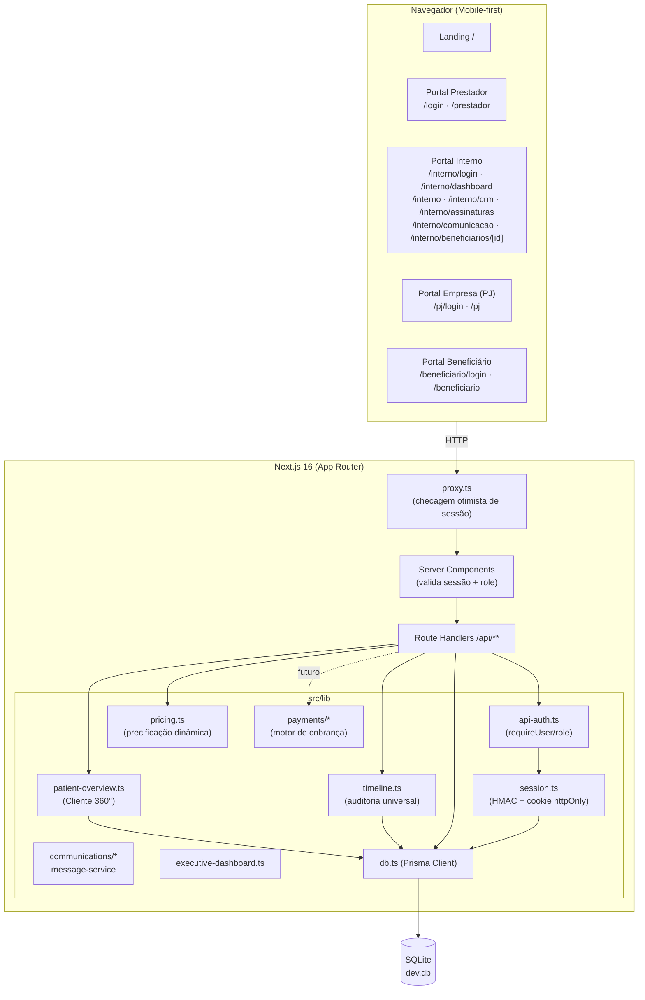
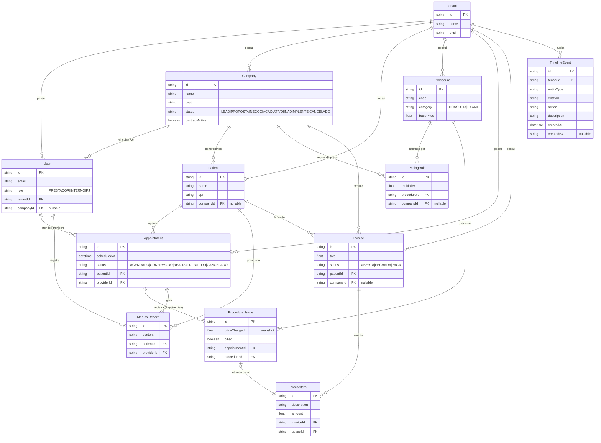
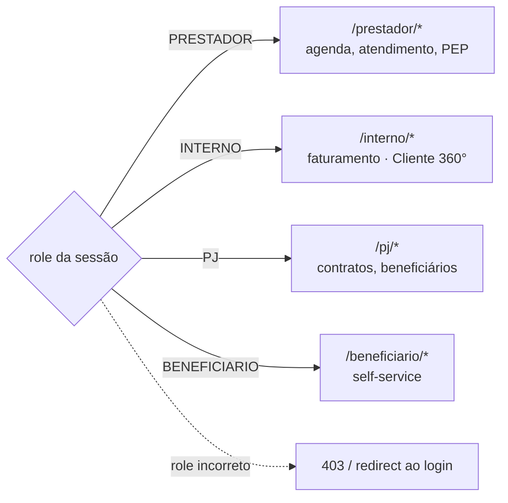
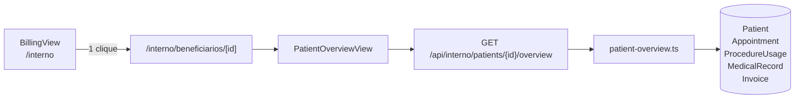
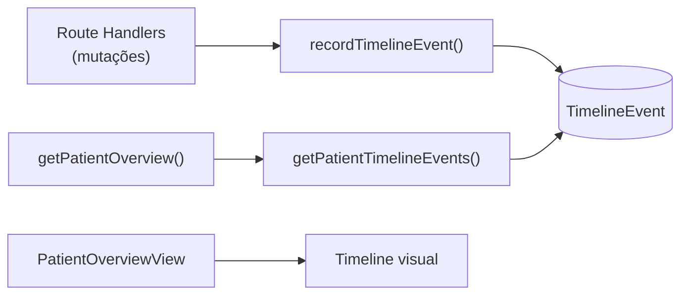
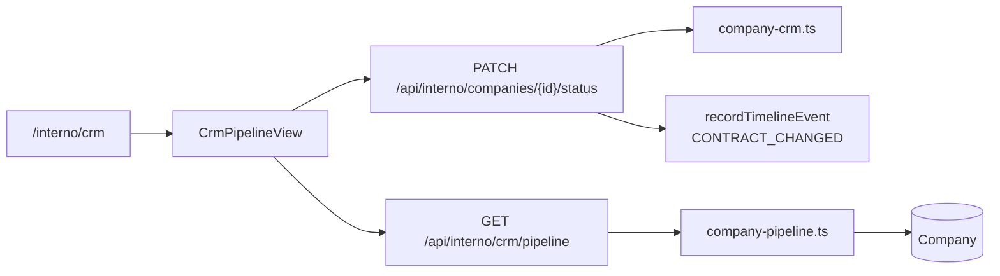
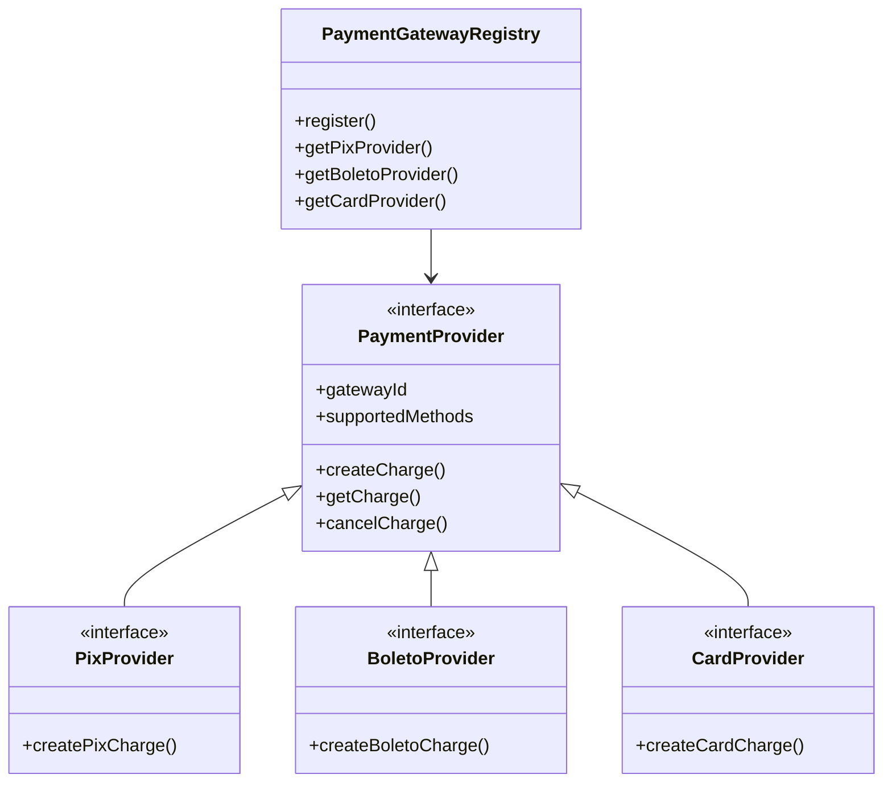
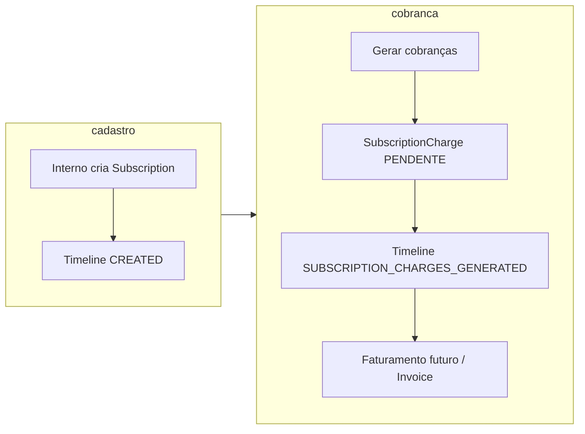
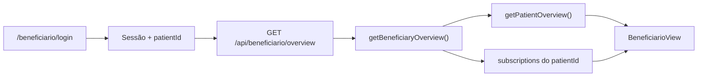
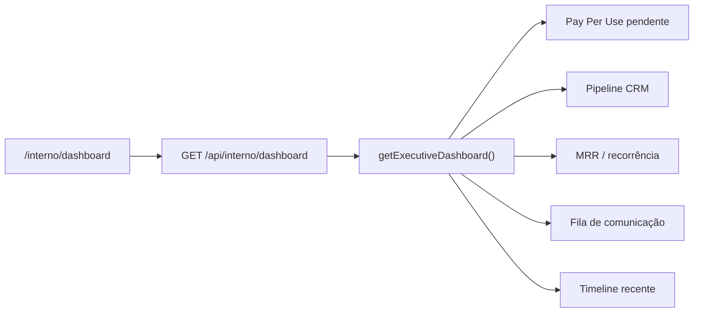

# Arquitetura — Sistema Bibi

Documento técnico com os diagramas de arquitetura, modelo de dados (ER) e os
principais fluxos do sistema. Os diagramas usam [Mermaid](https://mermaid.js.org/)
e são renderizados automaticamente no GitHub.

---

## 1. Visão de componentes



---

## 2. Modelo de dados (ER)



---

## 3. Fluxo Pay Per Use (sequência)

```mermaid
sequenceDiagram
  actor P as Prestador
  actor I as Interno
  participant API as API (Route Handlers)
  participant DB as SQLite (Prisma)

  P->>API: POST /api/auth/login (portal=prestador)
  API-->>P: cookie de sessão (httpOnly, HMAC)
  P->>API: GET /api/prestador/agenda
  API->>DB: agendamentos do dia
  DB-->>API: lista
  API-->>P: agenda

  P->>API: POST /appointments/{id}/procedures {procedureId}
  API->>DB: computePrice (precificação dinâmica)
  API->>DB: cria ProcedureUsage (preço congelado, billed=false)
  API-->>P: procedimento registrado

  P->>API: POST /api/prestador/records (PEP)
  P->>API: PATCH /appointments/{id} {status: REALIZADO}

  I->>API: POST /api/auth/login (portal=interno)
  I->>API: GET /api/interno/billing
  API->>DB: usos não faturados (billed=false)
  API-->>I: pendentes agrupados por paciente
  I->>API: POST /api/interno/invoices {patientId}
  API->>DB: cria Invoice + InvoiceItem; marca usos billed=true
  API-->>I: fatura FECHADA

  I->>API: GET /api/interno/patients/{id}/overview
  API->>DB: Patient + appointments + usages + records + invoices
  API-->>I: Cliente 360° consolidado
```

---

## 4. Segregação de acesso (multi-tenancy)



A validação ocorre em duas camadas: `src/proxy.ts` (checagem otimista do cookie,
redireciona ao login) e o servidor (`requireUser([...roles])` em cada handler e
`getSessionUser()` em cada página), que valida assinatura HMAC e `role`.

---

## 6. Cliente 360° (Épico 1)

Visão consolidada do beneficiário no Portal Interno, reutilizando entidades
existentes sem duplicar dados.



**Camadas:**
- `src/lib/patient-overview.ts` — query Prisma consolidada + formatação
- `src/app/api/interno/patients/[id]/overview/route.ts` — endpoint (role INTERNO)
- `src/app/interno/beneficiarios/[id]/page.tsx` — página protegida
- `src/components/PatientOverviewView.tsx` — UI Cliente 360°

### Checklist de homologação (Épico 1)

- [x] Acessar overview a partir de paciente pendente em billing (link Cliente 360°)
- [x] Ver dados pessoais + empresa vinculada
- [x] Ver histórico de atendimentos (seed: João, Maria, Pedro)
- [x] Ver procedimentos realizados com preços congelados
- [x] Ver PEP (João tem registro no seed)
- [ ] Ver faturas (após gerar via billing — fluxo manual)
- [x] Tentar acessar paciente inexistente → 404
- [x] Prestador/PJ não acessam rota interno → redirect/403 (via RBAC)
- [x] OpenAPI atualizado
- [x] Build passando

---

## 7. Timeline Universal (Épico 2)

Sistema de auditoria de eventos com entidade `TimelineEvent` e service centralizado.



**Eventos registrados automaticamente:**
- `LOGIN` — autenticação
- `UPDATED` / `APPOINTMENT_COMPLETED` — status de atendimento
- `PROCEDURE_REGISTERED` — Pay Per Use
- `MEDICAL_RECORD_CREATED` — PEP
- `INVOICE_ISSUED` — faturamento
- `CREATED` — seed e futuros cadastros

**Arquivos:**
- `prisma/schema.prisma` — model `TimelineEvent`
- `src/lib/timeline.ts` — `recordTimelineEvent`, `getPatientTimelineEvents`
- Hooks nos handlers de login, atendimento, procedimentos, PEP e faturas

### Checklist de homologação (Épico 2)

- [x] Model `TimelineEvent` criado (compatível SQLite/PostgreSQL)
- [x] Service centralizado sem acoplamento à UI
- [x] Eventos automáticos nos fluxos existentes
- [x] Timeline visível no Cliente 360°
- [x] Seed com eventos de demonstração (João/Maria)
- [x] OpenAPI e ARQUITETURA atualizados
- [x] Build passando

---

## 9. CRM Corporativo (Épico 3)

Evolução de `Company` com campo `status` e pipeline visual no Portal Interno.



**Status do pipeline:** LEAD → PROPOSTA → NEGOCIACAO → ATIVO → INADIMPLENTE → CANCELADO

**Arquivos:**
- `src/lib/company-crm.ts` — constantes e regras de status
- `src/lib/company-pipeline.ts` — consulta agrupada por etapa
- `src/components/CrmPipelineView.tsx` — kanban horizontal (mobile-first)
- `src/components/InternoNav.tsx` — navegação Faturamento / CRM

### Checklist de homologação (Épico 3)

- [x] Campo `Company.status` sem tabela paralela
- [x] `contractActive` sincronizado com status (compat. Portal PJ)
- [x] Pipeline visual com 6 colunas
- [x] Mover empresa entre etapas via PATCH
- [x] Evento `CONTRACT_CHANGED` na timeline
- [x] Seed com empresas em múltiplas etapas
- [x] OpenAPI, README e ARQUITETURA atualizados
- [x] Build passando

---

## 10. Motor de Cobrança (Épico 4)

Contratos Strategy para PIX, boleto e cartão — **sem integração fake**.



Detalhes: [`docs/PAYMENTS.md`](PAYMENTS.md)

### Checklist de homologação (Épico 4)

- [x] Interfaces `PaymentProvider`, `PixProvider`, `BoletoProvider`, `CardProvider`
- [x] `PaymentGatewayRegistry` (Strategy) + `charge-service` (fachada)
- [x] Tipos `ChargeReference` vinculados a `invoiceId`
- [x] Erro explícito quando gateway não configurado
- [x] Documentação de adapters Asaas / Efí / Inter
- [x] Nenhuma implementação fake
- [x] Build passando

---

## 11. Recorrência (Épico 5)

Assinaturas recorrentes vinculadas a beneficiário e/ou empresa, com geração
programada de cobranças futuras (`SubscriptionCharge`) que podem ser faturadas
posteriormente via Pay Per Use ou motor de cobrança (Épico 4).



| Camada | Arquivo | Responsabilidade |
|--------|---------|------------------|
| Schema | `prisma/schema.prisma` | `Subscription`, `SubscriptionCharge` |
| Domínio | `src/lib/subscription.ts` | Ciclos, status, `computeUpcomingDueDates()` |
| Serviço | `src/lib/subscription-service.ts` | CRUD, geração de cobranças, timeline |
| API | `src/app/api/interno/subscriptions/**` | Endpoints REST (role `INTERNO`) |
| UI | `src/components/SubscriptionsView.tsx` | Portal `/interno/assinaturas` |

### Checklist de homologação (Épico 5)

- [x] Modelos `Subscription` e `SubscriptionCharge` no Prisma
- [x] Ciclos MENSAL / TRIMESTRAL / SEMESTRAL / ANUAL
- [x] Geração de cobranças futuras com horizonte configurável
- [x] Integração com Timeline (`SUBSCRIPTION`, `SUBSCRIPTION_CHARGES_GENERATED`)
- [x] Visível no Cliente 360° (timeline do beneficiário)
- [x] Seed com assinaturas demo (João, Maria, Pedro)
- [x] Build passando

---

## 12. Portal Beneficiário (Épico 6)

Quarto portal segregado por `role: BENEFICIARIO`. O usuário é vinculado a um
`Patient` via `User.patientId` (mesmo padrão de `User.companyId` no PJ).



| Camada | Arquivo | Responsabilidade |
|--------|---------|------------------|
| Schema | `prisma/schema.prisma` | `User.patientId` → `Patient` |
| Serviço | `src/lib/beneficiary-overview.ts` | Reutiliza Cliente 360° + assinaturas |
| API | `src/app/api/beneficiario/overview/route.ts` | Escopo fixo em `user.patientId` |
| UI | `src/components/BeneficiarioView.tsx` | Self-service read-only |
| Auth | `requireBeneficiary()` em `api-auth.ts` | Impede IDOR |

### Checklist de homologação (Épico 6)

- [x] Role `BENEFICIARIO` + portal em `roles.ts` e `proxy.ts`
- [x] `User.patientId` no schema e sessão
- [x] API self-service sem expor IDs arbitrários
- [x] Reutilização de `getPatientOverview()` (sem duplicar queries)
- [x] Seed: `joao.pereira@email.com` vinculado a João Pereira
- [x] Landing page com 4º portal
- [x] Build passando

---

## 13. Comunicação (Épico 7)

Fila de mensagens outbound (e-mail, SMS, WhatsApp) com contratos Strategy e
integração à Timeline — **sem adapter fake**.

Detalhes: [`docs/COMMUNICATIONS.md`](COMMUNICATIONS.md)

### Checklist de homologação (Épico 7)

- [x] Modelo `Message` no Prisma (PENDENTE → ENVIADA | FALHA | CANCELADA)
- [x] Interfaces `EmailProvider`, `SmsProvider`, `WhatsAppProvider`
- [x] `CommunicationGatewayRegistry` + `notification-service`
- [x] `message-service` com fila, templates e dispatch
- [x] Timeline (`MESSAGE_QUEUED`, `MESSAGE_SENT`, `MESSAGE_FAILED`)
- [x] Portal `/interno/comunicacao`
- [x] Seed com mensagens demo enfileiradas
- [x] Build passando

---

## 15. Dashboard Executivo (Épico 8)

Visão consolidada de KPIs do tenant no Portal Interno, agregando dados dos
épicos anteriores sem duplicar entidades.



| KPI | Fonte |
|-----|-------|
| Pendente Pay Per Use | `ProcedureUsage` não faturados |
| Total faturado | `Invoice` |
| MRR estimado | `Subscription` ATIVA (normalizado mensal) |
| Pipeline CRM | `Company` por status |
| Atividade recente | `TimelineEvent` (últimos 10) |

### Checklist de homologação (Épico 8)

- [x] `getExecutiveDashboard()` com agregações paralelas
- [x] API `GET /api/interno/dashboard`
- [x] UI `/interno/dashboard` + aba no `InternoNav`
- [x] Links para módulos e Cliente 360°
- [x] Build passando

---

## 16. Documentação da API

A especificação **OpenAPI 3.0** está em [`public/openapi.yaml`](../public/openapi.yaml).
Com o servidor rodando (`npm run dev`), acesse a UI interativa em:

- **Swagger UI:** http://localhost:3000/api-docs.html
- **Spec (YAML):** http://localhost:3000/openapi.yaml
