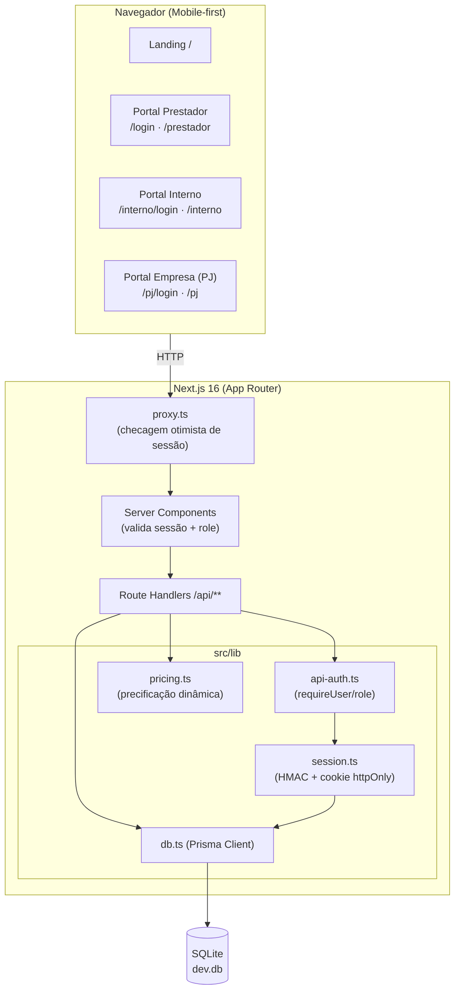
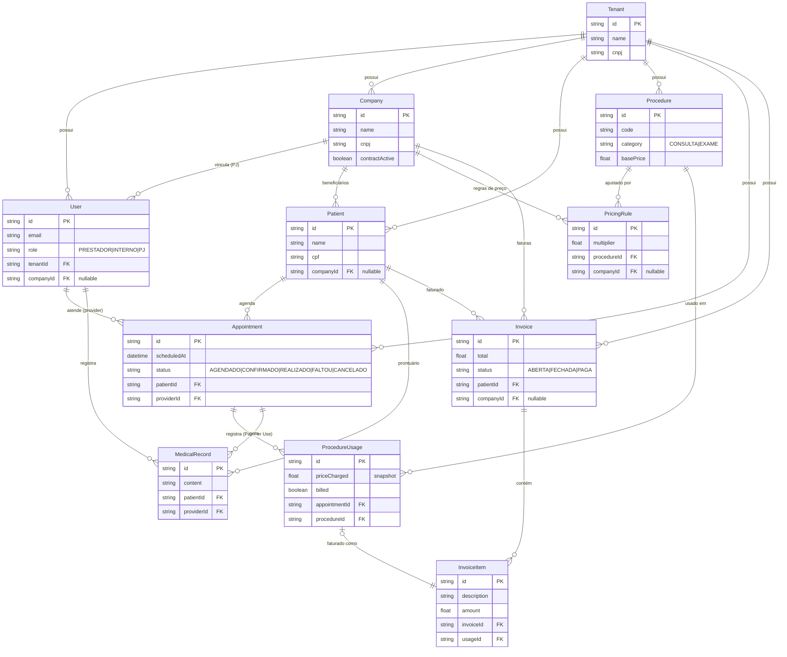
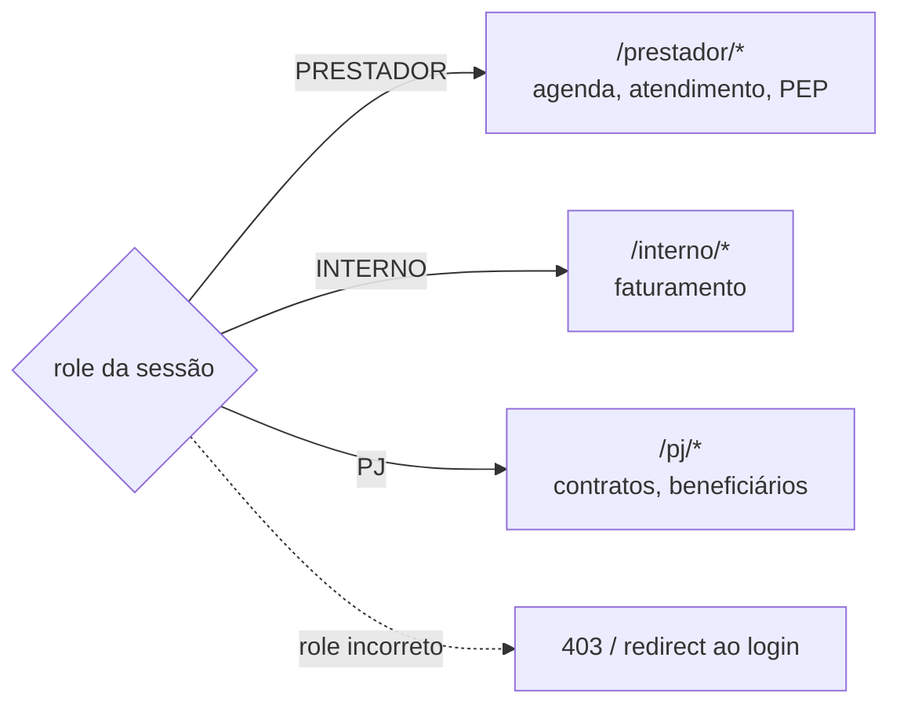

# Arquitetura — Sistema Bibi

Documento técnico com os diagramas de arquitetura, modelo de dados (ER) e os
principais fluxos do sistema. Os diagramas usam [Mermaid](https://mermaid.js.org/)
e são renderizados automaticamente no GitHub.

---

## 1. Visão de componentes



---

## 2. Modelo de dados (ER)



---

## 3. Fluxo Pay Per Use (sequência)

```mermaid
sequenceDiagram
  actor P as Prestador
  actor I as Interno
  participant API as API (Route Handlers)
  participant DB as SQLite (Prisma)

  P->>API: POST /api/auth/login (portal=prestador)
  API-->>P: cookie de sessão (httpOnly, HMAC)
  P->>API: GET /api/prestador/agenda
  API->>DB: agendamentos do dia
  DB-->>API: lista
  API-->>P: agenda

  P->>API: POST /appointments/{id}/procedures {procedureId}
  API->>DB: computePrice (precificação dinâmica)
  API->>DB: cria ProcedureUsage (preço congelado, billed=false)
  API-->>P: procedimento registrado

  P->>API: POST /api/prestador/records (PEP)
  P->>API: PATCH /appointments/{id} {status: REALIZADO}

  I->>API: POST /api/auth/login (portal=interno)
  I->>API: GET /api/interno/billing
  API->>DB: usos não faturados (billed=false)
  API-->>I: pendentes agrupados por paciente
  I->>API: POST /api/interno/invoices {patientId}
  API->>DB: cria Invoice + InvoiceItem; marca usos billed=true
  API-->>I: fatura FECHADA
```

---

## 4. Segregação de acesso (multi-tenancy)



A validação ocorre em duas camadas: `src/proxy.ts` (checagem otimista do cookie,
redireciona ao login) e o servidor (`requireUser([...roles])` em cada handler e
`getSessionUser()` em cada página), que valida assinatura HMAC e `role`.

---

## 5. Documentação da API

A especificação **OpenAPI 3.0** está em [`public/openapi.yaml`](../public/openapi.yaml).
Com o servidor rodando (`npm run dev`), acesse a UI interativa em:

- **Swagger UI:** http://localhost:3000/api-docs.html
- **Spec (YAML):** http://localhost:3000/openapi.yaml
