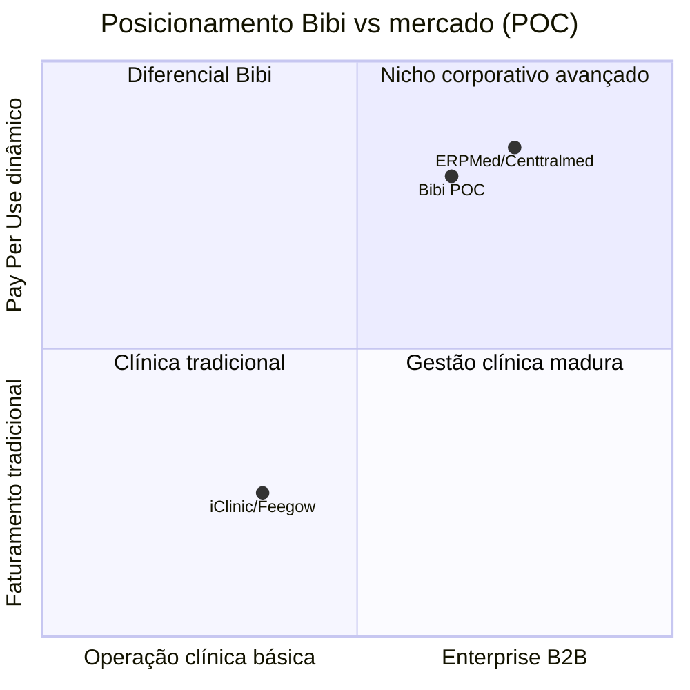

# Ações × Benchmark — ServiceOS Bibi v2.0

Comparativo entre **o que a plataforma implementa hoje** (ações/funcionalidades no código)
e **referências de mercado** citadas no projeto.

> **Escopo v2.0:** [`V2_0.md`](V2_0.md) · **Arquitetura multi-nicho:** [`V2_0_ARCHITECTURE.md`](V2_0_ARCHITECTURE.md) · **Pesquisa estratégica:** [`pesquisa/README.md`](pesquisa/README.md)

| Referência | Perfil | Uso neste documento |
|------------|--------|---------------------|
| **iClinic / Feegow** | SaaS de gestão clínica (agenda, PEP, cadastros) | Benchmark operacional — *table stakes* (Tier 2) |
| **ERPMed / Centtralmed** | HealthTech corporativo, Pay Per Use, multi-tenant | Benchmark de **modelo de negócio** e visão B2B |
| **Operadoras / TISS** | Faturamento ANS, guias, convênios | Benchmark regulatório e financeiro |

**Legenda**

| Símbolo | Significado |
|---------|-------------|
| ✅ | Implementado na POC (funcional ou mock configurável) |
| 🟡 | Parcial — contrato/UI prontos, integração real ou validação pendente |
| ❌ | Não implementado (roadmap) |
| ⭐ | Diferencial do Bibi vs benchmark típico de clínica |

Última revisão: **ServiceOS v2.0** — multi-nicho, `useLabels()`, landing por nicho, seed VET/DENTAL/LEGAL/SPA/EDUCATION (PR [#101](https://github.com/Piulres/sistema-bibi/pull/101)).

---

## 0. ServiceOS multi-nicho — diferencial vs mercado

| Capability | Bibi v2.0 | iClinic / Feegow | ERPMed | Conexa / Vitta |
|------------|:---------:|:----------------:|:------:|:--------------:|
| Mesmo deploy para saúde + vet + jurídico + educação | ⭐ ✅ | ❌ | ❌ | ❌ |
| Dicionário de termos por tenant (`labels`) | ⭐ ✅ | ❌ | ❌ | ❌ |
| Landing segmentada por nicho | ⭐ ✅ | ❌ | 🟡 | 🟡 |
| White label (logo, cores, domínio) | ✅ | 🟡 | ✅ | ✅ |
| Pay Per Use + Price Snapshot | ⭐ ✅ | ❌ | ✅ | 🟡 |
| Portal PJ + beneficiário self-service | ⭐ ✅ | ❌ | ✅ | ✅ |

**Leitura:** o v2.0 não compete em profundidade clínica (receituário CFM, grade flexível) — compete em **infraestrutura transacional horizontal** com vocabulário e marca do cliente. Ver [`pesquisa/01-matriz-competitiva.md`](pesquisa/01-matriz-competitiva.md).

---

## 1. Visão executiva

| Dimensão | Bibi POC | iClinic / Feegow | ERPMed / Centtralmed |
|----------|----------|------------------|----------------------|
| Foco principal | Pay Per Use + 4 portais | Gestão da clínica | Saúde corporativa B2B |
| Multi-tenant SaaS | ✅ | ✅ (por conta) | ✅ |
| Portal do paciente | ✅ self-service amplo | 🟡 variável | ✅ |
| Portal corporativo (PJ) | ✅ | ❌ / 🟡 | ✅ |
| Precificação dinâmica por empresa | ⭐ ✅ | ❌ | ✅ |
| Faturamento por uso efetivo | ⭐ ✅ | ❌ (fee fixo / convênio) | ✅ |

---

## 2. Matriz detalhada — Ações × Benchmark

### 2.1 Operação clínica (benchmark: iClinic / Feegow)

| Ação / capability | Bibi | iClinic / Feegow | Onde no Bibi |
|-------------------|:----:|:----------------:|--------------|
| Agenda do prestador (dia) | ✅ | ✅ | `/prestador`, `AgendaView` |
| Agenda administrativa (CRUD) | ✅ | ✅ | `/interno/agenda`, `AppointmentsView` |
| Status de consulta (agendado → realizado) | ✅ | ✅ | `appointment-service.ts` |
| Telemedicina (link sala) | 🟡 mock | ✅ | `modality=TELE`, `telemedicine.ts` |
| PEP / prontuário eletrônico | ✅ | ✅ | `MedicalRecord`, `AtendimentoView` |
| Templates PEP (evolução, receita, atestado) | ✅ | ✅ | `pep-templates.ts` |
| Cadastro de pacientes | ✅ | ✅ | `/interno/cadastros` |
| Cadastro de procedimentos / tabela | ✅ | ✅ | `Procedure`, cadastros |
| Cadastro de profissionais | ✅ | ✅ | `user-service`, prestadores |
| Agendamento online pelo paciente | ✅ | ✅ | `/beneficiario`, `scheduling-service` |
| Slots configuráveis (grade horária) | 🟡 fixo 8h–18h/30min | ✅ flexível | `scheduling-service.ts` |
| Confirmação automática (SMS/WhatsApp) | 🟡 fila + mock | ✅ | `reminder-service`, `Message` |
| Prontuário compartilhado multi-unidade | 🟡 por tenant | ✅ | multi-tenant isolado |
| NFSe / receituário digital CFM | ❌ | 🟡 | — |
| Assinatura digital em documentos | ❌ | 🟡 | — |

**Leitura:** Tier 2 cobre o **table stakes** operacional. Gaps vs iClinic: grade de horários flexível, integrações clínicas profundas e receituário regulado.

---

### 2.2 Faturamento e receita (benchmark: ERPMed + operadoras)

| Ação / capability | Bibi | ERPMed / Centtralmed | iClinic / Feegow | Onde no Bibi |
|-------------------|:----:|:--------------------:|:----------------:|--------------|
| Pay Per Use (cobra só o usado) | ⭐ ✅ | ✅ | ❌ | `ProcedureUsage`, `pricing.ts` |
| Preço congelado no atendimento | ⭐ ✅ | ✅ | ❌ | `priceCharged` snapshot |
| Desconto corporativo por empresa | ⭐ ✅ | ✅ | ❌ | `PricingRule.multiplier` |
| Fatura por beneficiário | ✅ | ✅ | 🟡 | `invoice-service`, `/interno` |
| Bridge assinatura → fatura | ✅ | 🟡 | ❌ | `invoiceSubscriptionCharge()` |
| PIX (cobrança) | 🟡 mock | ✅ | 🟡 | `MockPixAdapter`, Tier 1 |
| Boleto / cartão | 🟡 contrato | ✅ | 🟡 | `payments/*` Strategy |
| Marcar fatura paga (manual) | ✅ | ✅ | 🟡 | `BillingView` → Ações |
| Pagamento pelo beneficiário (self-service) | ✅ | 🟡 | ❌ | `BeneficiarioView` |
| Recorrência / assinatura (MRR) | ✅ | ✅ | ❌ | `Subscription`, `/interno/assinaturas` |
| Guia TISS / ANS (XML) | 🟡 simplificado | ✅ | ❌ | `tiss-service.ts` |
| Validação XSD TISS | ❌ | ✅ | ❌ | roadmap Tier 5 |
| Faturamento convênio / glosa | ❌ | ✅ | 🟡 | — |
| Repasse a prestador | ❌ | ✅ | 🟡 | — |
| Dashboard executivo (KPIs) | ✅ | ✅ | 🟡 | `/interno/dashboard` |

**Leitura:** o **diferencial Bibi** vs clínicas tradicionais está no ciclo Pay Per Use + precificação dinâmica. vs ERPMed: TISS e gateways reais ainda mock/parcial.

---

### 2.3 B2B, corporativo e CRM (benchmark: ERPMed / Centtralmed)

| Ação / capability | Bibi | ERPMed / Centtralmed | iClinic / Feegow | Onde no Bibi |
|-------------------|:----:|:--------------------:|:----------------:|--------------|
| Portal RH / empresa (PJ) | ✅ | ✅ | ❌ | `/pj`, `PjView` |
| Consumo por beneficiário corporativo | ✅ | ✅ | ❌ | `pj-portal-service.ts` |
| Pipeline CRM (lead → ativo) | ✅ | ✅ | ❌ | `/interno/crm`, `CrmPipelineView` |
| Alertas inadimplência / negociação | ✅ | ✅ | ❌ | alertas em `PjView` |
| Export CSV corporativo | ✅ | ✅ | 🟡 | `/api/pj/reports` |
| Webhooks outbound B2B | ✅ | ✅ | ❌ | `/interno/integracoes` |
| Log + retry de webhooks | ✅ | 🟡 | ❌ | `WebhookDelivery`, cron |
| API REST documentada | ✅ OpenAPI | ✅ | 🟡 | `public/openapi.yaml` |
| Cliente 360° (visão única) | ⭐ ✅ | ✅ | 🟡 | `/interno/beneficiarios/[id]` |
| Timeline universal de auditoria | ⭐ ✅ | 🟡 | ❌ | `TimelineEvent` |
| Contrato digital / proposta | ❌ | ✅ | ❌ | — |
| EDI operadora | ❌ | ✅ | ❌ | — |

**Leitura:** Bibi POC cobre bem o **core B2B** (PJ + CRM + webhooks). Falta camada comercial/contratual e integração operadora.

---

### 2.4 Experiência do beneficiário (benchmark: apps de saúde / operadoras)

| Ação / capability | Bibi | Operadoras / ERPMed | iClinic | Onde no Bibi |
|-------------------|:----:|:---------------------:|:-------:|--------------|
| Login dedicado paciente | ✅ | ✅ | 🟡 | `/beneficiario/login` |
| Ver consumo e valores | ⭐ ✅ | ✅ | 🟡 | Pay Per Use transparente |
| Ver e pagar faturas | ✅ | ✅ | ❌ | PIX + histórico |
| Agendar consulta | ✅ | ✅ | 🟡 | self-service |
| Ver prontuário próprio | ✅ | 🟡 | 🟡 | read-only no portal |
| Ver assinatura / plano | ✅ | ✅ | ❌ | overview |
| App mobile nativo | ❌ | ✅ | ✅ | web mobile-first |
| Carteirinha digital | ❌ | ✅ | ❌ | — |
| Autorização de procedimento | ❌ | ✅ | ❌ | — |

---

### 2.5 Comunicação (benchmark: iClinic + operadoras)

| Ação / capability | Bibi | iClinic / Feegow | ERPMed | Onde no Bibi |
|-------------------|:----:|:----------------:|:------:|--------------|
| Fila de mensagens (e-mail/SMS/WhatsApp) | ✅ | ✅ | ✅ | `/interno/comunicacao` |
| Templates (consulta, fatura, assinatura) | ✅ | ✅ | 🟡 | `Message.template` |
| Lembretes automáticos | ✅ | ✅ | ✅ | `reminder-service.ts` |
| Dispatch real (SendGrid/Twilio) | 🟡 console mock | ✅ | ✅ | adapters |
| Campanhas marketing | ❌ | 🟡 | 🟡 | — |
| Chat bidirecional | ❌ | 🟡 | 🟡 | — |

---

### 2.6 Segurança, compliance e plataforma (benchmark: enterprise SaaS)

| Ação / capability | Bibi | Enterprise típico | Onde no Bibi |
|-------------------|:----:|:-----------------:|--------------|
| Multi-tenant isolado | ✅ | ✅ | `tenantId` |
| RBAC granular (interno) | ✅ | ✅ | `interno-permissions.ts` |
| MFA TOTP | ✅ | ✅ | `/interno/seguranca`, `mfa.ts` |
| SSO OAuth / SAML | ❌ | ✅ | roadmap Tier 5 |
| Hash de senha (scrypt) | ✅ | ✅ | `password.ts` |
| LGPD — export JSON paciente | 🟡 light | ✅ | `patient-export.ts` |
| LGPD — consentimento | 🟡 campo | ✅ | `Patient.consentAt` |
| White label (cores, logo) | ✅ | ✅ | `TenantBranding` |
| Domínio customizado | 🟡 manual | ✅ | `customDomain` |
| Auditoria (timeline) | ⭐ ✅ | 🟡 | `TimelineEvent` |
| Postgres produção | ❌ SQLite POC | ✅ | roadmap |
| SLA / HA | ❌ | ✅ | — |

---

## 3. Ações de UI por portal (o que o usuário clica)

Referência rápida das **ações expostas na interface** — útil para demo e homologação.

### Portal Prestador

| Tela | Ações |
|------|-------|
| Agenda | Abrir atendimento |
| Atendimento | Registrar procedimento · Salvar PEP · Usar template · Marcar REALIZADO |

### Portal Interno

| Módulo | Ações principais |
|--------|------------------|
| Dashboard | Ver KPIs · links para módulos |
| Faturamento | Gerar fatura · **PIX** · **Marcar paga** · Download TISS XML · Cliente 360° |
| Agenda | Criar agendamento · Alterar status/modalidade |
| Cadastros | CRUD beneficiário, empresa, procedimento, usuário |
| CRM | Mover empresa no pipeline |
| Assinaturas | Criar · Gerar cobranças · **Faturar** cobrança |
| Comunicação | Enfileirar · Despachar · Cancelar · Disparar lembretes |
| Relatórios | Download CSV faturamento / CRM |
| White Label | Editar branding · Upload logo · Domínio custom |
| Integrações | CRUD webhook · Ver entregas · Retry |
| Segurança | Setup / enable / disable MFA |
| Cliente 360° | Ver overview · Export LGPD JSON |

### Portal PJ

| Ações |
|-------|
| Ver alertas · KPIs · consumo por beneficiário · export CSV *(somente leitura)* |

### Portal Beneficiário

| Ações |
|-------|
| Agendar consulta · Pagar fatura **PIX** · Confirmar PIX · Ver consumo / PEP / timeline |

---

## 4. Scorecard resumido (POC vs benchmark)

Escala: **0** ausente · **1** parcial/mock · **2** implementado alinhado ao mercado

| Categoria | Bibi | iClinic / Feegow | ERPMed / Centtralmed |
|-----------|:----:|:----------------:|:--------------------:|
| Operação clínica | **1,5** | **2,0** | **1,0** |
| Pay Per Use / faturamento dinâmico | **2,0** | **0,5** | **2,0** |
| B2B / corporativo | **1,5** | **0,5** | **2,0** |
| Portal beneficiário | **1,5** | **1,0** | **1,5** |
| Integrações / TISS | **1,0** | **0,5** | **2,0** |
| Enterprise (SSO, HA, Postgres) | **0,5** | **1,5** | **2,0** |
| **Total ponderado (POC)** | **~8/12** | **~6/12** | **~10,5/12** |

> ERPMed/Centtralmed permanece referência em **profundidade B2B e regulatório**.
> Bibi POC **iguala ou supera** iClinic/Feegow em Pay Per Use, portal PJ e auditoria;
> **fica atrás** em operação clínica madura (grade, receituário, app nativo).

---

## 5. Gaps prioritários (Ação → Benchmark)

| Gap | Benchmark espera | Ação sugerida (Tier 5+) |
|-----|------------------|-------------------------|
| Gateway PIX/boleto real | ERPMed, mercado | Adapter Asaas/Efí em produção |
| TISS XSD válido | Operadoras | Validação + campos ANS completos |
| SSO corporativo | Enterprise | OAuth/SAML no login |
| RBAC 100% nas APIs | Enterprise | `requireInternoModule` em todas mutações |
| Postgres + HA | SaaS produção | Netlify Database / migrar Prisma |
| Telemedicina real | iClinic, pós-COVID | Twilio/Whereby embed |
| Grade horária flexível | iClinic/Feegow | Config por prestador/unidade |
| App mobile | Mercado | PWA ou React Native |

---

## 6. Referências cruzadas

| Documento | Conteúdo relacionado |
|-----------|---------------------|
| [`V2_0.md`](V2_0.md) | Escopo e changelog ServiceOS v2.0 |
| [`V2_0_ARCHITECTURE.md`](V2_0_ARCHITECTURE.md) | Arquitetura técnica multi-nicho |
| [`pesquisa/README.md`](pesquisa/README.md) | Benchmark estratégico 2026 (matriz, mercado, roadmap, prompts) |
| [`pesquisa/01-matriz-competitiva.md`](pesquisa/01-matriz-competitiva.md) | Bibi × Conexa, Vitta, Alice, Pipo, Feegow, iClinic, etc. |
| [`pesquisa/09-sintese-consultor-senior.md`](pesquisa/09-sintese-consultor-senior.md) | Síntese executiva consultor — ROI, script CFO, Tier 1 |
| [`FLUXOS.md`](FLUXOS.md) | Fluxos detalhados de cada ação |
| [`JORNADA_CLIENTE.md`](JORNADA_CLIENTE.md) | Jornada UX nos 4 portais e backlog priorizado |
| [`NOTEBOOKLM.md`](NOTEBOOKLM.md) | Tiers 1–4 e épicos |
| [`ARQUITETURA.md`](ARQUITETURA.md) | Diagramas técnicos |
| [`PAYMENTS.md`](PAYMENTS.md) | Motor de cobrança vs mercado |
| [`README.md`](../README.md) | Pilares Pay Per Use |

---

*Documento de posicionamento — não substitui análise comercial ou due diligence de concorrentes.*
