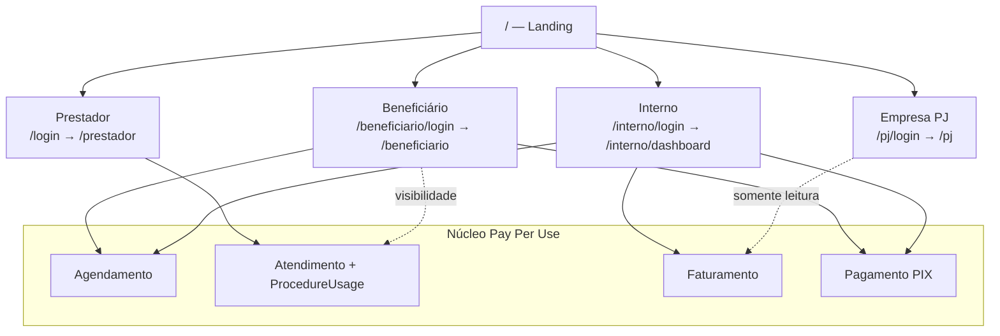
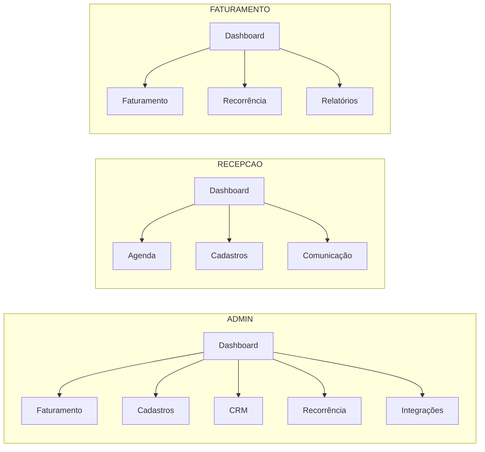
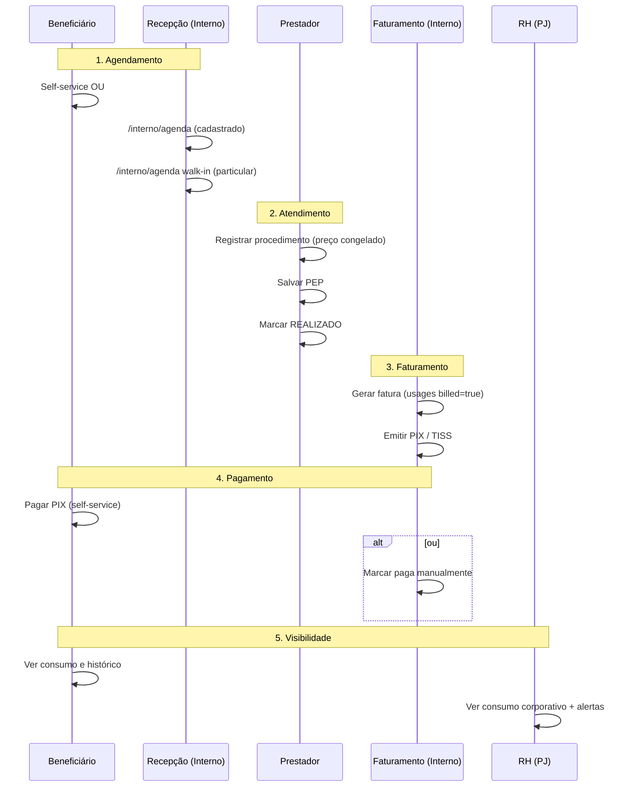

# Jornada do Cliente — Quatro Portais

Documentação da **experiência do usuário** em cada portal do Sistema Bibi, com
jornadas típicas, pontos fortes, gaps conhecidos e backlog de melhorias priorizado.

Complementa [`FLUXOS.md`](FLUXOS.md) (ações técnicas e APIs) e [`BENCHMARK.md`](BENCHMARK.md)
(posicionamento vs mercado). Para credenciais demo, ver [`README.md`](../README.md).

Última revisão: alinhada à `main` pós walk-in particular, edição CRUD em Cadastros e mapa `CRUD_OPERATIONS_MAP` (27 entidades).

---

## Índice

1. [Visão macro](#1-visão-macro)
2. [Portal Beneficiário](#2-portal-beneficiário)
3. [Portal PJ (Empresa)](#3-portal-pj-empresa)
4. [Portal Prestador](#4-portal-prestador)
5. [Portal Interno](#5-portal-interno)
6. [Jornada E2E Pay Per Use](#6-jornada-e2e-pay-per-use)
7. [Matriz de maturidade](#7-matriz-de-maturidade)
8. [Backlog priorizado](#8-backlog-priorizado)
9. [Referências cruzadas](#9-referências-cruzadas)

---

## 1. Visão macro

O Sistema Bibi organiza a experiência em **quatro portais segregados por `role`**,
todos alimentados pelo mesmo núcleo **Pay Per Use** (`ProcedureUsage` → `Invoice` → `Payment`).

| Portal | Público | Login | Destino pós-login | Papel na jornada |
|--------|---------|-------|-------------------|------------------|
| **Beneficiário** | Paciente / colaborador | `/beneficiario/login` | `/beneficiario` | Cliente final — agenda, paga, acompanha |
| **PJ** | RH / gestor corporativo | `/pj/login` | `/pj` | Cliente B2B — monitora consumo e alertas |
| **Prestador** | Médico / profissional | `/login` | `/prestador` | Entrega o serviço clínico |
| **Interno** | Equipe administrativa | `/interno/login` | `/interno/dashboard` | Operação, faturamento e backoffice |

**Entrada pública:** landing (`/`) → seção Portais → login dedicado por perfil.
Descrições de cada portal: `src/lib/landing/content.ts` (`LANDING_PORTALS`).

---

## 2. Portal Beneficiário

**Role:** `BENEFICIARIO` · **Escopo:** `user.patientId` (anti-IDOR) · **View:** `BeneficiarioView`

### 2.1 Jornada típica

| Etapa | Ação do usuário | Onde na UI | Efeito no sistema |
|-------|-----------------|------------|-------------------|
| 1. Entrada | Login com e-mail + senha | `/beneficiario/login` | Sessão escopada ao `patientId` |
| 2. Agendar | Escolhe prestador, data, slot, modalidade | Card “Agendar consulta” | `Appointment` AGENDADO; webhook `APPOINTMENT_CREATED` |
| 3. Consulta | Acessa link telemedicina (TELE) ou comparece presencial | Tabela “Minha agenda” | — |
| 4. Pós-atendimento | Consulta consumo Pay Per Use | Seção “Consumo Pay Per Use” | Vê procedimentos `billed` / não `billed` |
| 5. Faturamento | Aguarda fatura emitida pelo interno | KPI “Total faturado” | — |
| 6. Pagamento | Gera PIX → confirma pagamento | Seção “Faturas” | `Invoice` PAGA |
| 7. Acompanhamento | Consulta PEP, assinatura, timeline | Seções inferiores | Somente leitura |

### 2.2 Pontos fortes

- Self-service completo: agendar + pagar + ver consumo.
- Transparência Pay Per Use com preço congelado (`priceCharged`).
- Escopo estrito por `patientId` — sem acesso a dados de terceiros.

### 2.3 Gaps e melhorias

| Prioridade | Gap | Sugestão |
|:----------:|-----|----------|
| Alta | Não pode cancelar nem reagendar consulta | Ações com regras de antecedência (ex.: até 24 h antes) |
| Alta | PIX em dois passos manuais (gerar + confirmar) | Webhook do gateway ou polling; exibir QR Code |
| Média | Página única longa (scroll) | Abas: Agenda · Consumo · Faturas · Prontuário |
| Média | Slots fixos (8h–18h, 30 min) | Grade configurável por prestador (`scheduling-service.ts`) |
| Média | Notificações mock (`COMMUNICATION_PROVIDER=console`) | Adapter real (e-mail/SMS/WhatsApp) |
| Baixa | Sem carteirinha digital | Card com QR + dados do plano corporativo |
| Baixa | Sem PWA / app nativo | PWA instalável com push de lembrete |

**Código:** `src/components/BeneficiarioView.tsx` · APIs em `src/app/api/beneficiario/`

---

## 3. Portal PJ (Empresa)

**Role:** `PJ` · **Escopo:** `user.companyId` · **View:** `PjView` · **Modo:** somente leitura + export CSV

### 3.1 Jornada típica

| Etapa | Ação do usuário | Onde na UI | Efeito |
|-------|-----------------|------------|--------|
| 1. Entrada | Login PJ | `/pj/login` | Escopo limitado ao `companyId` |
| 2. Alertas | Lê avisos de inadimplência, faturas abertas, cobranças vencidas | Topo da página | Alertas com âncoras (`#assinaturas`) |
| 3. KPIs | Vê contrato, beneficiários, consumo PPU, MRR | Cards de resumo | `getPjPortalOverview()` |
| 4. Drill-down | Analisa consumo por colaborador | Tabela “Beneficiários” | Consumo e pendente por CPF |
| 5. Export | Baixa relatório CSV | Botão “Exportar relatório CSV” | `GET /api/pj/reports` |

### 3.2 Pontos fortes

- Alertas proativos (inadimplência, negociação, faturas abertas).
- Consumo granular por beneficiário — core B2B.
- Export CSV para integração com ERP/planilha.

### 3.3 Gaps e melhorias

| Prioridade | Gap | Sugestão |
|:----------:|-----|----------|
| Alta | 100% somente leitura — RH não executa ações | Gestão de beneficiários (incluir/excluir), upload em lote |
| Alta | Sem pagamento corporativo consolidado | Fatura por empresa + boleto/PIX corporativo |
| Média | Sem filtros por período ou status | Filtros + gráfico de tendência de consumo |
| Média | Alertas sem ação resolutiva (só âncora na página) | Contato comercial, abertura de chamado |
| Média | Sem drill-down por beneficiário | Clique no colaborador → detalhe consumo/faturas |
| Baixa | Sem SSO corporativo | OAuth/SAML via IdP da empresa |
| Baixa | Sem contrato digital | Visualização/assinatura de proposta no portal |

**Código:** `src/components/PjView.tsx` · `src/lib/pj-portal-service.ts`

---

## 4. Portal Prestador

**Role:** `PRESTADOR` · **Views:** `AgendaView` → `AtendimentoView`

### 4.1 Jornada típica

| Etapa | Ação do usuário | Onde na UI | Efeito |
|-------|-----------------|------------|--------|
| 1. Entrada | Login prestador | `/login` | Sessão `PRESTADOR` |
| 2. Agenda do dia | Vê consultas de hoje | `/prestador` | `GET /api/prestador/agenda` |
| 3. Abrir atendimento | Clica no card do paciente | `/prestador/atendimento/[id]` | Detalhe: paciente, empresa, procedimentos |
| 4. Registrar uso | Adiciona procedimento do catálogo | Formulário de procedimentos | `ProcedureUsage` com `priceCharged` congelado |
| 5. PEP | Salva evolução/receita/atestado | Templates PEP | `MedicalRecord` + timeline |
| 6. Concluir | Marca REALIZADO | Botão de conclusão | Libera faturamento interno |

### 4.2 Pontos fortes

- Fluxo clínico enxuto: agenda → atendimento → PEP → conclusão.
- Preço congelado no momento do uso (Pay Per Use).
- Templates PEP (`pep-templates.ts`) aceleram documentação.

### 4.3 Gaps e melhorias

| Prioridade | Gap | Sugestão |
|:----------:|-----|----------|
| Alta | Só exibe agenda do dia | Calendário semanal/mensal + filtros |
| Alta | Sem confirmação de chegada do paciente | Ação “Paciente presente” → status CONFIRMADO |
| Média | Telemedicina mock | Embed real (Twilio/Whereby) na tela de atendimento |
| Média | Sem histórico clínico no atendimento | Sidebar com PEP anterior, alergias, últimos procedimentos |
| Média | Sem assinatura digital em receitas/atestados | Conformidade CFM + PDF |
| Baixa | Sem fila automática de atendimento | “Próximo paciente” após marcar REALIZADO |

**Código:** `src/components/AgendaView.tsx` · `src/components/AtendimentoView.tsx`

---

## 5. Portal Interno

**Role:** `INTERNO` · **RBAC:** `internoProfile` · **Nav:** `InternoNav` filtrada por permissões

### 5.1 Jornada por perfil

| Módulo | Rota | Jornada principal |
|--------|------|-------------------|
| Dashboard | `/interno/dashboard` | KPIs → links rápidos (faturamento, CRM, recorrência) |
| Faturamento | `/interno` | Pendências PPU → gerar fatura → PIX / marcar paga → TISS XML |
| Agenda | `/interno/agenda` | CRUD agendamentos, **walk-in particular**, check-in, modalidade TELE |
| Cadastros | `/interno/cadastros` | Beneficiários, empresas, procedimentos, usuários (criar + **editar**) |
| Mapa CRUD | `/interno/cadastros?tab=operations` | 27 entidades — telas, rotas API, filtro por portal |
| CRM | `/interno/crm` | Pipeline lead → ativo (kanban) |
| Recorrência | `/interno/assinaturas` | Assinaturas → gerar cobranças → faturar |
| Comunicação | `/interno/comunicacao` | Fila de mensagens + lembretes automáticos |
| Cliente 360° | `/interno/beneficiarios/[id]` | Visão unificada + export LGPD |

Matriz completa perfil × módulo: [`FLUXOS.md`](FLUXOS.md) §9.

### 5.2 Pontos fortes

- Cobertura operacional ampla (table stakes + B2B).
- RBAC na navegação e em parte das APIs.
- Cliente 360° com timeline universal de auditoria.

### 5.3 Gaps e melhorias

| Prioridade | Gap | Sugestão |
|:----------:|-----|----------|
| Alta | RBAC incompleto nas APIs — RECEPCAO pode chamar URLs diretas | `requireInternoModule()` em todas as mutações |
| Alta | Cliente 360° sem RBAC de módulo | Restringir por perfil (ex.: ADMIN/RECEPCAO) |
| Média | Faturamento em `/interno` (rota não óbvia) | Alias `/interno/faturamento` já redireciona — destacar na nav |
| Média | Sem workflow guiado de faturamento em lote | Wizard: pendências → selecionar pacientes → gerar lote |
| Média | TISS simplificado | Validação XSD + campos ANS completos |
| Baixa | 11 abas na nav — sobrecarga cognitiva | Agrupar: Operação · Financeiro · Plataforma |

**Melhorias visuais implementadas (2026-06):** `StatCard` unificado em dashboard/PJ/beneficiário/faturamento; `FlowStepper` na jornada PPU; `CalloutCard` + `AppointmentCard` na agenda interna e prestador; `TabBar` em Cadastros; `EmptyState` com título e dica.

**Código:** `src/components/InternoNav.tsx` · `src/lib/interno-permissions.ts` · `docs/DESIGN_SYSTEM.md`

---

## 6. Jornada E2E Pay Per Use

Fluxo cross-portal que conecta os quatro perfis — núcleo do produto.

### 6.1 Gaps na jornada cross-portal

| # | Gap | Impacto | Melhoria sugerida |
|---|-----|---------|-------------------|
| 1 | Beneficiário agenda, mas confirmação é manual na recepção | Fricção operacional | Confirmação automática ou notificação push |
| 2 | Sem indicador visual de progresso entre portais | Usuário não sabe “onde está” no ciclo | Status tracker: Agendado → Em atendimento → Aguardando fatura → Pago |
| 3 | PJ vê alertas, mas não pode resolver | RH depende de suporte | Self-service de regularização ou chat |
| 4 | Lembretes automáticos mock (`console`) | Paciente não recebe lembrete real | Adapter SendGrid/Twilio em produção |
| 5 | Sem repasse ao prestador | Prestador não vê receita gerada | Módulo de repasse / extrato prestador |

Detalhe técnico do fluxo: [`FLUXOS.md`](FLUXOS.md) §7.

---

## 7. Matriz de maturidade

Escala por dimensão de jornada (não cobertura de código).

| Dimensão | Beneficiário | PJ | Prestador | Interno |
|----------|:------------:|:--:|:---------:|:-------:|
| Onboarding / login | ✅ | ✅ | ✅ | ✅ (+ MFA) |
| Self-service | ✅ agendar + pagar | ❌ só leitura | 🟡 só atendimento | ✅ CRUD completo |
| Transparência financeira | ⭐ ✅ | ⭐ ✅ | 🟡 vê preço no ato | ✅ |
| Comunicação proativa | 🟡 mock | 🟡 alertas passivos | ❌ | 🟡 fila mock |
| Mobile / PWA | ❌ | ❌ | ❌ | ❌ |
| Integrações reais | 🟡 PIX mock | 🟡 CSV only | ❌ | 🟡 webhooks OK, TISS parcial |

Legenda: ✅ implementado · 🟡 parcial/mock · ❌ ausente · ⭐ diferencial vs mercado clínico.

Scorecard vs concorrentes: [`BENCHMARK.md`](BENCHMARK.md) §4.

---

## 8. Backlog priorizado

Top 10 melhorias por impacto na jornada do cliente (ordenado por prioridade sugerida).

| # | Melhoria | Portal(es) | Impacto | Tier sugerido |
|---|----------|------------|---------|---------------|
| 1 | Cancelar/reagendar consulta | Beneficiário | Reduz carga da recepção | 5 |
| 2 | PIX com confirmação automática | Beneficiário, Interno | Elimina passo manual | 5 |
| 3 | RBAC 100% nas APIs internas | Interno | Segurança enterprise | 5 |
| 4 | Gestão de beneficiários no portal PJ | PJ | Desbloqueia valor B2B | 5 |
| 5 | Agenda semanal do prestador | Prestador | Operação clínica madura | 5 |
| 6 | Navegação por abas no portal Beneficiário | Beneficiário | UX mobile | 5 |
| 7 | Notificações reais (e-mail/SMS) | Todos | Lembretes e confirmações | 5 |
| 8 | Drill-down por beneficiário no PJ | PJ | Analytics corporativo | 5+ |
| 9 | Status tracker cross-portal | Todos | Visibilidade do ciclo PPU | 5+ |
| 10 | Gateway PIX real (Asaas/Efí) | Beneficiário, Interno | Receita em produção | 5 |

Gaps técnicos adicionais (SSO, Postgres, TISS XSD, telemedicina real): [`BENCHMARK.md`](BENCHMARK.md) §5.

---

## 9. Referências cruzadas

| Documento | Conteúdo relacionado |
|-----------|---------------------|
| [`FLUXOS.md`](FLUXOS.md) | Ações técnicas, APIs, RBAC, máquinas de estado |
| [`AUDITORIA_FLUXOS.md`](AUDITORIA_FLUXOS.md) | Falhas mapeadas por portal (segurança, RBAC API, bugs) |
| [`BENCHMARK.md`](BENCHMARK.md) | Posicionamento vs iClinic/Feegow/ERPMed |
| [`PAYMENTS.md`](PAYMENTS.md) | Motor PIX e ciclo de cobrança |
| [`COMMUNICATIONS.md`](COMMUNICATIONS.md) | Lembretes e fila de mensagens |
| [`DESIGN_SYSTEM.md`](DESIGN_SYSTEM.md) | UI dos portais (`PortalShell`, tokens) |
| [`evidencias/README.md`](evidencias/README.md) | Screenshots e vídeos dos fluxos validados |
| [`OPERACOES.md`](OPERACOES.md) | Quando atualizar esta documentação |

---

*Documento derivado do código em `src/app/`, `src/components/` e `src/lib/`, e da análise de jornada dos quatro portais.*
