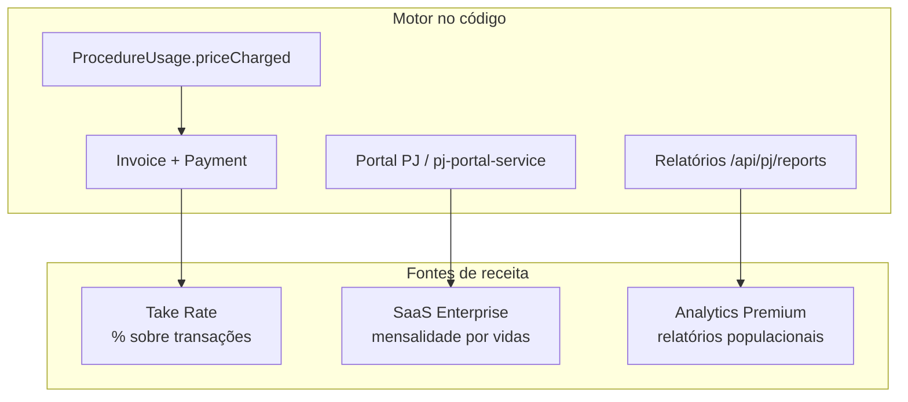

# Estratégia de Monetização — Sistema Bibi

Documento que descreve **onde o ServiceOS gera receita**, alinhado ao posicionamento
de infraestrutura financeira e clínica para saúde corporativa Pay Per Use.

> **Contexto de mercado:** [`pesquisa/09-sintese-consultor-senior.md`](pesquisa/09-sintese-consultor-senior.md) ·
> **Motor de cobrança (implementação):** [`PAYMENTS.md`](PAYMENTS.md) ·
> **Roadmap:** [`pesquisa/03-estrategia-produto-posicionamento.md`](pesquisa/03-estrategia-produto-posicionamento.md)

---

## Visão geral

O Bibi monetiza em três camadas complementares — não como corretora de planos nem
apenas como ERP clínico, mas como **sistema operacional** que processa transações
reais de saúde corporativa:

---

## 1. Take Rate — 0,5% a 2% sobre transações

**O quê:** percentual cobrado sobre cada transação processada pelo motor de
cobrança (consultas, exames e demais procedimentos Pay Per Use). Faixa comercial
recomendada: **0,5% a 2%** do valor transacionado, configurável por tenant.

**Como funciona na POC:**

1. Prestador registra procedimento → `ProcedureUsage` com `priceCharged` congelado.
2. Interno fecha `Invoice` + `InvoiceItem` vinculados ao uso (`invoice-service.ts`).
3. Pagamento via PIX (mock ou gateway real) → `Payment` confirmado (`charge-service.ts`).
4. A plataforma retém uma fração configurável do valor transacionado.

**Componentes técnicos:**

| Camada | Arquivo | Papel |
|--------|---------|-------|
| Snapshot de preço | `src/lib/pricing.ts` | `computePrice()` antes do registro |
| Faturamento | `src/lib/invoice-service.ts` | Invoice, PIX, marcar PAGA |
| Gateway | `src/lib/payments/charge-service.ts` | Strategy Pattern por `PAYMENT_GATEWAY` |
| Persistência | `Payment` (Prisma) | Histórico por fatura |

**Exemplo comercial (500 vidas, ~7% uso, consulta R$ 340):** volume transacionado
~R$ 11.560/mês; take rate de 1% ≈ R$ 116 — somado à taxa de plataforma compõe
a receita do ServiceOS sem inflar o custo do cliente (ROI ~91% vs plano tradicional
de R$ 175.000/mês).

---

## 2. SaaS Enterprise — taxa por vida/mês (Portal PJ)

**O quê:** mensalidade escalonada pelo número de beneficiários (vidas) geridos no
**Portal PJ** — independente do uso clínico. Modelo típico: **R$ X/vida/mês** ou
pacote fixo por faixa de colaboradores.

**Proposta de valor para o RH/CFO:**

- Acesso ao Portal Empresa: contratos, beneficiários, consumo em tempo real.
- Precificação dinâmica visível (descontos corporativos por `PricingRule`).
- White label e multi-tenant para redes e operadoras white-label.

**Referência de precificação (pesquisa 2026):** taxa de plataforma estimada em
**R$ 3.000/mês** para empresas de ~500 vidas — ver
[`pesquisa/09-sintese-consultor-senior.md`](pesquisa/09-sintese-consultor-senior.md).

**Componentes técnicos:**

| Recurso | Onde |
|---------|------|
| Overview corporativo | `GET /api/pj/overview` → `pj-portal-service.ts` |
| Gestão de beneficiários | Portal `/pj` |
| Regras de preço por empresa | `PricingRule` + seed `companies.ts` |

**Modelo sugerido (tiers):**

| Tier | Vidas | Exemplo mensalidade |
|------|-------|---------------------|
| SMB | até 100 | R$ 800–1.500 |
| PME | 100–1.000 | R$ 3.000–8.000 |
| Enterprise | 1.000+ | Sob consulta + SLA |

> Valores são **INFERÊNCIA** de mercado para POC; calibrar com validação comercial.

---

## 3. Analytics Premium — saúde populacional para RH

**O quê:** venda de relatórios avançados de saúde populacional e utilização para
gestores de RH e benefícios — camada acima do dashboard básico do Portal PJ.

**Escopo previsto:**

- Utilização por departamento, faixa etária e tipo de procedimento.
- Tendências de consumo e projeção de custo (Pay Per Use vs capitação).
- Indicadores para negociação com operadoras e auditoria interna.
- Export CSV/BI (`buildPjReportCsv` em `pj-portal-service.ts` como base).

**Status na POC:** relatórios básicos via `/api/pj/reports`; analytics premium
no roadmap Q3/Q4 ([`pesquisa/03-estrategia-produto-posicionamento.md`](pesquisa/03-estrategia-produto-posicionamento.md)).

---

## Alinhamento com o ROI

A combinação das três fontes sustenta o argumento comercial principal:

| Stakeholder | Dor | Monetização que resolve |
|-------------|-----|-------------------------|
| **CFO** | Sinistralidade opaca, reajuste sem explicação | Take rate + Pay Per Use + Price Snapshot |
| **RH** | Falta de visibilidade de uso | SaaS Enterprise (Portal PJ) |
| **Diretoria** | Decisão baseada em achismo | Analytics Premium |

**Cenário 500 vidas (síntese consultor):**

- Plano tradicional: **R$ 175.000/mês**
- Bibi (uso + taxa plataforma): **~R$ 14.500/mês**
- Economia: **~91%** — SaaS enterprise e take rate são linhas explícitas na
  proposta, não embutidas na mensalidade por vida do plano tradicional.

---

## Próximos passos (produto)

1. Parametrizar take rate em configuração por tenant (hoje implícito na POC).
2. Formalizar tiers de SaaS enterprise no Portal PJ (billing de assinatura).
3. Empacotar Analytics Premium como add-on pós-validação comercial (regra 80/20).

Ver também: [`ARQUITETURA.md`](ARQUITETURA.md) (Price Snapshot) ·
[`pesquisa/07-healthos-expansao-2026.md`](pesquisa/07-healthos-expansao-2026.md)
