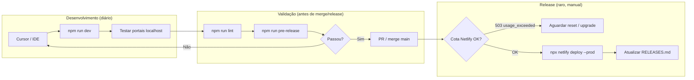

# Operações — Sistema Bibi

Manual único de **como operar** o projeto no dia a dia: desenvolvimento local,
validação de pacotes, publicação em produção, banco de dados e regras para
agentes de IA (Cursor / Cloud Agent).

**Leitura rápida:** [`WORKFLOW_CURSOR.md`](WORKFLOW_CURSOR.md) · **Pacotes:** [`RELEASES.md`](RELEASES.md) · **Deploy:** [`DEPLOY_NETLIFY.md`](DEPLOY_NETLIFY.md)

---

## 1. Mapa de operações



| Operação | Frequência | Quem | Comando / doc |
|----------|------------|------|---------------|
| Setup inicial | Uma vez por VM | Humano ou agente | §2 |
| Desenvolver feature | Diário | Cursor | `npm run dev` |
| Emular Netlify local | Quando usar Blobs | Humano | `npm run netlify:dev` |
| Lint | Antes de PR | Agente | `npm run lint` |
| Validar pacote | Antes de release | Humano ou agente | `npm run pre-release` |
| Publicar produção | **Raro** | **Só humano** | §5 · `DEPLOY_NETLIFY.md` |
| Fechar pacote | Após deploy | Humano | `RELEASES.md` § Publicar |
| Reset banco local | Evitar em agente | Humano | `db:push && db:seed` |

---

## 2. Setup inicial

```bash
git clone https://github.com/Piulres/sistema-bibi.git
cd sistema-bibi
cp .env.example .env          # se não existir
npm install                     # postinstall → prisma generate
npm run db:push && npm run db:seed
npm run dev                     # http://localhost:3000
```

| Variável | Padrão POC | Uso |
|----------|------------|-----|
| `DATABASE_URL` | `file:./dev.db` | SQLite local |
| `SEED_SCALE` | `medium` | `small` \| `medium` \| `large` |
| `PAYMENT_GATEWAY` | `mock` | PIX mock |
| `COMMUNICATION_PROVIDER` | `console` | E-mail no terminal |

Credenciais demo: senha **`bibi123`** — tabela completa em [`README.md`](../README.md) e `AGENTS.md`.

---

## 3. Scripts npm (referência)

| Script | O que faz | Quando usar |
|--------|-----------|-------------|
| `npm run dev` | Next.js dev server (:3000) | Desenvolvimento diário |
| `npm run netlify:dev` | Netlify Dev (:8888 → :3000) | Testar Blobs, headers, proxy |
| `npm run lint` | ESLint | Antes de PR |
| `npm run build` | `next build` | Build Next puro |
| `npm run netlify:build` | `db:push` + seed + `next build` | Mesmo pipeline do CI Netlify |
| `npm run pre-release` | lint + `netlify:build` | **Validar pacote sem publicar** |
| `npm run db:push` | Sincroniza schema SQLite | Após mudar `schema.prisma` |
| `npm run db:seed` | Popula massa demo | Após push ou banco vazio |
| `npm run db:reset` | `--force-reset` + seed | **Bloqueado para agentes** |

---

## 4. Operações de desenvolvimento

### 4.1 Branch e PR

1. Branch: `cursor/<descricao>-3ecd` (Cloud Agent) ou feature local.
2. Codar e testar com `npm run dev`.
3. `npm run lint` antes de abrir PR.
4. **Não** incluir deploy na PR — merge na `main` não publica produção.

### 4.2 Testar fluxos localmente

| Portal | URL | Login demo |
|--------|-----|------------|
| Landing | http://localhost:3000/ | — |
| Prestador | `/login` | `dra.helena@bibi.health` |
| Interno | `/interno/login` | `faturamento@bibi.health` |
| PJ | `/pj/login` | `rh@techcorp.com` |
| Beneficiário | `/beneficiario/login` | `joao.pereira@email.com` |
| VitaCare WL | `/interno/login` | `operacao@vitacare.demo` |

Evidências gravadas: [`evidencias/README.md`](evidencias/README.md). Fluxos detalhados: [`FLUXOS.md`](FLUXOS.md).

### 4.3 Banco de dados local

| Situação | Comando |
|----------|---------|
| VM nova / sem `dev.db` | `npm run db:push && npm run db:seed` |
| Schema alterado | `npm run db:push` (depois seed se necessário) |
| Recriar do zero | `npm run db:reset` — **só humano** (agentes bloqueados) |

---

## 5. Operações de release (pacote fechado)

Produção **não** acompanha cada merge. Só sobe quando você fecha um pacote.

### 5.1 Ciclo de vida do pacote

```
main acumula commits → pre-release OK → deploy manual → RELEASES.md atualizado
```

| Estado | Onde ver | Significado |
|--------|----------|-------------|
| Em produção | `RELEASES.md` → Pacote em produção | O que está (ou estava) no ar |
| Pendente | `RELEASES.md` → Próximo pacote | `main` ainda não publicada |
| Validado | `npm run pre-release` passou | Pronto para publicar, mas não publicado |

### 5.2 Checklist — publicar pacote

- [ ] `git checkout main && git pull`
- [ ] `npm run pre-release` — sem erros
- [ ] Cota Netlify: `curl` não retorna `503 usage_exceeded`
- [ ] `npx netlify deploy --prod --message "bibi-poc-YYYY-MM-DDx: resumo"`
- [ ] Smoke test: landing + um login por portal
- [ ] Atualizar [`RELEASES.md`](RELEASES.md) (mover rascunho → produção)
- [ ] Commit: `docs(release): fecha pacote bibi-poc-YYYY-MM-DDx`
- [ ] (Opcional) Tag git: `git tag -a bibi-poc-...`

### 5.3 Convenção de nome

```
bibi-poc-AAAA-MM-DD[a|b|c]
```

Exemplo atual em produção: `bibi-poc-2026-06-22a` (`beeb894`). Pendente: `bibi-poc-2026-06-22b` (`158b69f`).

---

## 6. Operações Netlify

| Operação | Comando / local | Notas |
|----------|-----------------|-------|
| Validar build CI | `npm run pre-release` | Não publica |
| Preview | `npx netlify deploy` | Não afeta produção |
| Produção | `npx netlify deploy --prod` | **Só com pedido explícito** |
| Parar gasto de cota | Painel → **Stop builds** | Desliga CI no push |
| Env vars | Painel → Site settings | `SESSION_SECRET`, `CRON_SECRET` obrigatórios |
| Troubleshooting | [`DEPLOY_NETLIFY.md`](DEPLOY_NETLIFY.md) | 503, Prisma, Blobs |

**Produção:** https://sistema-bibi.netlify.app

**Status conhecido (22/06/2026):** `503 usage_exceeded` — cota esgotada, não é bug de código.

---

## 7. Operações para agentes de IA

Regras obrigatórias para Cursor, Cloud Agent e assistentes. Detalhes também em
`.cursor/rules/operacoes-bibi.mdc` e `AGENTS.md`.

### 7.1 Sempre fazer

| Ação | Motivo |
|------|--------|
| Ler `AGENTS.md` e `docs/OPERACOES.md` | Contexto do projeto |
| `npm run dev` / testes locais | Validar sem custo |
| `npm run lint` antes de finalizar | Qualidade |
| `npm run pre-release` se pedirem “validar release” | Sem publicar |
| Usar `db:push && db:seed` em VM nova | `db:reset` é bloqueado |
| Consultar `RELEASES.md` para saber o que está em produção | Fonte única |

### 7.2 Nunca fazer (salvo pedido explícito)

| Ação | Motivo |
|------|--------|
| `npx netlify deploy --prod` | Queima cota + tokens |
| Loop de `curl` em produção | 503 = cota, não bug |
| Tratar `503 usage_exceeded` como regressão | Plano Netlify |
| `npm run db:reset` | Bloqueado / destrutivo |
| Atualizar `RELEASES.md` como “publicado” sem confirmação | Deploy foi manual |
| Upgrade Prisma 7 | Quebra schema atual |

### 7.3 Árvore de decisão — “produção fora”

```
curl produção
├── 503 + usage_exceeded → informar usuário (cota); continuar dev local
├── 502/500 → ver DEPLOY_NETLIFY.md; NÃO deploy automático
└── 200 → OK; não redeployar sem pedido
```

### 7.4 Árvore de decisão — “validar antes de subir”

```
Pedido de validação
├── Só código?     → npm run lint && npm run build
├── Pacote Netlify? → npm run pre-release
└── Publicar?      → só se usuário disse explicitamente "deploy" / "publicar"
```

---

## 8. Operações de documentação

| Quando | Atualizar |
|--------|-----------|
| Fechar pacote em produção | `docs/RELEASES.md` |
| Mudar fluxo de deploy | `DEPLOY_NETLIFY.md`, `WORKFLOW_CURSOR.md`, este arquivo |
| Nova feature de negócio | `FLUXOS.md`, `README.md` se necessário |
| Preferências de IA | `AGENTS.md`, `.cursor/rules/operacoes-bibi.mdc` |
| Base RAG / NotebookLM | `NOTEBOOKLM.md` |
| Auditoria de PRs/deploys | `HISTORICO_2026-06-21.md` ou novo histórico datado |

---

## 9. Matriz operação × ambiente

| Operação | Local (`dev`) | `netlify:dev` | Produção Netlify |
|----------|---------------|---------------|------------------|
| Codar / debug | ✅ | ✅ | ❌ agente |
| SQLite persistente | ✅ | ✅ | ❌ efêmero `/tmp` |
| Logos white-label | filesystem | Blobs | Blobs |
| PIX / e-mail | mock / console | mock / console | mock / console |
| Validar build | `pre-release` | `pre-release` | — |
| Publicar | — | — | CLI manual |

---

## 10. Links

| Documento | Conteúdo |
|-----------|----------|
| [`WORKFLOW_CURSOR.md`](WORKFLOW_CURSOR.md) | Resumo workflow Cursor |
| [`RELEASES.md`](RELEASES.md) | Pacotes fechados e histórico |
| [`DEPLOY_NETLIFY.md`](DEPLOY_NETLIFY.md) | Netlify técnico + troubleshooting |
| [`FLUXOS.md`](FLUXOS.md) | Fluxos de negócio |
| [`HISTORICO_2026-06-21.md`](HISTORICO_2026-06-21.md) | Auditoria PRs #1–#39 |
| [`evidencias/README.md`](evidencias/README.md) | Vídeos e screenshots |
| [`AGENTS.md`](../AGENTS.md) | Instruções para IA |
| [`.cursor/rules/operacoes-bibi.mdc`](../.cursor/rules/operacoes-bibi.mdc) | Regras Cursor (always apply) |
