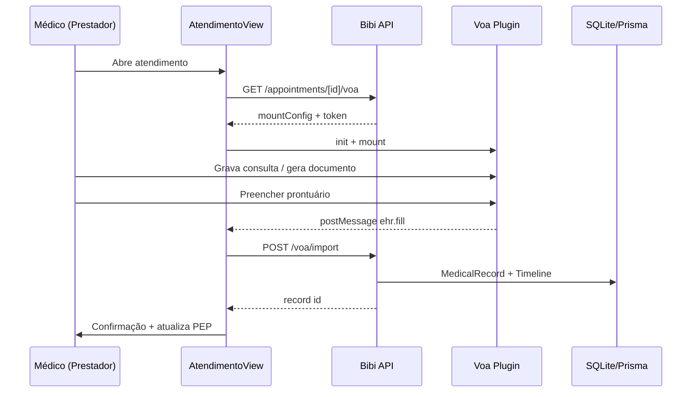

# Plano v1.4.0 — Integração Voa Health

**Versão alvo:** `v1.4.0`  
**Branch:** `cursor/voa-health-integration-0f4a`  
**Base:** `main` (v1.2.0 produção)  
**Documentação:** [`VOA_INTEGRATION.md`](VOA_INTEGRATION.md)

---

## Objetivo

Integrar o assistente de IA da Voa Health ao **portal Prestador** no fluxo de atendimento, permitindo transcrição de consultas e importação automática de anamneses/documentos no PEP do Bibi.

---

## Escopo por fase

### Fase 1 — POC embed ✅ (entregue nesta branch)

| # | Entrega | Critério de aceite |
|---|---------|-------------------|
| 1.1 | `docs/VOA_INTEGRATION.md` | Mapeamento entidades, eventos, LGPD |
| 1.2 | `docs/PLANO_V1_4_VOA.md` | Fases, APIs, testes |
| 1.3 | `src/lib/voa/*` | Config, constantes, mount builder, import service |
| 1.4 | `GET .../voa` | Retorna mount config + token se `VOA_ENABLED` |
| 1.5 | `POST .../voa/import` | Cria `MedicalRecord` + timeline |
| 1.6 | `VoaAssistantPanel` | Carrega plugin, mount, listener `ehr.fill` |
| 1.7 | `AtendimentoView` | Nova aba **Assistente IA** |
| 1.8 | Env vars | `.env.example` + `VARIAVEIS_AMBIENTE.md` |
| 1.9 | Testes | API import + unit config; lint + pre-release |

**Fora da Fase 1:** identify API server-side, tenant config UI, RNDS, billing add-on.

### Fase 2 — Produção clínica

- Proxy `identify` (token efêmero por consulta)
- `structuredOutputSchema` → campos PEP estruturados
- Mapeamento `User.specialty` → template Voa
- Pré-contexto: alergias/crônicos do `PatientClinicalProfile`
- Toggle por tenant em `/interno/integracoes`
- Webhook outbound `MEDICAL_RECORD_CREATED` (se já não existir)

### Fase 3 — Enterprise

- White-label (ocultar marca Voa quando tenant exigir)
- RNDS via API Voa + certificado A1
- Métricas de uso (tempo economizado, docs importados)
- Add-on SaaS “IA clínica” no faturamento interno

---

## Diagrama de sequência (Fase 1)



---

## Arquivos previstos (Fase 1)

```
docs/
  VOA_INTEGRATION.md
  PLANO_V1_4_VOA.md
src/lib/voa/
  constants.ts
  config.ts
  mount.ts
  import-record.ts
src/app/api/prestador/appointments/[id]/voa/
  route.ts
  import/route.ts
src/components/voa/
  VoaAssistantPanel.tsx
src/components/AtendimentoView.tsx          (aba Assistente IA)
src/lib/timeline-constants.ts             (VOA_DOCUMENT_IMPORTED)
tests/
  unit/voa-config.test.ts
  api/voa-import.test.ts
```

---

## Variáveis de ambiente

```env
VOA_ENABLED=false
VOA_INTEGRATION_TOKEN=
# VOA_PLUGIN_SCRIPT_URL=https://integration.voa.health/plugin.js
```

Para testar com sandbox Voa: solicitar token em integration@voahealth.com e definir `VOA_ENABLED=true`.

---

## RBAC e portais

| Portal | Acesso Fase 1 |
|--------|---------------|
| Prestador | ✅ Assistente IA no atendimento |
| Interno | ❌ (config tenant na fase 2) |
| Beneficiário | ❌ |
| PJ | ❌ |

---

## Testes

| Suite | Casos |
|-------|-------|
| `tests/unit/voa-config.test.ts` | enabled/disabled, modality mapping |
| `tests/api/voa-import.test.ts` | POST import cria record; 403 sem prestador; Voa disabled |

**Regressão:** `npm test` (baseline + novos) · `npm run pre-release`

---

## Riscos e mitigações

| Risco | Mitigação |
|-------|-----------|
| Sem token sandbox | UI informa config; import testável via API direta |
| CSP bloqueia script externo | Documentar fallback iframe (fase 1.1) |
| `main` sem v1.3 estoque | Branch parte de `main`; merge em `dev` depois |
| LGPD | Aviso + `consentAt` check (soft warning POC) |

---

## Checklist de release (humano)

- [ ] Token Voa produção no Netlify (secrets)
- [ ] `VOA_ENABLED=true` só em tenants piloto
- [ ] Merge `dev` → `main`, tag `v1.4.0`
- [ ] Atualizar `docs/RELEASES.md` após deploy confirmado

---

## Credenciais demo (fluxo sem Voa real)

1. `VOA_ENABLED=false` — painel exibe instruções de configuração
2. Teste API: `POST /api/prestador/appointments/{id}/voa/import` com body `{ "document": "..." }` como prestador logado
3. Com token Voa: `VOA_ENABLED=true` + aba Assistente IA no atendimento

**Login:** `dra.helena@bibi.health` / `bibi123`
