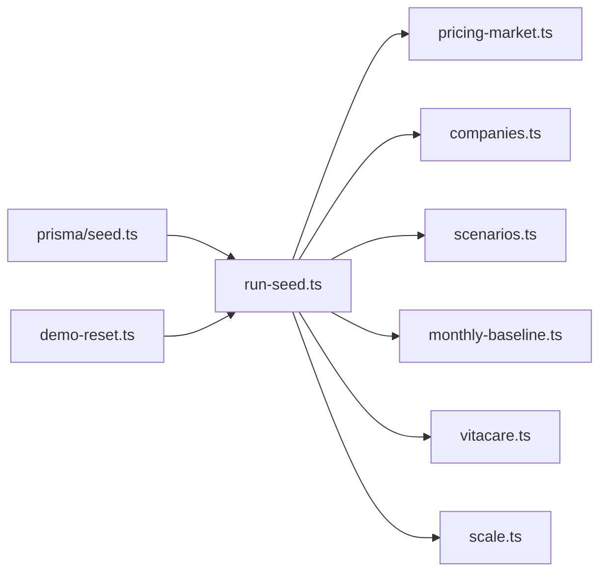

# Massa demo e seed — Sistema Bibi

Referência da **massa de dados de demonstração**: arquitetura dos módulos em
`prisma/seed-data/`, precificação de mercado B2B, escalas de volume e restauração
via UI.

**Comandos:** `npm run db:seed` · `npm run db:push && npm run db:seed` (VM nova)  
**Variáveis:** [`VARIAVEIS_AMBIENTE.md`](VARIAVEIS_AMBIENTE.md) §3 · **Operações:** [`OPERACOES.md`](OPERACOES.md) §4.4

---

## Visão geral

| Etapa | Módulo | Responsabilidade |
|-------|--------|------------------|
| Entrada | `prisma/seed.ts` | Delega para `runDatabaseSeed()` |
| Orquestração | `run-seed.ts` | Limpa tabelas, cria tenant, catálogo, massa operacional |
| Preços e setores | `pricing-market.ts` | Tabela de procedimentos, benefícios corporativos, perfis clínicos |
| Empresas PJ | `companies.ts` | 50 empresas com setor, status CRM e desconto corporativo |
| Cenários | `scenarios.ts` | Agendamentos, usages, PEP, assinaturas por perfil de setor |
| Receita histórica | `monthly-baseline.ts` | 6 meses de faturas corporativas derivadas do porte/setor |
| White-label | `vitacare.ts` | Tenant VitaCare com empresas e beneficiários extras |
| Volume | `scale.ts` | Presets `small` \| `medium` \| `large` via `SEED_SCALE` |
| Restauração | `src/lib/demo-reset.ts` | Reexecuta o seed completo (UI `/interno/seguranca`) |

O seed **apaga todos os dados** do tenant antes de recriar. IDs mudam após cada execução — sessões antigas ficam inválidas.

---

## Precificação de mercado (`pricing-market.ts`)

Tabela alinhada a clínica privada/corporativa BR (referência 2024–2025).

### Procedimentos clínicos

| Código | Nome | Categoria | Base (R$) |
|--------|------|-----------|-----------|
| `CON-CLM` | Consulta Clínica Médica | CONSULTA | 320 |
| `CON-CAR` | Consulta Cardiologia | CONSULTA | 420 |
| `CON-DER` | Consulta Dermatologia | CONSULTA | 380 |
| `CON-PSI` | Consulta Psicologia | CONSULTA | 280 |
| `CON-OFT` | Consulta Oftalmologia | CONSULTA | 350 |
| `EXA-HEM` | Hemograma Completo | EXAME | 48 |
| `EXA-ECG` | Eletrocardiograma | EXAME | 95 |
| `EXA-USG` | Ultrassonografia Abdominal | EXAME | 220 |
| `EXA-RX` | Raio-X Tórax | EXAME | 78 |
| `EXA-GLI` | Glicemia em Jejum | EXAME | 22 |
| `EXA-COL` | Colesterol Total | EXAME | 28 |

### Medicina do trabalho (B2B)

| Código | Nome | Base (R$) |
|--------|------|-----------|
| `OCC-ASO` | ASO — Exame Admissional | 110 |
| `OCC-PCM` | Exame Periódico PCMSO | 85 |
| `OCC-AUD` | Audiometria Ocupacional | 65 |

### Benefícios corporativos (add-on, não plano operadora)

| Produto | Ciclo | Valor (R$) |
|---------|-------|------------|
| Telemedicina 24h | MENSAL | 29,90 |
| Bem-estar mental | MENSAL | 39,90 |
| Check-up programado | TRIMESTRAL | 119,70 |
| Telemedicina particular | MENSAL | 49,90 |

### Desconto corporativo

`PricingRule.multiplier` vem de `SeedCompany.clinicalDiscount` (ex.: TechCorp `0.85` = 15% off). Aplica-se a categorias `CONSULTA` e `OCUPACIONAL` via `chargePrice()` — exames laboratoriais mantêm preço base.

**Exemplo TechCorp:** Consulta Clínica R$ 320,00 × 0,85 = **R$ 272,00** (congelado em `ProcedureUsage` no atendimento).

### Perfis por setor

Cada setor define procedimentos típicos, taxa de telemedicina e motivos de consulta:

| Setor | Procedimentos típicos | Telemedicina |
|-------|----------------------|--------------|
| Tecnologia | clínica, psicologia, painel básico | ~65% |
| Financeiro | clínica, cardio, ECG, check-up | ~35% |
| Varejo | clínica, hemograma, RX, PCMSO | ~20% |
| Indústria | ASO, PCMSO, audiometria, ECG | ~10% |
| Logística | ASO, PCMSO, clínica | ~15% |

`scenarios.ts` usa esses perfis para gerar agendamentos e usages coerentes com o contrato B2B de cada empresa.

---

## Empresas e volume

### `companies.ts`

- **50 empresas PJ** com status CRM (`ATIVO`, `PROPOSTA`, `NEGOCIACAO`, etc.)
- Setores variados (Tecnologia, Financeiro, Indústria, Saúde, Educação…)
- `beneficiaryCount` controla quantos pacientes `generators.ts` cria por empresa
- **TechCorp** (`rh@techcorp.com`) é o caso demo principal do portal PJ

### `SEED_SCALE` (`scale.ts`)

| Escala | Agendamentos | Mensagens | Histórico | VitaCare (empresas) |
|--------|--------------|-----------|-----------|---------------------|
| `small` | 40 | 18 | 90 dias | 5 |
| `medium` *(padrão)* | 120 | 45 | 180 dias | 8 |
| `large` | 280 | 90 | 365 dias | 12 |

CI E2E usa `SEED_SCALE=small` para reduzir tempo de seed. Ver [`TESTES.md`](TESTES.md).

---

## Fluxo demo fixo (João / Maria / Pedro)

Além da massa gerada por setor, `run-seed.ts` mantém três beneficiários com histórico narrativo para E2E e demos manuais:

| Persona | E-mail portal | Empresa | Uso nos fluxos |
|---------|---------------|---------|----------------|
| João Pereira | `joao.pereira@email.com` | TechCorp | Beneficiário — agendamento, PIX, assinatura |
| Maria Silva | *(sem login)* | Banco Horizonte | Histórico clínico e faturamento |
| Pedro Costa | *(sem login)* | Indústria | Saúde ocupacional (ASO/PCMSO) |

Credenciais completas: [`README.md`](../README.md) · [`FLUXOS.md`](FLUXOS.md) §1.

---

## Receita histórica (`monthly-baseline.ts`)

Gera **6 meses** de faturas corporativas fechadas/pagas:

- Total mensal por empresa derivado de `estimateCompanyMonthlyPpu()` (porte + setor), não valor fixo
- Indústria/Construção/Logística: maior peso de itens ocupacionais (~55%)
- Crescimento simulado de ~3% ao mês

Útil para dashboards internos, relatórios PJ e CRM com pipeline realista.

---

## Restaurar demo (produção e local)

| | |
|---|---|
| **UI** | `/interno/seguranca` → “Restaurar estado original do seed” |
| **API** | `POST /api/interno/demo/reset` — body `{ "confirm": "RESTAURAR" }` |
| **Permissão** | Interno **ADMIN** (`faturamento@bibi.health`) |
| **Habilitação** | `isDemoResetEnabled()` em `src/lib/demo-reset.ts` |

**Regras de habilitação:**

1. `ALLOW_DEMO_RESET=true` (ou `1`) → sempre habilitado
2. `ALLOW_DEMO_RESET=false` (ou `0`) → desligado
3. `NETLIFY=true` *(sem flag explícita)* → habilitado na POC Netlify
4. Demais ambientes → habilitado se `NODE_ENV !== production`

Em produção Netlify, `netlify.toml` define `NETLIFY=true` e `ALLOW_DEMO_RESET=true`.

> Após reset, **todas as sessões são invalidadas** (IDs recriados). Faça login novamente.

Testes: `tests/unit/demo-reset.test.ts`

---

## Relação com `src/lib/pricing.ts`

| Camada | Quando |
|--------|--------|
| **Seed** (`chargePrice`, `pricing-market.ts`) | Popula `Procedure.basePrice` e simula descontos na massa |
| **Runtime** (`computePrice`) | Calcula preço no atendimento real com `PricingRule` do banco |

O seed grava `PricingRule` por empresa; o prestador usa `computePrice()` ao registrar `ProcedureUsage` — preço **congelado** no uso.

---

## Referências

- Fluxos de negócio: [`FLUXOS.md`](FLUXOS.md)
- Precificação Pay Per Use: [`ARQUITETURA.md`](ARQUITETURA.md) · `src/lib/pricing.ts`
- Variáveis: [`VARIAVEIS_AMBIENTE.md`](VARIAVEIS_AMBIENTE.md)
- Operações de banco: [`OPERACOES.md`](OPERACOES.md) §4.3–4.4
- Testes: [`TESTES.md`](TESTES.md)
