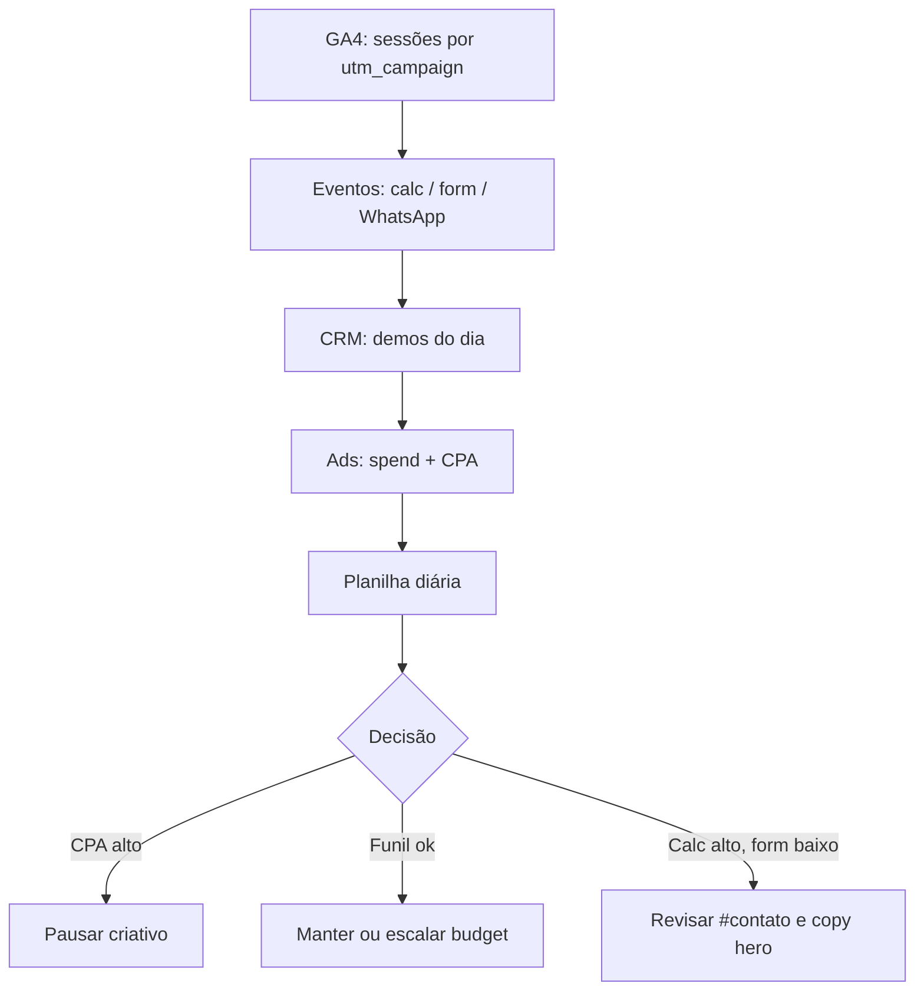

# Análise diária — evolução das campanhas

Ritual operacional para acompanhar **tráfego, intenção e pipeline** das campanhas Q3 2026 do **Sistema Bibi - ServiceOS**.

> **Campanhas:** [`CAMPANHAS_Q3_2026.md`](CAMPANHAS_Q3_2026.md) · **UTM/GTM:** [`../plataforma/MARKETING_CAMPAIGNS.md`](../plataforma/MARKETING_CAMPAIGNS.md) · **Próximos passos release:** [`PROXIMOS_PASSOS.md`](PROXIMOS_PASSOS.md)

---

## Pré-requisitos (configurar uma vez)

### Variáveis Netlify / produção

```env
NEXT_PUBLIC_MARKETING_ENABLED=true
NEXT_PUBLIC_GTM_ID=GTM-XXXXXXX
NEXT_PUBLIC_SALES_WHATSAPP=+5511970828949
```

Opcional: `NEXT_PUBLIC_DEMO_VIDEO_URL`, `NEXT_PUBLIC_META_PIXEL_ID`.

Detalhes: [`../plataforma/VARIAVEIS_AMBIENTE.md`](../plataforma/VARIAVEIS_AMBIENTE.md).

### GTM → GA4 (container mínimo)

| Tag / trigger | Evento dataLayer | Uso na análise |
|---------------|------------------|----------------|
| GA4 Configuration | All Pages | Sessões base |
| GA4 Event | `page_view_enriched` | Tráfego com UTM |
| GA4 Event | `roi_calculator_change` | Engajamento calculadora |
| GA4 Event | `lead_form_submit` | Formulário `#contato` |
| GA4 Event | `cta_whatsapp_click` | Intenção alta |
| GA4 Event | `cta_demo_click` | Demo self-service |
| GA4 Event | `segment_landing_view` | Página `/segmentos/*` |

**Variáveis dataLayer recomendadas no GTM:** `utm_source`, `utm_medium`, `utm_campaign`, `utm_content`, `cta_location`, `segment`, `eligible`, `utilization_pct`, `savings_pct`, `page_path`.

Validar com **GTM Preview** antes de veicular. Código: [`src/lib/marketing/data-layer.ts`](../../src/lib/marketing/data-layer.ts).

### CRM / planilha (fonte da verdade para demos)

O produto **não** grava demo qualificada automaticamente. Use:

- HubSpot / Notion / Google Sheets — template: [`templates/planilha-campanhas-diaria.csv`](templates/planilha-campanhas-diaria.csv)

**KPI norte:** demos **qualificadas** por nicho (meta ~25–30 / 60 dias — ver campanhas).

---

## Ritual diário (~15 minutos)

### Passo 1 — Tráfego (GA4)

**Caminho:** Relatórios → Aquisição → Aquisição de tráfego.

**Filtros:**

- `utm_campaign` contém `q3-2026` (ou `medical-q3-2026`, `vet-q3-2026`, …)
- Período: **ontem** + comparar **últimos 7 dias**

**Anotar por nicho ativo:**

| Métrica | Ontem | 7 dias | Observação |
|---------|-------|--------|------------|
| Sessões | | | |
| Usuários | | | |
| Taxa de engajamento | | | |
| Principais `utm_source` | | | linkedin / google / email |
| Melhor `utm_content` | | | hero / cta-roi / cta-contato |

### Passo 2 — Funil de intenção (GA4 → Exploração → Funil)

Ordem sugerida de eventos:

```text
page_view_enriched
  → roi_calculator_change
  → lead_form_submit  OU  cta_whatsapp_click
  → (manual CRM) demo_agendada
```

**Taxas de referência (INFERÊNCIA — calibrar na 1ª semana):**

| Etapa | Meta orientativa |
|-------|------------------|
| Sessão → calculadora | ≥ 15% |
| Sessão → form ou WhatsApp | ≥ 8% |
| Form/WhatsApp → demo no CRM | ≥ 10% |

**Relatório alternativo:** Exploração → Eventos → filtrar nomes acima → segmentar por parâmetro `segment` (MEDICAL, VET, …).

### Passo 3 — Pipeline (CRM / planilha)

Atualizar **cada lead do dia**:

| Campo | Exemplo |
|-------|---------|
| `data` | 2026-06-27 |
| `nicho` | MEDICAL |
| `utm_source` / `utm_campaign` / `utm_content` | linkedin / medical-q3-2026 / cta-roi |
| `empresa` | Acme Ltda |
| `elegiveis` | 450 |
| `estagio` | lead \| demo_agendada \| demo_feita \| sql \| piloto |
| `qualificada` | sim / não |
| `notas` | CFO + RH na call |

### Passo 4 — WhatsApp (2 min)

Mensagens do formulário incluem contexto UTM (via [`utm.ts`](../../src/lib/marketing/utm.ts)). Contar:

- Conversas novas com bloco `[Campanha: …]`
- Cruzar com `lead_form_submit` no GA4 (deve ser próximo)

### Passo 5 — Mídia paga (se ativa)

| Plataforma | Métricas diárias | Ação se… |
|------------|------------------|----------|
| LinkedIn Ads | Impressões, CPC, leads, spend | CPA demo &gt; R$ 400 → pausar criativo |
| Google Ads | CTR, termos, conversões | Termo irrelevante → negativar |
| Meta remarketing | Frequência, CPA | Frequência &gt; 5 → refresh criativo |

**CPA demo** = spend ÷ demos **qualificadas** no CRM (não cliques).

### Passo 6 — Registrar na planilha diária

Uma linha por nicho ativo — ver CSV template.

---

## Rotina semanal (sexta, +30 min)

1. Comparar **7d vs 7d anterior** (sessões, conversões, spend).
2. Ranking de `utm_content` — escalar vencedor, pausar perdedor.
3. Analisar `roi_calculator_change`: `segment` + `savings_pct` médio → ajustar copy.
4. Revisar demos não qualificadas — padrão de objeção?
5. Decidir **uma** variável A/B para a semana seguinte (assunto e-mail, criativo, CTA).
6. Atualizar notas em [`CAMPANHAS_Q3_2026.md`](CAMPANHAS_Q3_2026.md) ou wiki interna.

---

## Dashboards sugeridos (GA4)

### Exploração livre — dimensões úteis

| Dimensão | Parâmetro / evento |
|----------|-------------------|
| Campanha | `utm_campaign` (via page_view_enriched ou session) |
| Nicho | `segment` em roi_calculator_change / lead_form_submit |
| Criativo | `utm_content` |
| Canal | `utm_source` + `utm_medium` |
| Local CTA | `cta_location` |

### Metas GA4 (opcional)

| Conversão | Evento |
|-----------|--------|
| Micro — calculadora | `roi_calculator_change` |
| Macro — lead | `lead_form_submit` |
| Macro — WhatsApp | `cta_whatsapp_click` |

Marcar `lead_form_submit` e `cta_whatsapp_click` como **conversões principais** para relatórios de aquisição.

---

## Limitações atuais (honestidade)

| Lacuna | Workaround |
|--------|------------|
| Demo qualificada sem evento GTM | CRM manual |
| Tags desligadas por padrão | `MARKETING_ENABLED=false` até ativar |
| Sem banner LGPD (CMP) | Fase 2 — ativar tags após política de cookies |
| UTMs só na sessão (`sessionStorage`) | Primeira página da visita deve ter UTM na URL |
| Produção pode estar atrás da `dev` | Validar versão em [`RELEASES.md`](../versoes/RELEASES.md) antes de analisar |

---

## Fluxo visual



---

## Referência rápida — eventos implementados

| Evento | Dispara quando | Payload relevante |
|--------|----------------|-----------------|
| `page_view_enriched` | Page load com UTM | `utm`, `page_path` |
| `roi_calculator_change` | Slider/preset calculadora | `segment`, `eligible`, `utilization_pct`, `savings_pct` |
| `lead_form_submit` | Submit `#contato` | `segment`, `utm` |
| `cta_whatsapp_click` | Clique WhatsApp | `cta_location`, `utm` |
| `cta_demo_click` | Demo / Swagger | `cta_location` |
| `cta_portals_click` | Explorar portais | `cta_location` |
| `segment_landing_view` | `/segmentos/[slug]` | `segment_slug`, `niche` |

---

## Manutenção deste doc

Atualizar quando:

- Novos eventos forem adicionados em `data-layer.ts`
- Metas de campanha mudarem em `CAMPANHA_*_Q3_2026.md`
- GTM/GA4 property for recriada

Rodar `npm run docs:verify` após editar.
