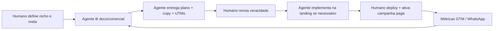

# Papel do agente Cursor em marketing e captação

O que o **agente de IA** pode fazer pelo time comercial do ServiceOS — e o que continua sendo responsabilidade humana.

> **Prompt para campanhas:** [`PROMPT_CAMPANHAS_MARKETING.md`](PROMPT_CAMPANHAS_MARKETING.md)

---

## O agente PODE ajudar

| Área | Exemplos concretos |
|------|-------------------|
| **Estratégia e pesquisa** | Ler benchmarks, COMERCIAL.md por nicho, sintetizar ICP/dor/concorrentes |
| **Copy e conteúdo** | Headlines, posts LinkedIn, e-mails outbound, scripts de demo, FAQs comerciais |
| **Landing e produto** | Hero por UTM, calculadora ROI, comparativo, formulário lead→WhatsApp, seções da home |
| **UTM e tracking** | Montar URLs, documentar dataLayer, estruturar eventos GTM |
| **Battle cards** | Tabela ServiceOS vs. plano fechado vs. mercado (com tags FATO/INFERÊNCIA) |
| **Documentação** | Plano homepage, prompts de campanha, atualizar `docs/comercial/` |
| **Validação local** | `npm run dev`, lint, testes unitários, gravação de evidências na VM |
| **PR para `dev`** | Implementar melhorias de captação em branch `cursor/*` |

---

## O agente NÃO faz (sem pedido explícito)

| Área | Motivo |
|------|--------|
| **Gastar budget de mídia** | Sem acesso a contas Meta/Google/LinkedIn Ads |
| **Publicar em redes sociais** | Sem credenciais das contas da marca |
| **Deploy em produção** | Política do projeto — deploy manual humano após `pre-release` |
| **Garantir leads ou ROI comercial** | Resultado depende de mercado, preço e execução humana |
| **Prometer features inexistentes** | Deve cruzar com código e `MODULOS_COMUNS.md` |
| **Inventar depoimentos de clientes** | Usar apenas cenários POC rotulados ou clientes reais confirmados |

---

## Fluxo recomendado humano + agente

---

## Como pedir ajuda (exemplos)

1. *"Use PROMPT_CAMPANHAS_MARKETING.md para montar campanha VET no LinkedIn — só orgânico."*
2. *"Escreva battle card ServiceOS vs. Gympass para nicho SPA."*
3. *"Ajuste hero para utm_segment=dental com copy do COMERCIAL.md."*
4. *"Roteiro demo 20 min para CFO saúde — credenciais em AGENTS.md."*

---

## Veracidade comercial

O agente deve seguir a política em [`README.md`](README.md#política-de-veracidade):

- **FATO** — feature no código ou demo seed.
- **INFERÊNCIA** — projeções de ROI, TAM, scripts — sempre rotular.

Números como ~87% de economia são **cenários modelados** ([`CALCULADORA_ROI.md`](CALCULADORA_ROI.md)), não SLA contratual.

---

## Resposta curta à pergunta "o agente me ajuda com marketing?"

**Sim** — planejamento, copy, landing, UTMs, documentação e implementação técnica de captação.

**Parcialmente** — execução de campanhas pagas, publicação social e resultados comerciais exigem você (ou time humano) com contas, budget e deploy.
