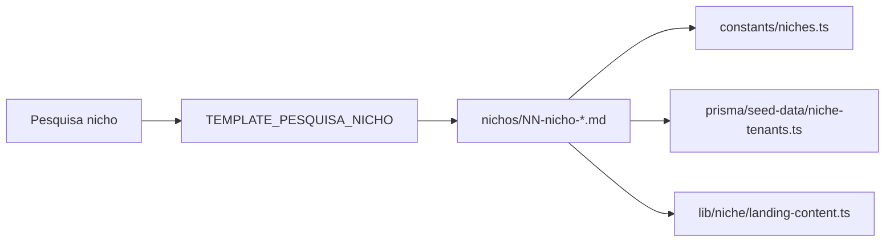

# Pesquisa por nicho — ServiceOS v2.0

Relatórios de **Deep Research** por vertical, alimentando dicionários de labels, preços do seed e benchmarks competitivos.

| Doc | Nicho | Foco |
|-----|-------|------|
| [`10-nicho-vet.md`](10-nicho-vet.md) | `VET` (PetOS) | Banho/tosa, consultas, auxílio pet corporativo |
| [`11-nicho-legal.md`](11-nicho-legal.md) | `LEGAL` (LawOS) | Hora técnica, LegalTechs, faturamento jurídico |
| [`12-nicho-dental.md`](12-nicho-dental.md) | `DENTAL` | Limpeza, canal, Pay Per Use vs plano odontológico |
| [`13-nicho-education.md`](13-nicho-education.md) | `EDUCATION` (EduOS) | Mentorias, aulas particulares, infoprodutos |
| [`14-nicho-spa.md`](14-nicho-spa.md) | `SPA` | Bem-estar corporativo, massagens, yoga |

**Template:** [`../TEMPLATE_PESQUISA_NICHO.md`](../TEMPLATE_PESQUISA_NICHO.md)  
**Índice geral:** [`../README.md`](../README.md)  
**Código canônico labels:** [`../../src/constants/niches.ts`](../../src/constants/niches.ts)

## Fluxo de integração

1. Pesquisar (web, entrevistas, tabelas de preço).
2. Preencher relatório com FATO / INFERÊNCIA.
3. Validar labels com stakeholders do nicho.
4. Atualizar seed com preços = mediana da faixa.
5. Registrar no glossário `AGENTS.md`.
