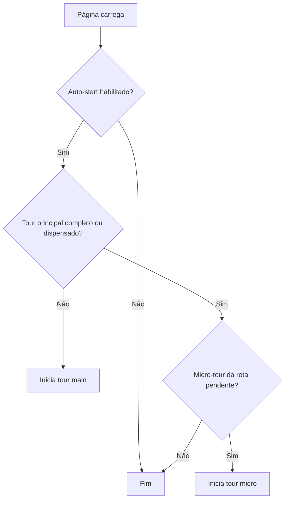

# Onboarding guiado — Product tour nos portais

Guia do **tour de onboarding v3** nos quatro portais autenticados: arquitetura,
comportamento, persistência, testes e como estender passos.

**Versão do tour:** `ONBOARDING_VERSION = 3` (`src/lib/onboarding/types.ts`)

**Pacotes:** v2.2.0 (tour inicial) · v2.3.0 (duas fases + micro-tours + mobile)

---

## 1. O que o usuário vê

| Comportamento | Descrição |
|---------------|-----------|
| **Tour principal** | Na primeira visita ao portal (interno, prestador, beneficiário): passos condensados sobre header, nav e módulos |
| **Micro-tour por rota** | Na primeira visita a cada módulo (ex.: `/interno/agenda`): passos curtos com hotspots em ações-chave |
| **Portal PJ** | Tour **único** (`full`) — sem divisão main/micro |
| **Reinício manual** | Botão **Tour** no header (`OnboardingTrigger`) — zera progresso do portal e recomeça |
| **Labels multi-nicho** | Textos usam `useLabels()` — paciente, pet, obra, cliente… |
| **RBAC interno** | Passos com `module` são filtrados conforme permissões do usuário |

### Modos de tour

| Modo | Quando | Portais |
|------|--------|---------|
| `main` | Primeira visita ao portal | interno, prestador, beneficiário |
| `micro` | Primeira visita a um escopo de rota | interno, prestador, beneficiário |
| `full` | Primeira visita (único tour) | PJ |

Auto-start aguarda **700 ms** após o carregamento da página (`OnboardingProvider`).

---

## 2. Arquitetura

```
PortalShell (Interno / Prestador / PJ / Beneficiário)
  └── OnboardingProvider
        ├── OnboardingTour      ← spotlight + tooltip + hotspots
        └── OnboardingTrigger   ← botão Tour no PortalHeader
```

| Camada | Caminho | Papel |
|--------|---------|-------|
| Provider | `src/components/onboarding/OnboardingProvider.tsx` | Estado, auto-start, modos main/micro/full |
| UI | `src/components/onboarding/OnboardingTour.tsx` | Spotlight, tooltip, progresso, navegação |
| Passos por portal | `src/lib/onboarding/tours/{interno,prestador,pj,beneficiario}.ts` | Re-exportam builders |
| Mapa de features | `src/lib/onboarding/feature-map.ts` | Passos principais + micro-tours por rota |
| Escopo de rota | `src/lib/onboarding/route-scope.ts` | Chave estável por módulo (`interno:agenda`, …) |
| Persistência | `src/lib/onboarding/storage.ts` | `localStorage` → `bibi_onboarding` |
| Auto-start | `src/lib/onboarding/auto-start.ts` | Respeita `NEXT_PUBLIC_DISABLE_ONBOARDING_AUTO` |
| Seletores | `src/lib/onboarding/targets.ts` | `data-tour-id`, `data-tour-nav` |
| Estilos | `src/app/globals.css` | `.onboarding-*` |

### Fluxo de auto-start (interno / prestador / beneficiário)



---

## 3. Persistência (`bibi_onboarding`)

Estrutura em `localStorage`:

```json
{
  "interno": { "completed": true, "version": 3, "completedAt": "…", "dismissed": false },
  "routes": {
    "interno:agenda": { "completed": true, "version": 3, "completedAt": "…" },
    "prestador:atendimento": { "dismissed": true, "version": 3 }
  }
}
```

| Ação | Efeito |
|------|--------|
| Concluir tour principal | `markTourCompleted(portal)` |
| Fechar/pular tour principal | `markTourDismissed(portal)` — **não** auto-inicia de novo |
| Concluir micro-tour | `markRouteTourCompleted(routeKey)` |
| Botão Tour | `resetTour(portal)` — limpa portal + rotas `portal:*` |

**Bump de versão:** ao incrementar `ONBOARDING_VERSION`, usuários com `version` menor recebem o tour novamente.

---

## 4. Escopos de rota (micro-tours)

Chave: `{portal}:{scope}` via `routeStorageKey()`.

| Portal | Escopos (exemplos) |
|--------|-------------------|
| Interno | `dashboard`, `billing`, `agenda`, `cadastros`, `cliente-360`, `seguranca`, … |
| Prestador | `atendimento`, `agenda`, `pacientes`, … |
| Beneficiário | `agendar`, `faturas`, `prontuario`, … |
| PJ | `main`, `projetos` (CONSTRUCTION) |

Resolução: `getRouteScopeKey(portal, pathname)` em `route-scope.ts`.

---

## 5. Hotspots e `data-tour-*`

Preferir seletores estáveis nos componentes:

| Atributo | Uso |
|----------|-----|
| `data-tour-id="portal-header"` | Header do portal |
| `data-tour-id="portal-nav"` | Barra de navegação desktop |
| `data-tour-id="mobile-nav-trigger"` | Botão **Módulos** (mobile) |
| `data-tour-nav="{key}"` | Aba de nav — ex.: `data-tour-nav="agenda"` |
| `data-tour-id="{hotspot}"` | Elemento destacado — ex.: `billing-cliente-360` |

Constantes: `TOUR` em `src/lib/onboarding/targets.ts`.

Passos com `order < 100` → tour principal; `order >= 100` → micro-tour.

---

## 6. Variáveis de ambiente e testes

### Desabilitar auto-start (E2E / CI)

```env
NEXT_PUBLIC_DISABLE_ONBOARDING_AUTO=true
```

Já configurado em `playwright.config.ts`. O botão **Tour** continua funcionando.

### E2E — pular tour sem env

`e2e/helpers/auth.ts` → `skipOnboardingTours(page)` injeta `localStorage` com tours completos (versão 3).

### Testes unitários

```bash
npm run test -- tests/unit/onboarding.test.ts
```

Cobre: `match-route`, `route-scope`, `feature-map`, builders de tours, `storage`.

---

## 7. Como adicionar um passo

1. Marque o elemento alvo com `data-tour-id` ou `data-tour-nav`.
2. Em `feature-map.ts`, adicione um `step({ … })`:
   - `order: 0–99` para tour principal
   - `order: 100+` para micro-tour
   - `route: "/interno/agenda"` ou prefixo com `*`
   - `module: "agenda"` (interno) para respeitar RBAC
3. Se for módulo novo no interno, confirme que `getRouteScopeKey` resolve o escopo.
4. Rode `tests/unit/onboarding.test.ts` e um smoke manual com botão **Tour**.

---

## 8. Limitações conhecidas

| Item | Detalhe |
|------|---------|
| Navegação durante tour | Troca de `pathname` encerra o tour ativo |
| PJ | Sem micro-tours — apenas `full` |
| CONSTRUCTION | Nav beneficiário reduzida (obras, resumo, faturas, histórico) — tours adaptados |
| Wizard de escolha de nicho | **Não** implementado — ver [`JORNADA_CLIENTE.md`](../produto/JORNADA_CLIENTE.md) |

---

## Referências

| Documento | Conteúdo |
|-----------|----------|
| [`../versoes/V2_3.md`](../versoes/V2_3.md) | Changelog onboarding v3 |
| [`../versoes/RELEASES.md`](../versoes/RELEASES.md) | Pacotes v2.2 / v2.3 |
| [`TESTES.md`](TESTES.md) | Mapa de testes onboarding |
| [`VARIAVEIS_AMBIENTE.md`](VARIAVEIS_AMBIENTE.md) | `NEXT_PUBLIC_DISABLE_ONBOARDING_AUTO` |
| [`../produto/JORNADA_CLIENTE.md`](../produto/JORNADA_CLIENTE.md) | Jornada UX nos portais |
