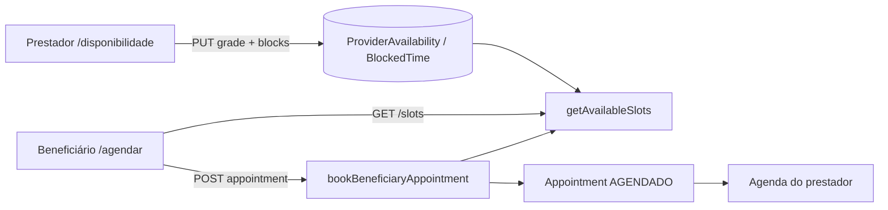

# Disponibilidade do prestador → slots → agendamento

Fluxo completo para o médico/prestador **publicar horários** que o beneficiário (e a atribuição automática) consomem.

## Fluxo

1. Prestador abre `/prestador/disponibilidade`
2. Define dias/horários (ex.: seg–sex 08–12 e 14–18) e duração do slot
3. Opcional: bloqueia almoço/férias
4. Prévia mostra os slots livres do dia
5. Beneficiário em `/beneficiario/agendar` só vê esses horários
6. Ao confirmar, nasce `Appointment` na agenda do prestador

## Fallback

Se o prestador **nunca salvou** grade → padrão POC **08:00–18:00 todos os dias / 30 min** (compatível com o comportamento antigo).

Se salvou grade e um dia não tem janela → **fechado** (zero slots).

## APIs

| Método | Path |
|--------|------|
| GET/PUT | `/api/prestador/availability` |
| GET/POST | `/api/prestador/availability/blocks` |
| DELETE | `/api/prestador/availability/blocks/{id}` |
| GET | `/api/prestador/availability/preview?date=` |

Motor: `src/lib/scheduling-service.ts` + `src/lib/availability/*`.

## Observações

- Interno (`/interno/agenda`) continua podendo agendar em horário livre (recepção); o self-service respeita a grade.
- Calendário externo (Google/Outlook) continua em **mock** por padrão — ver `CALENDAR_INTEGRATION.md`.
