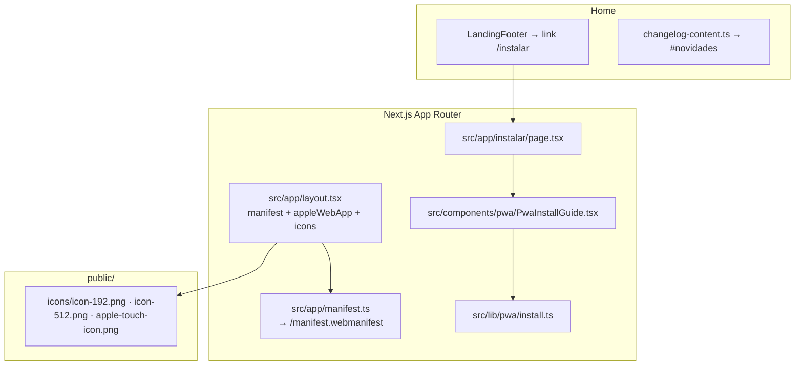

# PWA — ServiceOS v3.0 (app shell mobile)

Guia técnico da **Progressive Web App** introduzida na v3.0.0: manifest
standalone, metas Apple, página de instalação e smoke pós-build.

> **Changelog do pacote:** [`../versoes/V3_0.md`](../versoes/V3_0.md) · **Produção:** [`../versoes/RELEASES.md`](../versoes/RELEASES.md) · **Capacitor (futuro):** [`../../mobile/README.md`](../../mobile/README.md)

---

## Intenção

Permitir que usuários instalem o Sistema Bibi - ServiceOS na tela inicial do
celular (iPhone/Android) e usem os **mesmos quatro portais** em modo
`standalone` — sem barra do navegador e sem App Store.

A v3.0.0 **não** inclui service worker nem cache offline. O foco é o shell
instalável; push e offline ficam para fases posteriores.

---

## Arquitetura (mapa de arquivos)



| Arquivo | Responsabilidade |
|---------|------------------|
| `src/app/manifest.ts` | Web App Manifest (`display: standalone`, ícones 192/512, `start_url: /`) |
| `src/app/layout.tsx` | `manifest`, `appleWebApp`, `apple-mobile-web-app-capable`, `icons.apple` |
| `src/lib/pwa/install.ts` | `PWA_INSTALL_PATH`, `isStandaloneDisplay()` (iOS + `display-mode`) |
| `src/components/pwa/PwaInstallGuide.tsx` | Passo a passo por plataforma (Safari iOS / Chrome Android) |
| `src/app/instalar/page.tsx` | Página pública do guia (`robots: noindex`) |
| `public/icons/*` | Ícones servidos estaticamente pela Netlify |
| `src/components/landing/LandingFooter.tsx` | Link **Instalar app** no rodapé da home |
| `scripts/smoke-netlify-pwa.mjs` | Smoke pós-build no `pre-release` |

**Versão exibida:** `PLATFORM.release` em `src/lib/platform.ts` — title, footer,
`#novidades` e `/instalar` leem da mesma fonte.

---

## Rotas e assets públicos

| URL | Tipo | Notas |
|-----|------|-------|
| `/manifest.webmanifest` | JSON | Gerado por `manifest.ts`; `display` deve ser `standalone` |
| `/instalar` | HTML | Guia de instalação; `noindex` |
| `/icons/icon-192.png` | PNG | Manifest `purpose: any` |
| `/icons/icon-512.png` | PNG | Manifest `any` + `maskable` |
| `/icons/apple-touch-icon.png` | PNG | 180×180 — iOS Add to Home Screen |

A home (`/`) deve incluir no HTML:

- `rel="manifest"` → `/manifest.webmanifest`
- `rel="apple-touch-icon"` → `/icons/apple-touch-icon.png`
- meta `mobile-web-app-capable` e `apple-mobile-web-app-title`

O smoke `scripts/smoke-netlify-pwa.mjs` valida esses trechos automaticamente.

---

## Desenvolvimento local

```bash
npm run dev
# http://localhost:3000/instalar
# http://localhost:3000/manifest.webmanifest
```

| Check manual | Como |
|--------------|------|
| Manifest | `curl -s localhost:3000/manifest.webmanifest \| jq .display` → `"standalone"` |
| Ícones | `curl -I localhost:3000/icons/icon-512.png` → `200` |
| Guia iOS/Android | DevTools → device toolbar → abrir `/instalar` |
| Modo standalone | Só após instalar no dispositivo; `isStandaloneDisplay()` retorna `true` |

**Limitação:** no `npm run dev`, o comportamento de “Adicionar à Tela de Início”
pode diferir do build de produção. Valide sempre com `pre-release` antes de fechar pacote.

---

## Validação no pacote (`pre-release`)

O script `scripts/pre-release.mjs` executa, após `netlify:build`:

```bash
node scripts/smoke-netlify-pwa.mjs
# ou isolado:
npm run smoke:netlify-pwa
```

O smoke:

1. Sobe `next start` em porta livre
2. Verifica HTTP 200 em `/`, `/instalar`, `/manifest.webmanifest`, `/icons/*`, logins
3. Confirma `manifest.display === "standalone"` e `icons.length >= 2`
4. Confirma metas PWA no HTML da home
5. Confirma que um chunk CSS em `/_next/static/` responde 200

Falha aqui indica que o artefato **não** está pronto para Netlify — corrija antes de `netlify deploy --prod`.

---

## Smoke em produção (após deploy)

```bash
BASE=https://sistema-bibi.netlify.app

curl -s "$BASE/manifest.webmanifest" | jq '{display, icons: (.icons|length)}'
curl -s -o /dev/null -w "%{http_code}\n" "$BASE/instalar"
curl -s -o /dev/null -w "%{http_code}\n" "$BASE/icons/apple-touch-icon.png"
curl -s "$BASE/" | rg -o 'rel="manifest"|apple-touch-icon|mobile-web-app-capable'
```

Checklist humano (iPhone):

1. Safari → `https://sistema-bibi.netlify.app/instalar`
2. Compartilhar → **Adicionar à Tela de Início**
3. Abrir o ícone — sem barra do Safari; login nos portais funciona

---

## Troubleshooting

| Sintoma | Causa provável | Ação |
|---------|----------------|------|
| Manifest 404 em produção | Deploy com `--no-build` | Republicar com build integrado — ver [`DEPLOY_NETLIFY.md`](DEPLOY_NETLIFY.md) |
| Ícone genérico no iOS | Falta `apple-touch-icon` ou cache Safari | Confirmar `/icons/apple-touch-icon.png` 200; remover atalho antigo e reinstalar |
| “Instalar app” não aparece no Android | Critérios do Chrome (HTTPS, manifest, SW opcional) | Usar Chrome; manifest com `display: standalone` e ícones 192+512 |
| Guia mostra “já está no modo aplicativo” | `isStandaloneDisplay()` true | Esperado quando aberto pelo ícone instalado |
| Smoke falha no CSS | Build incompleto ou `next start` sem `.next` | Rodar `npm run netlify:build` antes do smoke |
| Title/footer versão errada | `PLATFORM.release` desatualizado | Alinhar `src/lib/platform.ts`, `package.json` e [`LANDING_CHANGELOG.md`](LANDING_CHANGELOG.md) |

---

## O que não está na v3.0.0

| Item | Status |
|------|--------|
| Service worker / cache offline | Planejado (Fase B ou posterior) |
| Web Push | Fora de escopo |
| Scaffold Capacitor (`mobile/`) | Pasta reservada — ver [`../../mobile/README.md`](../../mobile/README.md) |
| Redesign dos portais | Fora de escopo |

---

## Referências

- Operações gerais: [`OPERACOES.md`](OPERACOES.md)
- Deploy Netlify: [`DEPLOY_NETLIFY.md`](DEPLOY_NETLIFY.md)
- Testes (smoke): [`TESTES.md`](TESTES.md)
- Changelog landing: [`LANDING_CHANGELOG.md`](LANDING_CHANGELOG.md)
