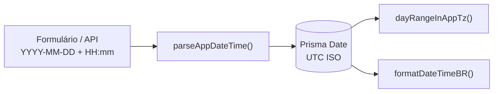

# Fuso operacional — America/Sao_Paulo (BRT)

Guia para desenvolvedores e agentes sobre **como o ServiceOS trata data e hora**.
O fuso operacional é fixo em `America/Sao_Paulo` — independente do fuso do host
(Netlify/Node rodam em UTC).

> **Contexto:** hotfix **v3.0.9** — ver [`../versoes/V3_0.md`](../versoes/V3_0.md) §v3.0.9.

---

## Por que existe

| Ambiente | Fuso do processo | Problema sem `timezone.ts` |
|----------|------------------|----------------------------|
| Dev local (Brasil) | `America/Sao_Paulo` | Parece funcionar — mascara o bug |
| Netlify / CI | UTC | Agenda mostra dia errado após 21h BRT; slots 8h viram 5h; filtros de “hoje” deslocam |

**Regra:** toda data/hora **civil da clínica** (agenda, slots, dashboards, labels, seed)
passa por `src/lib/timezone.ts`. O banco continua armazenando `Date` em UTC (ISO).

---

## Módulo canônico

| Item | Valor |
|------|-------|
| Arquivo | `src/lib/timezone.ts` |
| Constantes | `APP_TIMEZONE = "America/Sao_Paulo"` · `APP_LOCALE = "pt-BR"` |
| Testes | `tests/unit/timezone.test.ts` |

### API pública

| Função | Uso |
|--------|-----|
| `parseAppDateTime(dateISO, timeHM)` | Formulário/API: `YYYY-MM-DD` + `HH:mm` → instante UTC |
| `zonedDateTimeToUtc({ year, month, day, hour, … })` | Componentes civis no fuso da app → UTC |
| `civilDateISO(date?)` | Data civil `YYYY-MM-DD` no fuso da app |
| `civilTimeHM(date?)` | Horário `HH:mm` no fuso da app |
| `startOfDayInAppTz` / `endOfDayInAppTz` | Limites do dia civil (inclusive 23:59:59.999) |
| `dayRangeInAppTz` | `{ from, to, dateISO }` para queries Prisma |
| `shiftCivilDate(dateISO, days)` | Soma dias no calendário civil (não no relógio UTC) |
| `formatDateBR` / `formatTimeBR` / `formatDateTimeBR` | Labels `pt-BR` com `timeZone: APP_TIMEZONE` |

### O que **não** usar

```ts
// ❌ Depende do fuso do host — quebra em Netlify (UTC)
new Date("2026-07-26T09:00:00");
date.toLocaleString("pt-BR");
date.getHours();

// ✅ Horário civil da clínica → UTC
parseAppDateTime("2026-07-26", "09:00");
// → 2026-07-26T12:00:00.000Z

// ✅ Label para o usuário
formatDateTimeBR(new Date("2026-07-26T12:00:00.000Z"));
// → "26/07/2026, 09:00" (em qualquer host)
```

---

## Fluxo de dados



1. **Entrada:** usuário informa data/hora **civil** (ex.: consulta às 09:00 do dia 26).
2. **Persistência:** `parseAppDateTime` ou `zonedDateTimeToUtc` converte para UTC antes do `prisma.*.create`.
3. **Consulta:** filtros “do dia” usam `dayRangeInAppTz` — nunca `new Date(dateISO)` nem `setHours(0,0,0,0)`.
4. **Saída:** labels e exports usam `formatDateBR` / `formatDateTimeBR` / `formatTimeBR`.

---

## Consumidores principais

| Domínio | Arquivo(s) |
|---------|------------|
| Slots beneficiário | `scheduling-service.ts`, `GET /api/beneficiario/slots` |
| Agenda interno/prestador | `appointment-service.ts`, `AgendaView.tsx`, `AppointmentsView.tsx` |
| Lembretes do dia | `reminder-service.ts` (`startOfDayInAppTz` / `endOfDayInAppTz`) |
| Dashboard executivo | `executive-dashboard.ts` |
| Exports PDF/CSV/TXT | `src/lib/exports/*` |
| Assistente (datas relativas) | `assistant/dates.ts`, tools `read.ts` / `write.ts` |
| Seed demo | `prisma/seed-data/helpers.ts`, `cedig-catalog.ts` |

Horário comercial dos slots (POC): **8h–18h BRT**, intervalos de 30 min — ver `scheduling-service.ts`.

---

## Exemplos verificados (testes)

```ts
// 09:00 BRT → 12:00 UTC (offset -03 em jul/2026)
parseAppDateTime("2026-07-26", "09:00").toISOString();
// "2026-07-26T12:00:00.000Z"

// Limites do dia civil 26/07/2026 em BRT
dayRangeInAppTz("2026-07-26");
// from: 2026-07-26T03:00:00.000Z
// to:   2026-07-27T02:59:59.999Z

// 23:30 do dia 26 entra no range; 00:30 do dia 27 não
// 02:00 UTC = 23:00 BRT do dia anterior
civilDateISO(new Date("2026-07-26T02:00:00.000Z")); // "2026-07-25"
```

Rodar: `npx vitest run tests/unit/timezone.test.ts`

---

## Checklist para PRs que tocam data/hora

1. Entrada de formulário → `parseAppDateTime` ou `zonedDateTimeToUtc`.
2. Filtro “hoje” / “dia X” → `dayRangeInAppTz` ou `civilDateISO`.
3. Label na UI ou export → `formatDate*BR` / `formatTimeBR`.
4. Seed com “hoje” / “daqui N dias” → helpers em `prisma/seed-data/helpers.ts`.
5. Teste unitário se a regra for nova ou não coberta por `timezone.test.ts`.

---

## Troubleshooting

| Sintoma | Causa provável | Correção |
|---------|----------------|----------|
| Agenda vazia após 21h BRT em produção | Filtro com `new Date()` / `toLocaleDateString` sem `timeZone` | `civilDateISO` + `dayRangeInAppTz` |
| Slot 09:00 aparece como 06:00 | `getHours()` ou `toLocaleString` sem timezone | `formatTimeBR` / `civilTimeHM` |
| Agendamento 23:30 some do dia | Range UTC em vez de dia civil BRT | `dayRangeInAppTz` |
| Teste passa local, falha no CI | VM em UTC expõe uso de API nativa sem fuso | Importar de `@/lib/timezone` |
| Seed com datas “no passado” em UTC | `new Date()` direto no seed | `helpers.ts` (`todayAt`, `daysAgo`, …) |

---

## Limitações atuais

- Fuso **único** para toda a plataforma — sem `Tenant.timezone` por cliente.
- Horário comercial dos slots é constante (8–18h); feriados e bloqueios avançados ficam fora do escopo deste módulo.
- Brasil sem DST desde 2019; o algoritmo de `zonedDateTimeToUtc` é genérico (duas passagens de offset) para futuras mudanças regulatórias.
