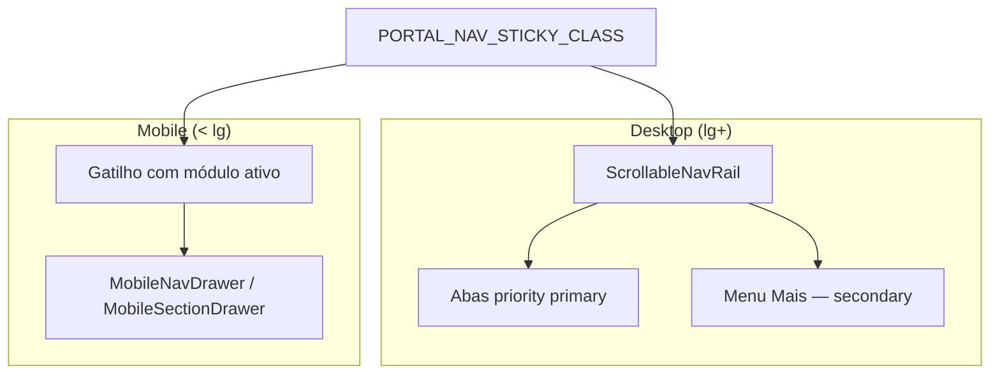

# Arquitetura de Portais — Sistema Bibi - ServiceOS

Mapa hierárquico canônico da plataforma. Implementação em código: `src/lib/platform/structure.ts`.

## Portal Sistema Bibi

```
Portal Sistema Bibi
├── Portal Landing Page
│   ├── /segmentos/saude          → Página Saúde (MEDICAL)
│   ├── /segmentos/veterinaria    → Página Veterinária (VET)
│   ├── /segmentos/odontologia    → Página Odontológica (DENTAL)
│   ├── /segmentos/juridico       → Página Jurídica (LEGAL)
│   ├── /segmentos/bem-estar      → Página Bem-estar (SPA)
│   └── /segmentos/educacao       → Página Educação (EDUCATION)
├── Portal Interno — Administração do Negócio
│   └── Acesso Equipe Administrativa
│       ├── Dashboard
│       ├── Faturamento
│       ├── Agendamento
│       ├── Cadastros
│       └── CRM
├── Portal do Prestador
│   └── Acesso do Prestador
│       ├── Médico / Veterinário / Dentista / Advogado / Instrutor
│       └── Profissionais (todos os prestadores)
├── Portal Empresa — Programa de Beneficiários
│   └── Acesso Corporações, RH & Gestores
│       ├── Contratos
│       ├── Consumo
│       └── Relatórios
└── Portal Beneficiário
    └── Acesso do Cliente Final
        ├── Pacientes (saúde / odonto)
        ├── Tutores (vet)
        ├── Alunos (educação)
        └── Clientes (jurídico / bem-estar)
```

**Mapa interativo:** `/plataforma`

## Site para venda do Sistema Bibi

Página comercial separada da demonstração por segmento: `/venda`

| Seção | Âncora | Conteúdo |
|-------|--------|----------|
| Propósitos | `#propositos` | Por que a plataforma existe |
| Para quem | `#para-quem` | Público-alvo por vertical |
| Missão | `#missao` | Posicionamento e compromisso |
| Valor | `#valor` | ROI e proposta de valor |

## Compatibilidade

- `/?tenant=petcare` e `/?niche=VET` continuam funcionando (legado)
- URLs canônicas por segmento: `/segmentos/[slug]`
- Cookie `bibi_segment` persiste o tenant ao navegar entre páginas

## Navegação dos portais autenticados (v3.0.6)

Implementação compartilhada nos quatro portais (Interno, Prestador, PJ, Beneficiário).



| Componente | Arquivo | Papel |
|------------|---------|-------|
| Abas de rota | `NavTabs.tsx` | Split primary/secondary, menu **Mais**, `shortLabel` até `xl` |
| Faixa rolável | `ScrollableNavRail.tsx` | Scroll horizontal + centraliza aba ativa |
| Drawer mobile | `MobileNavDrawer.tsx` / `MobileSectionDrawer.tsx` | Lista completa de módulos ou seções |
| Wrapper sticky | `portal-nav.ts` | `PORTAL_NAV_STICKY_CLASS` + `data-tour-id="portal-nav"` |
| Nav por portal | `InternoNav.tsx`, `PrestadorNav.tsx`, `BeneficiarioNav.tsx`, `SectionNav.tsx` (PJ) | Montam tabs a partir de `src/lib/navigation/` |

**Regra para novos módulos:** declarar `priority: "secondary"` quando o portal tiver muitas abas (ex.: interno com 14 módulos). Tour onboarding referencia `data-tour-id="portal-nav"` — ver [`ONBOARDING_TOUR.md`](ONBOARDING_TOUR.md).

## Rotas públicas

| Rota | Papel |
|------|-------|
| `/` | Landing do **produto** — visão, valores, segmentos, 4 portais |
| `/segmentos/*` | Landing **por segmento** — como funciona no nicho, switcher, portais segmentados |
| `/plataforma` | Mapa hierárquico da estrutura |
| `/venda` | Site comercial (propósitos, missão, valor) |
| `/interno/login` | Portal Interno |
| `/login` | Portal Prestador |
| `/pj/login` | Portal Empresa |
| `/beneficiario/login` | Portal Beneficiário |
