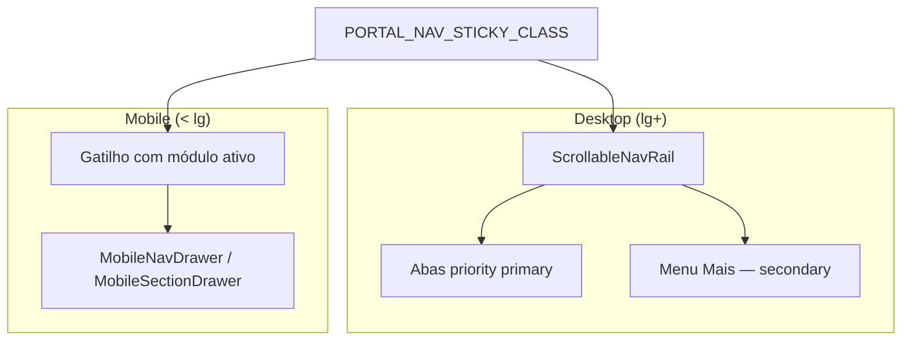

# Arquitetura de Portais — Sistema Bibi - ServiceOS

Mapa hierárquico canônico da plataforma. Implementação em código: `src/lib/platform/structure.ts`.

## Portal Sistema Bibi

```
Portal Sistema Bibi
├── Portal Landing Page
│   ├── /segmentos/saude          → Página Saúde (MEDICAL)
│   ├── /segmentos/veterinaria    → Página Veterinária (VET)
│   ├── /segmentos/odontologia    → Página Odontológica (DENTAL)
│   ├── /segmentos/juridico       → Página Jurídica (LEGAL)
│   ├── /segmentos/bem-estar      → Página Bem-estar (SPA)
│   └── /segmentos/educacao       → Página Educação (EDUCATION)
├── Portal Interno — Administração do Negócio
│   └── Acesso Equipe Administrativa
│       ├── Dashboard
│       ├── Faturamento
│       ├── Agendamento
│       ├── Cadastros
│       └── CRM
├── Portal do Prestador
│   └── Acesso do Prestador
│       ├── Médico / Veterinário / Dentista / Advogado / Instrutor
│       └── Profissionais (todos os prestadores)
├── Portal Empresa — Programa de Beneficiários
│   └── Acesso Corporações, RH & Gestores
│       ├── Contratos
│       ├── Consumo
│       └── Relatórios
└── Portal Beneficiário
    └── Acesso do Cliente Final
        ├── Pacientes (saúde / odonto)
        ├── Tutores (vet)
        ├── Alunos (educação)
        └── Clientes (jurídico / bem-estar)
```

**Mapa interativo:** `/plataforma`

## Site para venda do Sistema Bibi

Página comercial separada da demonstração por segmento: `/venda`

| Seção | Âncora | Conteúdo |
|-------|--------|----------|
| Propósitos | `#propositos` | Por que a plataforma existe |
| Para quem | `#para-quem` | Público-alvo por vertical |
| Missão | `#missao` | Posicionamento e compromisso |
| Valor | `#valor` | ROI e proposta de valor |

## Compatibilidade

- `/?tenant=petcare` e `/?niche=VET` continuam funcionando (legado)
- URLs canônicas por segmento: `/segmentos/[slug]`
- Cookie `bibi_segment` persiste o tenant ao navegar entre páginas

## Navegação dos portais autenticados (v3.0.28)

Implementação compartilhada nos quatro portais (Interno, Prestador, PJ, Beneficiário). Desde **v3.0.28**, abas desktop usam **pills com ícones**; menu **Mais** agrupa módulos secundários por categoria. Drawer mobile (v3.0.7+) abre pela **direita**.



| Componente | Arquivo | Papel |
|------------|---------|-------|
| Abas de rota | `NavTabs.tsx` | Pills com ícones (`nav-icons.tsx`), split primary/secondary, gatilho **Mais** |
| Menu Mais (desktop) | `NavOverflowMenu.tsx` | Dropdown portaled agrupado — Operação / Financeiro / Administração |
| Faixa rolável | `ScrollableNavRail.tsx` | Scroll horizontal + centraliza aba ativa |
| Drawer mobile | `MobileNavDrawer.tsx` / `MobileSectionDrawer.tsx` | Lista completa de módulos ou seções — **painel fixo à direita** (`right-0`, `z-[70]`), overlay `z-[60]` |
| Wrapper sticky | `portal-nav.ts` | `PORTAL_NAV_STICKY_CLASS` + `data-tour-id="portal-nav"` |
| Nav por portal | `InternoNav.tsx`, `PrestadorNav.tsx`, `BeneficiarioNav.tsx`, `SectionNav.tsx` (PJ) | Montam tabs a partir de `src/lib/navigation/` |

**Regra para novos módulos:** declarar `priority: "secondary"` quando o portal tiver muitas abas (ex.: interno com 14 módulos). Tour onboarding referencia `data-tour-id="portal-nav"` — ver [`ONBOARDING_TOUR.md`](ONBOARDING_TOUR.md).

### Checklist — novo módulo de navegação (v3.0.28)

Ao expor uma rota nos portais autenticados, alinhar **definição da aba**, **ícone** e **testes**:

| Passo | Arquivo | O que fazer |
|-------|---------|-------------|
| 1 | `src/lib/navigation/niche-nav.ts` (ou builder do portal) | Adicionar entrada com `key`, `href`, `label`, `shortLabel?`, `group`, `priority` |
| 2 | `src/lib/navigation/nav-icons.tsx` | Registrar SVG em `NAV_ICON_MAP` com a **mesma chave** do `key` da aba |
| 3 | `src/lib/navigation/routes.ts` | Garantir rota canônica e permissões (se interno) |
| 4 | E2E | `e2e/mobile-nav.spec.ts` ou spec do portal — locators em [`TESTES.md`](../plataforma/TESTES.md) §nav |

**Ícones:** `NavModuleIcon` resolve pelo `navKey` da aba. Sem entrada no mapa, cai no ícone genérico `more` (três pontos) — aceitável só como placeholder temporário.

**Grupos no menu Mais:** `NavOverflowMenu` ordena por `GROUP_ORDER` — Operação, Financeiro, Administração, Agenda, Conta, Clínico, Obra. Grupos desconhecidos vão para o fim (ordem alfabética).

**Pin de aba secundária:** quando o usuário abre um módulo `priority: "secondary"` pelo menu **Mais**, a aba ativa fica pinada na faixa principal até trocar de módulo (`hasPinnedSecondary` no overflow).

### Contrato a11y para E2E (v3.0.6)

| Portal | Desktop nav | Drawer mobile (`< lg`) | PJ seções |
|--------|-------------|------------------------|-----------|
| Interno | `navigation` "Navegação por abas" | `navigation` "Módulos internos" | — |
| Prestador | idem | "Módulos do prestador" | — |
| Beneficiário | idem | "Módulos do portal" | — |
| PJ | `SectionNav` faixa | `dialog` "Seções da empresa" | gatilho `aria-controls="mobile-section-drawer"` |

Menu **Mais** (desktop): `button` "Mais" → `menu` "Mais módulos".

**Categorias no drawer (v3.0.7):** tabs com `group` renderizam cabeçalho de categoria como `<p>` (ex.: "Agenda", "Financeiro") e links de módulo como `<a>`. Em E2E, não use `getByText("Agenda")` — o texto aparece duas vezes (categoria + link) e dispara strict mode. Prefira `getByRole("paragraph").filter({ hasText: /^Agenda$/ })` para o cabeçalho e `getByRole("link", { name: "Agenda" })` para navegar. Gatilho: `data-tour-id="mobile-nav-trigger"` (módulo ativo, sem contagem; alvo do tour onboarding).

Helpers interno: `e2e/helpers/auth.ts` (`internoNav`, `expectInternoNavHref`). Demais portais: locators diretos em `e2e/mobile-nav.spec.ts`.

## Rotas públicas

| Rota | Papel |
|------|-------|
| `/` | Landing do **produto** — visão, valores, segmentos, 4 portais |
| `/segmentos/*` | Landing **por segmento** — como funciona no nicho, switcher, portais segmentados |
| `/plataforma` | Mapa hierárquico da estrutura |
| `/venda` | Site comercial (propósitos, missão, valor) |
| `/interno/login` | Portal Interno |
| `/login` | Portal Prestador |
| `/pj/login` | Portal Empresa |
| `/beneficiario/login` | Portal Beneficiário |
