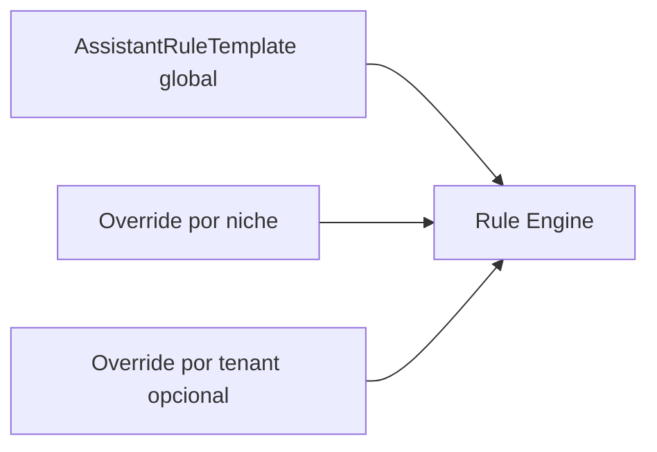

# Assistente — plano de regras, IA e testes de rotina

Documento mestre da evolução do assistente operacional (Fase 0+). Complementa [`ASSISTENTE_SERVERLESS.md`](ASSISTENTE_SERVERLESS.md).

**Decisões (Renan · jul/2026):**

| # | Decisão |
|---|---------|
| 1 | Painel em **`/interno/assistente`** (módulo `assistente`) |
| 2 | Regras: **template global + override por tenant**; vocabulário por **nicho** |
| 3 | **Fase 0 primeiro:** inventário, matriz de testes, schema, RBAC |
| — | Flag **IA no Tenant.settings** (realm), junto das configs do sistema |
| — | IA usa o **fluxo existente** (regras + tools + confirmação) na tomada de decisão |
| — | **RBAC ADMIN** para painel; revisão RBAC global em paralelo |

---

## Dois modos de operação

| Modo | Ativação | Motor | Custo |
|------|----------|-------|-------|
| **Regras** (padrão) | Sempre (`rulesEnabled: true`) | Gatilhos + condições + tools | Baixo |
| **IA** (add-on) | `Tenant.settings.assistant.aiEnabled` + gateway env | LLM → valida via regras → tools | Tokens |

### Pipeline híbrido (modo IA)

```
Mensagem → contexto (portal, página, nicho, RBAC, sessionState)
         → LLM interpreta intenção
         → motor de regras valida/refina
         → tools → draft → confirm (JTI) → actions
```

A IA **não contorna** RBAC, confirmação serverless nem labels de nicho.

---

## Arquitetura de regras (Fase 2–3)



| Camada | Igual entre nichos | Varia |
|--------|-------------------|-------|
| Fluxo | draft → confirm → link | — |
| Tools | `create_appointment`, etc. | extras VET/CONSTRUCTION |
| Gatilhos | Estrutura base | Vocabulário (`consulta` / `atendimento` / `sessão`) |
| RAG | Formato snippet | Conteúdo (`niche-knowledge.ts`) |
| Labels | Chaves `useLabels()` | Valores `Tenant.labels` |

---

## Schema — Tenant.settings

```typescript
type TenantAssistantSettings = {
  aiEnabled: boolean;       // add-on IA — default false
  rulesEnabled: boolean;    // motor regras — default true
  ruleOverrides?: TenantRuleOverride[]; // Fase 2+ — gatilhos por tool
};

type TenantRuleOverride = {
  tool: string;
  addTriggers?: string[];
  removeTriggers?: string[];
  disabled?: boolean;
};

type TenantSettings = {
  assistant: TenantAssistantSettings;
};
```

- **Campo Prisma:** `Tenant.settings` (JSON string)
- **Lib:** `src/lib/tenant/settings.ts` — `parseTenantSettings` / `parseTenantRuleOverrides`
- **Modo efetivo:** `src/lib/assistant/mode.ts` → `resolveAssistantMode(settings)`
- **API:** `GET/PATCH /api/interno/assistant/settings` (módulo `assistente`, write = ADMIN)

---

## Motor de regras (Fase 2 — v3.0.18)

O provider **mock** deixa de usar `MOCK_INTENTS` diretamente. Cada turno resolve regras efetivas e converte para `MockIntentDef` antes do match.

### Resolução em camadas

```
MOCK_INTENTS (globalRuleTemplates)
        ↓ merge gatilhos
niche-overrides.ts (vocabulário por nicho)
        ↓ add/remove/disable por tool
Tenant.settings.assistant.ruleOverrides
        ↓
resolveAssistantRules() → rulesToMockIntents() → mock-match
```

| Camada | Fonte | Efeito |
|--------|-------|--------|
| **Global** | `src/lib/assistant/rules/templates.ts` | Catálogo base (~350 gatilhos) derivado de `mock-intents.ts` |
| **Nicho** | `src/lib/assistant/rules/niche-overrides.ts` | Gatilhos extras por tool (ex.: VET: `pet`, `tutor`, `banho`) |
| **Tenant** | `Tenant.settings.assistant.ruleOverrides` | `addTriggers` / `removeTriggers` / `disabled` por tool |

Regras com `disabled: true` removem a tool do conjunto efetivo. Overrides de gatilho marcam `source: "tenant"` no painel.

### Arquivos do motor

| Arquivo | Papel |
|---------|-------|
| `src/lib/assistant/rules/resolve.ts` | Merge global → nicho → tenant; dedup de gatilhos (NFD) |
| `src/lib/assistant/rules/engine.ts` | `resolveAssistantIntents`, `buildRuleEngineStats` |
| `src/lib/assistant/rules/types.ts` | `AssistantRuleDef`, `TenantRuleOverride`, `RuleEngineStats` |
| `src/lib/assistant/rules/tenant-overrides.ts` | Parse seguro de `ruleOverrides` no JSON |
| `src/lib/assistant/provider/mock-match.ts` | Consome `resolveAssistantIntents(user)` por turno |

### Painel interno

`GET /api/interno/assistant/settings` retorna `rules` com contadores (`globalRules`, `nicheRules`, `tenantOverrides`, `totalTriggers`, `niche`). A UI em `AssistenteConfigView` exibe o bloco **Motor de regras** quando `rulesEnabled=true`.

Toggles disponíveis hoje: `aiEnabled` e `rulesEnabled`. CRUD visual de `ruleOverrides` permanece Fase 3 (persistência já suportada no schema).

### Exemplo de override tenant (JSON em `Tenant.settings`)

```json
{
  "assistant": {
    "aiEnabled": false,
    "rulesEnabled": true,
    "ruleOverrides": [
      { "tool": "count_appointments", "addTriggers": ["agenda do dia", "consultas hoje"] },
      { "tool": "draft_create_user", "disabled": true }
    ]
  }
}
```

### Como validar Fase 2

```bash
npx vitest run tests/unit/assistant-rule-engine.test.ts
npx vitest run tests/unit/assistant-routine-matrix.test.ts
npx vitest run tests/unit/tenant-settings.test.ts tests/unit/assistant-mode.test.ts
npm run lint
```

Manual: login ADMIN → `/interno/assistente` → conferir contadores do motor e toggles IA/regras.

---

## RBAC

### Módulo `assistente` (portal Interno)

| Ação | Perfil |
|------|--------|
| Ver `/interno/assistente` | **ADMIN** |
| Editar flag IA / regras (futuro) | **ADMIN** |
| Usar chat nos portais | Todos (com tools filtradas por perfil) |

### Revisão RBAC global (paralelo)

| Item | Status | Próximo passo |
|------|--------|---------------|
| APIs internas com `requireInternoModule` | 96/96 ✅ | Manter inventário (`rbac-gaps.test.ts`) |
| `requireInternoModuleWrite` generalizado | Parcial | Fechar ~58 rotas mutáveis |
| Tools assistente × perfil interno | ✅ | Estender quando regras forem configuráveis |
| Confirmação JTI + RBAC | ✅ | Manter no modo IA |

---

## Inventário Fase 0

### Tools por portal

| Portal | Leitura | Draft / escrita |
|--------|---------|-----------------|
| **Interno** | KPIs, agenda, receita, devedores, buscas | user, patient, appointment |
| **Prestador** | agenda, pacientes, extrato | — |
| **PJ** | overview, beneficiários, faturas | — |
| **Beneficiário** | resumo, faturas, slots | book appointment |
| **Shared** | explain_capability (ajuda/RAG) | — |

Fonte canônica: `src/lib/assistant/inventory.ts`

### Cenários de rotina

Catálogo: `src/lib/assistant/scenarios.ts` (70+ cenários)

| Categoria | Exemplos |
|-----------|----------|
| `read` | "Quantos agendamentos hoje?", "Receita de ontem" |
| `help` | "Como faturar?", "Como agendar?" |
| `draft` | Agendamento multi-turno, cadastro |
| `rbac` | READONLY bloqueado em drafts |
| `niche` | VET pet+tutor, LEGAL cliente, CONSTRUCTION |
| `error` | Fallback humanizado |

Testes: `tests/unit/assistant-scenarios.test.ts`, `tests/unit/assistant-routine-matrix.test.ts`

---

## Matriz de testes de rotina

```
Portais:  interno | prestador | pj | beneficiario
Nichos:   MEDICAL | VET | DENTAL | LEGAL | SPA | EDUCATION | CONSTRUCTION
Perfis:   ADMIN | FATURAMENTO | RECEPCAO | READONLY (interno)
Fluxos:   read | help | draft | confirm | rbac | niche | fallback
Modo:     rules | ai (flag tenant + gateway)
```

Helper: `buildRoutineMatrix()` em `inventory.ts`

---

## Fases de entrega

| Fase | Escopo | Status |
|------|--------|--------|
| **0** | Inventário, matriz testes, `Tenant.settings`, RBAC `assistente`, stub `/interno/assistente` | ✅ Este pacote |
| **1** | Flag IA persistida + UI toggle (ADMIN) | ✅ Parcial (API + toggle) |
| **2** | Modelo de regras + engine substituindo/complementando `mock-intents` | ✅ v3.0.18 |
| **3** | Painel CRUD regras + preview + templates por nicho | ⏳ Parcial (stats + toggles; overrides só via JSON) |
| **4** | IA híbrida completa (LLM → regras → tools) | ⏳ |
| **5** | RBAC write guards generalizados | ⏳ Paralelo |

---

## Arquivos canônicos

| Arquivo | Papel |
|---------|-------|
| `src/lib/assistant/inventory.ts` | Inventário tools + matriz |
| `src/lib/assistant/scenarios.ts` | Cenários de rotina |
| `src/lib/assistant/mode.ts` | Resolução rules vs IA |
| `src/lib/assistant/rules/engine.ts` | Entrada do motor — intents + stats |
| `src/lib/assistant/rules/resolve.ts` | Merge global → nicho → tenant |
| `src/lib/assistant/rules/niche-overrides.ts` | Vocabulário por nicho |
| `src/lib/assistant/rules/tenant-overrides.ts` | Parse de `ruleOverrides` |
| `src/lib/tenant/settings.ts` | Settings do realm |
| `src/app/interno/assistente/page.tsx` | Painel ADMIN |
| `src/app/api/interno/assistant/settings/route.ts` | API config |
| `docs/produto/ASSISTENTE_SERVERLESS.md` | Arquitetura serverless |

---

## Como validar Fase 0

```bash
npm run db:push          # Tenant.settings
npx vitest run tests/unit/assistant-routine-matrix.test.ts
npx vitest run tests/unit/assistant-rule-engine.test.ts
npx vitest run tests/unit/tenant-settings.test.ts tests/unit/assistant-mode.test.ts
npx vitest run tests/unit/assistant-scenarios.test.ts
npm run lint
```

Manual: login ADMIN interno → `/interno/assistente` → ver inventário e toggle IA (se gateway configurado).
