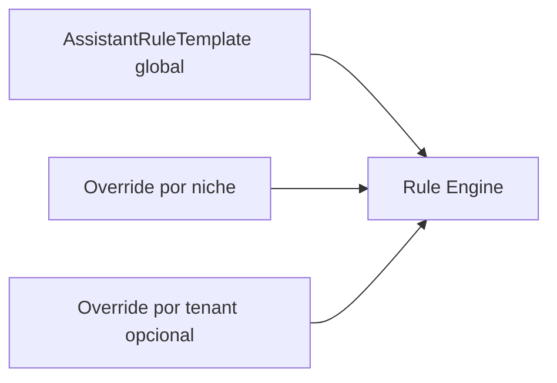

# Assistente — plano de regras, IA e testes de rotina

Documento mestre da evolução do assistente operacional (Fase 0+). Complementa [`ASSISTENTE_SERVERLESS.md`](ASSISTENTE_SERVERLESS.md).

**Decisões (Renan · jul/2026):**

| # | Decisão |
|---|---------|
| 1 | Painel em **`/interno/assistente`** (módulo `assistente`) |
| 2 | Regras: **template global + override por tenant**; vocabulário por **nicho** |
| 3 | **Fase 0 primeiro:** inventário, matriz de testes, schema, RBAC |
| — | Flag **IA no Tenant.settings** (realm), junto das configs do sistema |
| — | IA usa o **fluxo existente** (regras + tools + confirmação) na tomada de decisão |
| — | **RBAC ADMIN** para painel; revisão RBAC global em paralelo |

---

## Dois modos de operação

| Modo | Ativação | Motor | Custo |
|------|----------|-------|-------|
| **Regras** (padrão) | Sempre (`rulesEnabled: true`) | Gatilhos + condições + tools | Baixo |
| **IA** (add-on) | `Tenant.settings.assistant.aiEnabled` + gateway env | LLM → valida via regras → tools | Tokens |

### Pipeline híbrido (modo IA)

```
Mensagem → contexto (portal, página, nicho, RBAC, sessionState)
         → LLM interpreta intenção
         → motor de regras valida/refina
         → tools → draft → confirm (JTI) → actions
```

A IA **não contorna** RBAC, confirmação serverless nem labels de nicho.

---

## Arquitetura de regras (Fase 2–3)



| Camada | Igual entre nichos | Varia |
|--------|-------------------|-------|
| Fluxo | draft → confirm → link | — |
| Tools | `create_appointment`, etc. | extras VET/CONSTRUCTION |
| Gatilhos | Estrutura base | Vocabulário (`consulta` / `atendimento` / `sessão`) |
| RAG | Formato snippet | Conteúdo (`niche-knowledge.ts`) |
| Labels | Chaves `useLabels()` | Valores `Tenant.labels` |

---

## Schema — Tenant.settings

```typescript
type TenantRuleOverride = {
  tool: string;
  addTriggers?: string[];     // gatilhos extras (normalizados, deduplicados)
  removeTriggers?: string[];  // remove gatilhos herdados (global/nicho)
  disabled?: boolean;         // desativa a tool inteira para o tenant
};

type TenantSettings = {
  assistant: {
    aiEnabled: boolean;       // add-on IA — default false
    rulesEnabled: boolean;    // motor regras — default true
    ruleOverrides?: TenantRuleOverride[];  // Fase 3 — omitido quando vazio
  };
};
```

- **Campo Prisma:** `Tenant.settings` (JSON string)
- **Lib:** `src/lib/tenant/settings.ts` · parse/normalize em `src/lib/assistant/rules/tenant-overrides.ts`
- **Modo efetivo:** `src/lib/assistant/mode.ts` → `resolveAssistantMode(settings)`
- **API:** `GET/PATCH /api/interno/assistant/settings` (módulo `assistente`, write = ADMIN)

---

## RBAC

### Módulo `assistente` (portal Interno)

| Ação | Perfil |
|------|--------|
| Ver `/interno/assistente` | **ADMIN** |
| Editar flag IA / regras / `ruleOverrides` | **ADMIN** |
| Usar chat nos portais | Todos (com tools filtradas por perfil) |

### Revisão RBAC global (paralelo)

| Item | Status | Próximo passo |
|------|--------|---------------|
| APIs internas com `requireInternoModule` | 96/96 ✅ | Manter inventário (`rbac-gaps.test.ts`) |
| `requireInternoModuleWrite` generalizado | Parcial | Fechar ~58 rotas mutáveis |
| Tools assistente × perfil interno | ✅ | Overrides por tenant não alteram RBAC de tools |
| Confirmação JTI + RBAC | ✅ | Manter no modo IA |

---

## Inventário Fase 0

### Tools por portal

| Portal | Leitura | Draft / escrita |
|--------|---------|-----------------|
| **Interno** | KPIs, agenda, receita, devedores, buscas | user, patient, appointment |
| **Prestador** | agenda, pacientes, extrato | — |
| **PJ** | overview, beneficiários, faturas | — |
| **Beneficiário** | resumo, faturas, slots | book appointment |
| **Shared** | explain_capability (ajuda/RAG) | — |

Fonte canônica: `src/lib/assistant/inventory.ts`

### Cenários de rotina

Catálogo: `src/lib/assistant/scenarios.ts` (70+ cenários)

| Categoria | Exemplos |
|-----------|----------|
| `read` | "Quantos agendamentos hoje?", "Receita de ontem" |
| `help` | "Como faturar?", "Como agendar?" |
| `draft` | Agendamento multi-turno, cadastro |
| `rbac` | READONLY bloqueado em drafts |
| `niche` | VET pet+tutor, LEGAL cliente, CONSTRUCTION |
| `error` | Fallback humanizado |

Testes: `tests/unit/assistant-scenarios.test.ts`, `tests/unit/assistant-routine-matrix.test.ts`

---

## Matriz de testes de rotina

```
Portais:  interno | prestador | pj | beneficiario
Nichos:   MEDICAL | VET | DENTAL | LEGAL | SPA | EDUCATION | CONSTRUCTION
Perfis:   ADMIN | FATURAMENTO | RECEPCAO | READONLY (interno)
Fluxos:   read | help | draft | confirm | rbac | niche | fallback
Modo:     rules | ai (flag tenant + gateway)
```

Helper: `buildRoutineMatrix()` em `inventory.ts`

---

## Fases de entrega

| Fase | Escopo | Status |
|------|--------|--------|
| **0** | Inventário, matriz testes, `Tenant.settings`, RBAC `assistente`, stub `/interno/assistente` | ✅ Este pacote |
| **1** | Flag IA persistida + UI toggle (ADMIN) | ✅ Parcial (API + toggle) |
| **2** | Modelo de regras + engine substituindo/complementando `mock-intents` | ✅ Este pacote |
| **3** | Painel CRUD regras + preview + templates por nicho | ✅ v3.0.19 |
| **4** | IA híbrida completa (LLM → regras → tools) | ⏳ |
| **5** | RBAC write guards generalizados | ⏳ Paralelo |

---

## Fase 3 — CRUD de `ruleOverrides` (v3.0.19)

Painel em **`/interno/assistente`** (`AssistenteConfigView`) — seção **Regras por tenant**.

### Resolução efetiva (global → nicho → tenant)

```
globalRuleTemplates()
  → nicheRuleOverrides(niche)     // vocabulário por segmento
  → tenant ruleOverrides          // add/remove gatilhos ou disabled
  → resolveAssistantRules()       // motor no chat
```

| Operação do override | Efeito |
|---------------------|--------|
| `addTriggers` | Acrescenta gatilhos à tool (dedupe case/accent-insensitive) |
| `removeTriggers` | Remove gatilhos herdados de global/nicho |
| `disabled: true` | Exclui a tool do motor para o tenant |
| Lista vazia `[]` no PATCH | Remove todos os overrides do tenant |

Overrides sem efeito (tool sem add/remove/disabled) são descartados na persistência.

### API `GET/PATCH /api/interno/assistant/settings`

Resposta inclui, além de flags e inventário:

| Campo | Descrição |
|-------|-----------|
| `ruleOverrides` | Lista persistida no tenant |
| `previewRules` | Gatilhos efetivos por tool + `source` (`global` \| `niche` \| `tenant`) + `disabled` |
| `rules` | `RuleEngineStats` — contagens global/nicho/tenant/triggers |

**PATCH** aceita patch parcial:

```json
{
  "ruleOverrides": [
    { "tool": "count_appointments", "addTriggers": ["quantos atendimentos"] },
    { "tool": "create_patient", "disabled": true }
  ]
}
```

Enviar `"ruleOverrides": []` limpa overrides. `aiEnabled: true` retorna **422** se o gateway não estiver configurado.

### UI (ADMIN)

1. Selecionar tool (inventário + preview).
2. Editar gatilhos a adicionar/remover (textarea, separados por linha/vírgula).
3. Marcar **Desativar tool** para `disabled`.
4. **Salvar overrides** → `PATCH` com lista completa em `draftOverrides`.
5. **Descartar** restaura do servidor.

O preview na tabela reflete o merge antes de salvar; após salvar, `previewRules` vem recalculado pela API.

### Testes

- `tests/unit/assistant-rule-engine.test.ts` — merge e preview
- `tests/unit/tenant-settings.test.ts` — persistência e limpeza de lista vazia
- `tests/api/interno-assistant-settings.test.ts` — GET/PATCH + preview efetivo

---

## Arquivos canônicos

| Arquivo | Papel |
|---------|-------|
| `src/lib/assistant/inventory.ts` | Inventário tools + matriz |
| `src/lib/assistant/scenarios.ts` | Cenários de rotina |
| `src/lib/assistant/mode.ts` | Resolução rules vs IA |
| `src/lib/assistant/rules/templates.ts` | Regras globais |
| `src/lib/assistant/rules/niche-overrides.ts` | Patches por nicho |
| `src/lib/assistant/rules/resolve.ts` | Merge + `buildRulesPreview` |
| `src/lib/assistant/rules/engine.ts` | Stats + entrada do motor |
| `src/lib/assistant/rules/tenant-overrides.ts` | Parse/normalize de overrides |
| `src/lib/tenant/settings.ts` | Settings do realm |
| `src/components/AssistenteConfigView.tsx` | UI CRUD Fase 3 |
| `src/app/interno/assistente/page.tsx` | Painel ADMIN |
| `src/app/api/interno/assistant/settings/route.ts` | API config |
| `docs/produto/ASSISTENTE_SERVERLESS.md` | Arquitetura serverless |

---

## Como validar

```bash
npx vitest run tests/unit/assistant-rule-engine.test.ts
npx vitest run tests/unit/tenant-settings.test.ts tests/unit/assistant-mode.test.ts
npx vitest run tests/api/interno-assistant-settings.test.ts
npx vitest run tests/unit/assistant-routine-matrix.test.ts
npx vitest run tests/unit/assistant-scenarios.test.ts
npm run lint
```

Manual: login ADMIN interno → `/interno/assistente` → toggle IA, editar overrides, conferir preview e salvar.
