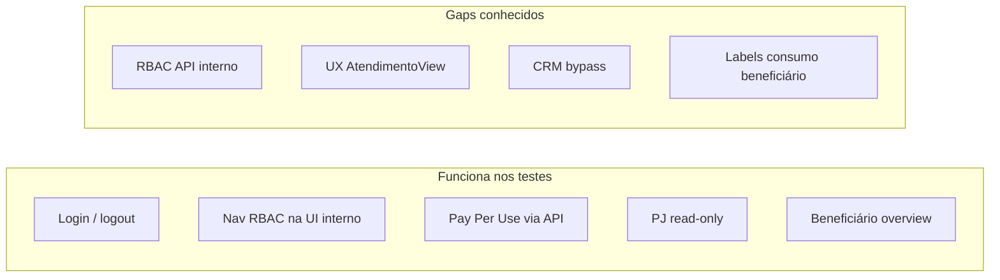

# Auditoria de fluxos — ServiceOS (quatro portais)

Mapeamento de **falhas e lacunas** nos fluxos de usuário dos quatro portais do
Sistema Bibi - ServiceOS, com evidências de código, testes automatizados e validação manual
via API.

> **Nota v2.0:** migração para `useLabels()` está **parcial** — várias strings fixas
> ("Paciente", "Beneficiário") permanecem em `routes.ts`, breadcrumbs e APIs.
> Ver backlog em [`../versoes/V2_0.md`](../versoes/V2_0.md) §7.

**Data da auditoria:** 2026-06-22 (fluxos core) · atualização v2.0: 2026-06-23  
**Commit de referência (auditoria original):** `93f466a`  
**Relacionado:** [`FLUXOS.md`](FLUXOS.md) · [`JORNADA_CLIENTE.md`](JORNADA_CLIENTE.md) · [`TESTES.md`](../plataforma/TESTES.md)

---

## Índice

1. [Resumo executivo](#1-resumo-executivo)
2. [Metodologia](#2-metodologia)
3. [Portal Prestador](#3-portal-prestador)
4. [Portal Interno](#4-portal-interno)
5. [Portal PJ](#5-portal-pj)
6. [Portal Beneficiário](#6-portal-beneficiário)
7. [Cross-cutting](#7-cross-cutting)
8. [Lacunas de cobertura de testes](#8-lacunas-de-cobertura-de-testes)
9. [Priorização de correção](#9-priorização-de-correção)
10. [Como reproduzir](#10-como-reproduzir)

---

## 1. Resumo executivo

| Resultado | Detalhe |
|-----------|---------|
| **Fluxos felizes** | 74 testes Vitest + 39 e2e Playwright passando |
| **Falha crítica** | RBAC de API no portal interno — UI restringe, API na maior parte não |
| **Falha alta (UX)** | Prestador: conclusão de atendimento e erros silenciosos / exibidos como sucesso |
| **Falha alta (negócio)** | Bypass CRM via `PATCH /api/interno/companies/[id]` sem webhook/timeline |
| **Isolamento cross-portal** | APIs retornam 403 entre roles (prestador ↔ interno ↔ PJ ↔ beneficiário) |



---

## 2. Metodologia

| Camada | Comando / artefato |
|--------|-------------------|
| Unitário + API + segurança | `npm run test` (74 testes) |
| E2E browser | `npm run test:e2e` (39 testes) |
| RBAC manual | `curl` com cookie `bibi_session` após `POST /api/auth/login` |
| Revisão estática | Views em `src/components/*View.tsx`, rotas em `src/app/api/**` |

Credenciais demo: senha `bibi123` — ver tabela em [`FLUXOS.md`](FLUXOS.md) §1.

---

## 3. Portal Prestador

**Rotas:** `/login` → `/prestador` · `/prestador/atendimento/[id]`  
**Role:** `PRESTADOR`

### Fluxos validados

| Fluxo | Evidência |
|-------|-----------|
| Login → agenda do dia | e2e `flows.spec.ts`, `smoke.spec.ts` |
| Abrir tela de atendimento | e2e quando há consulta no dia |
| `GET /api/prestador/agenda` | `tests/api/portal-flows.test.ts` |

### Falhas

| Sev. | Fluxo | Problema | Arquivo |
|------|-------|----------|---------|
| **Alta** | Concluir atendimento (`REALIZADO`) | `markRealizado()` não verifica `res.ok` — falha da API é silenciosa | `src/components/AtendimentoView.tsx` |
| **Alta** | Registrar procedimento / salvar PEP | Mensagens de erro renderizadas com `<Alert tone="success">` | `src/components/AtendimentoView.tsx` |
| **Média** | Carregar agenda | `AgendaView` não checa `res.ok` — 401/403 aparece como agenda vazia | `src/components/AgendaView.tsx` |
| **Média** | Registrar procedimento (PPU) | API não valida status do agendamento — aceita `CANCELADO` / `FALTOU` | `src/app/api/prestador/appointments/[id]/procedures/route.ts` |
| **Média** | Máquina de estados (§10.1 FLUXOS) | PATCH de status sem regras de transição | `src/app/api/prestador/appointments/[id]/route.ts` |
| **Baixa** | Agenda API | Filtro por `providerId` sem `tenantId` explícito (mitigado por UUID) | `src/app/api/prestador/agenda/route.ts` |

### Detalhe — UX do atendimento

```typescript
// markRealizado — não trata resposta
await fetch(`/api/prestador/appointments/${appointmentId}`, { method: "PATCH", ... });
await load(); // recarrega mesmo se PATCH falhou

// msg de erro usa tone="success"
{msg && <Alert tone="success">{msg}</Alert>}
```

---

## 4. Portal Interno

**Rotas:** 11 módulos sob `/interno/*`  
**Role:** `INTERNO` + `internoProfile` (RBAC)

### Fluxos validados

| Fluxo | Evidência |
|-------|-----------|
| ADMIN carrega os 11 módulos | e2e `interno-modules.spec.ts` |
| RECEPCAO: nav sem faturamento; `/interno` → dashboard | e2e `rbac.spec.ts` |
| FATURAMENTO: faturamento OK; cadastros bloqueado na UI | e2e `rbac.spec.ts` |
| Pay Per Use completo (API) | `tests/api/pay-per-use-flow.test.ts` |

### Falha crítica — RBAC API vs UI

A matriz de permissões em `interno-permissions.ts` filtra **páginas e nav**, mas
**~29 de 39 rotas** em `/api/interno/*` usam apenas `requireUser(["INTERNO"])`.

**Rotas com `requireInternoModule` (referência):**

- `/api/interno/invoices` (POST)
- `/api/interno/invoices/[id]/tiss`
- `/api/interno/companies/[id]/status`
- `/api/interno/users` (GET/POST)
- `/api/interno/branding` (GET/PATCH)
- `/api/interno/branding` — logo upload **não** usa módulo
- `/api/interno/webhooks/*`
- `/api/interno/patients/[id]/export`

Teste que documenta a lacuna: `tests/security/rbac-gaps.test.ts`.

### Evidência manual — RECEPCAO (`recepcao@bibi.health`)

Comportamento **esperado** (matriz §9 FLUXOS): HTTP **403**.  
Comportamento **observado** na auditoria:

| Endpoint | HTTP | Impacto |
|----------|------|---------|
| `GET /api/interno/billing` | **200** | Lista pendências e faturas |
| `GET /api/interno/reports?type=billing` | **200** | Exporta CSV de faturamento |
| `POST /api/interno/invoices/{id}/pix` | **200** | Gera cobrança PIX |
| `PATCH /api/interno/companies/{id}` `{ status }` | **200** | Altera status CRM |
| `GET /api/interno/crm/pipeline` | **200** | Lê pipeline completo |
| `POST /api/interno/invoices` | 403 | Protegido corretamente |
| `POST /api/interno/webhooks` | 403 | Protegido corretamente |

### Evidência manual — FATURAMENTO (`financeiro@bibi.health`)

| Endpoint | HTTP | Impacto |
|----------|------|---------|
| `GET /api/interno/patients` | **200** | Lista beneficiários (módulo cadastros negado na UI) |

### Falha crítica — bypass CRM

Duas rotas alteram status de empresa:

| Rota | Guard | Timeline + webhook `COMPANY_STATUS_CHANGED` |
|------|-------|-----------------------------------------------|
| `PATCH .../companies/[id]/status` | `requireInternoModule("crm")` | Sim |
| `PATCH .../companies/[id]` | só `requireUser(["INTERNO"])` | **Não** |

RECEPCAO pode ativar empresa pelo caminho genérico sem eventos de integração
documentados em [`FLUXOS.md`](FLUXOS.md) §4.4.

### Outras falhas internas

| Sev. | Fluxo | Problema | Arquivo |
|------|-------|----------|---------|
| **Alta** | MFA TOTP | `GET\|POST /api/auth/mfa/setup` aceita **qualquer role** autenticada | `src/app/api/auth/mfa/setup/route.ts` |
| **Alta** | Editar usuários | `PATCH /api/interno/users/[id]` sem guard de módulo `cadastros` | `src/app/api/interno/users/[id]/route.ts` |
| **Média** | Cliente 360° | `/interno/beneficiarios/[id]` sem módulo RBAC | `src/app/interno/beneficiarios/[id]/page.tsx` |
| **Média** | Faturamento UI | `BillingView` em 403 mostra listas vazias, não erro de permissão | `src/components/BillingView.tsx` |
| **Média** | Agenda | `updateStatus()` ignora falha de PATCH | `src/components/AppointmentsView.tsx` |
| **Média** | Comunicação / recorrência / cadastros | Loads iniciais sem feedback em erro de auth | várias `*View.tsx` |
| **Baixa** | Logo white label | Upload sem `requireInternoModule("branding")` | `src/app/api/interno/branding/logo/route.ts` |
| **Baixa** | Demo reset | API exige ADMIN mas não módulo `seguranca` | `src/app/api/interno/demo/reset/route.ts` |

---

## 5. Portal PJ

**Rotas:** `/pj/login` → `/pj`  
**Role:** `PJ` · escopo `user.companyId`

### Fluxos validados

| Fluxo | Evidência |
|-------|-----------|
| KPIs TechCorp, beneficiários, assinaturas, faturas | e2e `flows.spec.ts` |
| Export CSV | e2e + `tests/api/portal-flows.test.ts` |
| Anti-IDOR (`companyId` no serviço) | `pj-portal-service.ts` |
| Cross-portal: outras roles → 403 | `tests/api/portal-flows.test.ts` |

### Falhas

| Sev. | Fluxo | Problema | Arquivo |
|------|-------|----------|---------|
| **Média** | Login sem `companyId` | Página não valida vínculo; erro genérico na API | `src/app/pj/page.tsx`, `PjView.tsx` |
| **Baixa** | Carregar painel | `PjView` não verifica `res.ok` antes de parsear JSON | `src/components/PjView.tsx` |

---

## 6. Portal Beneficiário

**Rotas:** `/beneficiario/login` → `/beneficiario`  
**Role:** `BENEFICIARIO` · escopo `user.patientId`

### Fluxos validados

| Fluxo | Evidência |
|-------|-----------|
| Overview, agendamento (formulário), seções de consumo | e2e `flows.spec.ts` |
| `GET /api/beneficiario/overview` | `tests/api/portal-flows.test.ts` |
| PIX com anti-IDOR (`patientId`) | `src/app/api/beneficiario/invoices/[id]/pay/route.ts` |

### Falhas

| Sev. | Fluxo | Problema | Arquivo |
|------|-------|----------|---------|
| **Baixa** | Tabela de consumo PPU | `billed: false` exibido como badge **"ABERTA"** (confunde com fatura) | `src/components/BeneficiarioView.tsx` |
| **Baixa** | Agendar consulta | Falha ao carregar prestadores → dropdown vazio sem mensagem | `src/components/BeneficiarioView.tsx` |
| **Baixa** | Guards inconsistentes | `overview` usa `requireBeneficiary()`; `appointments`/`slots`/`providers` usam só `requireUser(["BENEFICIARIO"])` | rotas em `src/app/api/beneficiario/` |
| **Info** | Agendamento E2E | Sem slots livres no seed para o dia da auditoria — fluxo de booking não exercitado de ponta a ponta no browser | massa demo |

### Detalhe — label enganosa

```tsx
<StatusBadge value={usage.billed ? "PAGA" : "ABERTA"} map="invoice" />
```

`billed: false` significa **procedimento ainda não faturado**, não fatura aberta.

---

## 7. Cross-cutting

| Sev. | Área | Problema | Notas |
|------|------|----------|-------|
| **Alta** | `src/proxy.ts` | Verifica apenas **presença** do cookie — não role nem HMAC | Páginas compensam com redirect server-side |
| **Alta** | RBAC interno | Matriz UI ≠ matriz API | Ver §4 e [`TESTES.md`](../plataforma/TESTES.md) §1 |
| **Alta** | MFA API | Setup aberto a todos os roles | Deveria restringir a `INTERNO` + módulo `seguranca` |
| **Média** | `SESSION_SECRET` | Fallback dev se variável ausente | Risco se chegar a produção sem override |
| **Baixa** | TISS | XML sem validação XSD | POC — [`FLUXOS.md`](FLUXOS.md) §12.4 |

### O que funciona bem

- Isolamento **entre portais** nas APIs: prestador, PJ e beneficiário recebem **403** ao acessar rotas de outro portal.
- Fluxo Pay Per Use **via API** cobre agendamento → procedimento → fatura → PIX → PAGA.
- Redirect de login por portal errado (ex.: prestador em `/interno/login`) exibe erro na UI.

---

## 8. Lacunas de cobertura de testes

| Fluxo | Cobertura atual | Gap |
|-------|-----------------|-----|
| Pay Per Use E2E na UI | Smoke (agenda prestador) | Fatura + PIX na interface não testados |
| RBAC API por perfil | `rbac-gaps.test.ts` documenta | Não há asserts de negação (403) por RECEPCAO/FATURAMENTO |
| Prestador — concluir atendimento | Abre tela se há consulta | `markRealizado` e alertas de erro não testados |
| Beneficiário — PIX na UI | Adapter mock em integração | Sem e2e de pagamento |
| MFA cross-role | Tokens TOTP testados | Prestador em `/api/auth/mfa/setup` sem teste de negação |
| CRM bypass | Não coberto | Diferença `companies/[id]` vs `.../status` |
| Máquina de estados appointment | Documentada em FLUXOS §10.1 | Sem enforcement server-side testado |

---

## 9. Priorização de correção

| Prioridade | Pacote | Ações |
|------------|--------|-------|
| **P0** | Segurança interno | `requireInternoModule()` em todas as rotas sensíveis; fechar bypass CRM; restringir MFA |
| **P0** | Testes RBAC | Asserts 403 por perfil em billing, reports, pix, CRM, patients |
| **P1** | UX prestador | Checar `res.ok` em `markRealizado`; `tone="danger"` para erros |
| **P1** | Regras de negócio | Bloquear procedimento em agendamentos terminais; validar transições de status |
| **P2** | UX interno | Estados vazios com mensagem de permissão negada (403) |
| **P2** | Beneficiário | Labels de consumo PPU distintas de status de fatura |
| **P3** | PJ | Guard de `companyId` na página; tratamento de `res.ok` |

---

## 10. Como reproduzir

### Testes automatizados

```bash
npm run test          # 74 testes Vitest
npm run test:e2e      # 39 testes Playwright (porta 3100)
```

### RBAC manual (exemplo RECEPCAO)

```bash
# 1. Login
curl -s -c /tmp/cookies.txt -X POST http://localhost:3000/api/auth/login \
  -H "Content-Type: application/json" \
  -d '{"email":"recepcao@bibi.health","password":"bibi123","portal":"interno"}'

# 2. Tentar billing (esperado: 403; observado na auditoria: 200)
curl -s -b /tmp/cookies.txt -o /dev/null -w "%{http_code}\n" \
  http://localhost:3000/api/interno/billing
```

### Referências de código

| Tema | Arquivo |
|------|---------|
| Matriz RBAC | `src/lib/interno-permissions.ts` |
| Guard de página interno | `src/lib/interno-guard.ts` |
| Guard de API interno | `src/lib/api-auth.ts` (`requireInternoModule`) |
| Lacunas RBAC (teste) | `tests/security/rbac-gaps.test.ts` |
| Fluxos esperados | [`FLUXOS.md`](FLUXOS.md) |

---

*Documento de auditoria — atualizar após correções ou nova rodada de testes.*
