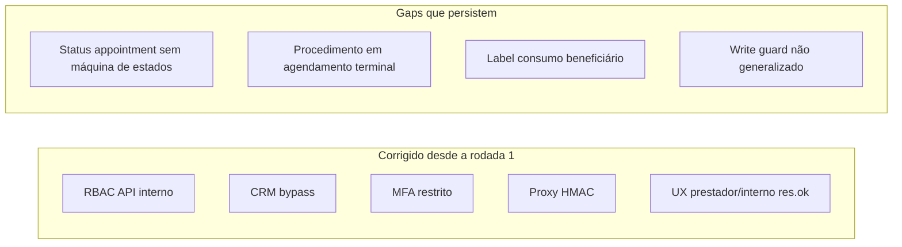

# Auditoria de fluxos — ServiceOS (quatro portais)

Mapeamento de **falhas e lacunas** nos fluxos de usuário dos quatro portais do
Sistema Bibi - ServiceOS, com evidências de código, testes automatizados e validação manual
via API.

> **Nota v2.0 / v3.0.1:** migração para `useLabels()` nas **views e breadcrumbs**
> dos portais foi ampliada no pacote **3.0.1** (ver [`../versoes/V3_0.md`](../versoes/V3_0.md)).
> Strings fixas ainda podem aparecer em `src/lib/navigation/routes.ts` (labels de nav)
> e em pontos do backlog v2.0 §7.

**Rodadas de auditoria:**

| Rodada | Data | Commit ref. | Escopo |
|--------|------|-------------|--------|
| 1 | 2026-06-22 | `93f466a` | Fluxos core, RBAC manual |
| 2 | 2026-06-23 | — | Atualização v2.0 (labels) |
| 3 | 2026-07-26 | `0c9d800` (v3.0.0) | Reverificação item a item + novas áreas (gestão clínica, dual-store, assistente) |
| **3.1 (correções)** | **2026-07-26** | branch `cursor/auditoria-falhas-rodada3` | Correção dos P1–P3 abertos (ver §11) |
| **3.2 (correções)** | **2026-07-26** | branch `cursor/auditoria-falhas-rodada3` | Guards do beneficiário, hardening de rotas destrutivas + onboarding (`npm run setup`) |
| **3.3 (release)** | **2026-07-26** | `daf690e` (v3.0.1) | Labels multi-nicho nas views/breadcrumbs (#209); publicado em produção |

> **Correções aplicadas na rodada 3.1:** máquina de estados do agendamento
> (P1), higiene do teste de dual-store (P1), label de consumo do beneficiário e
> feedback de erro em prestadores (P2), tratamento de erro em `ClinicalCarePanel`
> e `ClinicFinanceView` (P2) e aviso de conta PJ sem empresa (P3). Detalhe no §11.
>
> **Rodada 3.2:** guards do beneficiário padronizados em `requireBeneficiary()`
> (#14); rotas internas destrutivas (`void`/`reverse`/`retry`/`revert-recent`)
> passam a exigir `requireInternoModuleWrite` (bloqueio explícito de READONLY);
> onboarding com `npm run setup` + gotchas de teste documentados
> (`docs/plataforma/TESTES.md` §Setup e gotchas).

**Relacionado:** [`FLUXOS.md`](FLUXOS.md) · [`JORNADA_CLIENTE.md`](JORNADA_CLIENTE.md) · [`TESTES.md`](../plataforma/TESTES.md)

---

## Índice

1. [Resumo executivo](#1-resumo-executivo)
2. [Metodologia](#2-metodologia)
3. [Status das falhas da rodada 1–2](#3-status-das-falhas-das-rodadas-anteriores)
4. [Portal Prestador](#4-portal-prestador)
5. [Portal Interno](#5-portal-interno)
6. [Portal PJ](#6-portal-pj)
7. [Portal Beneficiário](#7-portal-beneficiário)
8. [Cross-cutting](#8-cross-cutting)
9. [Novas áreas (pós-v2.0)](#9-novas-áreas-pós-v20)
10. [Lacunas de cobertura de testes](#10-lacunas-de-cobertura-de-testes)
11. [Priorização de correção](#11-priorização-de-correção)
12. [Como reproduzir](#12-como-reproduzir)

---

## 1. Resumo executivo

| Resultado | Detalhe |
|-----------|---------|
| **Fluxos felizes** | 550 testes Vitest (76 arquivos) + 152 e2e Playwright passando · `npm run lint` limpo |
| **P0 anteriores** | **Corrigidos** — RBAC de API interno (94/94 rotas com guard de módulo), bypass CRM fechado, MFA restrito a `seguranca`, proxy com HMAC |
| **Falha alta (negócio) — PERSISTE** | Prestador: API aceita registrar procedimento (cobrança + baixa de estoque) em agendamento `CANCELADO`/`FALTOU`; PATCH de status sem máquina de estados — **confirmado em runtime** |
| **Falha média (UX) — PERSISTE** | Beneficiário: `billed:false` renderizado como badge "ABERTA"; dropdown de prestadores vazio sem mensagem quando `/providers` falha |
| **Guards de escrita — PARCIAL** | Só 2 de ~65 rotas mutáveis do interno usam `requireInternoModuleWrite`; risco prático baixo pela matriz atual, mas o padrão de defesa em profundidade não foi generalizado |
| **Isolamento cross-portal** | OK — APIs retornam 403 entre roles; assistente filtra tools por role |


```mermaid
flowchart LR
  subgraph OK["Corrigido desde a rodada 1"]
    R[RBAC API interno]
    C[CRM bypass]
    M[MFA restrito]
    X[Proxy HMAC]
    U[UX prestador/interno res.ok]
  end
  subgraph GAP["Gaps que persistem"]
    S[Status appointment sem máquina de estados]
    P[Procedimento em agendamento terminal]
    B[Label consumo beneficiário]
    W[Write guard não generalizado]
  end
```

---

## 2. Metodologia

| Camada | Comando / artefato | Resultado rodada 3 |
|--------|-------------------|--------------------|
| Unitário + API + segurança | `npm run test` | **550 passed** (76 arquivos) |
| E2E browser | `npm run test:e2e` | **152 passed** (chromium + mobile) |
| Lint | `npm run lint` | **limpo** |
| RBAC manual | `curl` com cookie `bibi_session` por perfil | ver §5 |
| Regras de negócio | `curl` PATCH/POST em agendamento demo (revertido depois) | ver §4 |
| Revisão estática | Views em `src/components/*View.tsx`, rotas em `src/app/api/**` | ver §3–§9 |

Credenciais demo: senha `bibi123` — ver tabela em [`FLUXOS.md`](FLUXOS.md) §1.

---

## 3. Status das falhas das rodadas anteriores

Reverificação item a item das falhas mapeadas em junho/2026. Legenda:
**CORRIGIDA** · **PERSISTE** · **PARCIAL** · **MUDOU**.

| # | Falha original | Status | Evidência atual |
|---|----------------|--------|-----------------|
| 1 | `AtendimentoView.markRealizado` sem `res.ok`; erro com `tone="success"` | **CORRIGIDA** | usa `useAsyncAction().run` → toast `danger` em `!parsed.ok` (`src/hooks/useAsyncAction.ts`) |
| 2 | `AgendaView` sem `res.ok` → agenda vazia | **CORRIGIDA** | `fetchJson` + `useAsyncData` + `ViewStateBoundary` |
| 3 | Procedimento aceito em `CANCELADO`/`FALTOU` | **CORRIGIDA (3.1)** | `procedures/route.ts` usa `canRegisterProcedureForStatus` → 409; runtime confirmado |
| 4 | PATCH de status sem regras de transição | **CORRIGIDA (3.1)** | `canTransitionAppointmentStatus` (FLUXOS §10.1) no PATCH prestador/interno → 409/400 |
| 5 | Agenda API sem `tenantId` | **CORRIGIDA** | `baseWhere = { providerId, tenantId }`; resíduo em `appointments/[id]` (só `providerId`) |
| 6 | ~29/39 rotas interno sem `requireInternoModule` | **CORRIGIDA** | 94/94 rotas com guard de módulo (`tests/security/rbac-gaps.test.ts` afirma `[]`) |
| 7 | Bypass CRM `PATCH companies/[id]` | **CORRIGIDA** | rota rejeita `status` com 403 e aponta endpoint dedicado |
| 8 | MFA setup aberto a qualquer role | **CORRIGIDA** | `requireInternoModule("seguranca")` em GET e POST |
| 9 | `/interno/beneficiarios/[id]` sem guard | **CORRIGIDA** | `requireInternoPage("cadastros")` |
| 10 | `BillingView` 403 = lista vazia | **CORRIGIDA** | `useAsyncData` seta `error` (403) → `ViewStateBoundary` |
| 11 | `AppointmentsView.updateStatus` ignora falha | **CORRIGIDA** | usa `useAsyncAction().run` |
| 12 | PJ login sem `companyId`; `PjView` sem `res.ok` | **PARCIAL** | `PjView` corrigido (`fetchJson`); página só valida role `PJ`, não `companyId` |
| 13 | Beneficiário: `billed:false` = "ABERTA"; dropdown vazio | **CORRIGIDA (3.1)** | badge "Faturado"/"A faturar"; falha em `/providers` exibe mensagem + retry |
| 14 | Guards beneficiário inconsistentes | **CORRIGIDA (3.2)** | todas as rotas `src/app/api/beneficiario/*` usam `requireBeneficiary()` — `patientId` garantido e 403 consistente |
| 15 | `proxy.ts` só presença do cookie | **MUDOU → OK** | agora valida HMAC (`verifySessionToken`); role fica no server-side (documentado) |
| 16 | `SESSION_SECRET` fallback dev | **PERSISTE (endurecido)** | fallback só fora de produção; em produção exige ≥32 chars e rejeita fracos (`security/config.ts`) |
| 17 | TISS XML sem XSD | **PERSISTE** | `buildTissGuideXml` gera XML simplificado (POC) |
| 18 | `rbac-gaps.test.ts` documenta lacuna | **MUDOU** | agora **afirma cobertura** (`withoutModuleGuard === []`, 15 módulos) |

Resumo: **9 corrigidas**, **6 persistem**, **1 parcial**, **2 mudaram para OK/mais rígido**.

---

## 4. Portal Prestador

**Rotas:** `/login` → `/prestador` · `/prestador/atendimento/[id]`
**Role:** `PRESTADOR`

### Falhas confirmadas em runtime (rodada 3)

Login `dra.helena@bibi.health` · agendamento demo `cms13kuqk…` (revertido após teste):

| Sev. | Passo | HTTP | Esperado | Arquivo |
|------|-------|------|----------|---------|
| **Alta** | `POST /appointments/[id]/procedures` com agendamento `CANCELADO` | **200** (cria cobrança + baixa 2 lotes de estoque) | 4xx | `src/app/api/prestador/appointments/[id]/procedures/route.ts` |
| **Alta** | `PATCH /appointments/[id]` `CANCELADO → REALIZADO` | **200** | 4xx (transição inválida) | `src/app/api/prestador/appointments/[id]/route.ts` |

```jsonc
// POST procedures em agendamento CANCELADO — resposta real (bug):
{"usage":{"procedure":"Consulta Clínica Médica","priceCharged":360,"priceLabel":"R$ 360,00"},
 "stockConsumed":[{"productName":"Luva de procedimento — tamanho M","quantity":2},
                  {"productName":"Gaze estéril 7,5x7,5cm","quantity":1}]}
```

**Impacto:** um agendamento cancelado/faltou pode gerar faturamento Pay Per Use e consumir
estoque, sem qualquer trava server-side. A máquina de estados documentada em
[`FLUXOS.md`](FLUXOS.md) §10.1 não é aplicada.

### Falha residual (baixa)

| Sev. | Fluxo | Problema | Arquivo |
|------|-------|----------|---------|
| **Baixa** | GET/PATCH agendamento | `where: { id, providerId }` sem `tenantId` (agenda e procedures já têm) | `src/app/api/prestador/appointments/[id]/route.ts` |

---

## 5. Portal Interno

**Rotas:** módulos sob `/interno/*` (14 abas + gestão clínica condicional)
**Role:** `INTERNO` + `internoProfile` (RBAC)

### RBAC API — reverificação manual (rodada 3)

Comportamento **observado** hoje (era o P0 crítico na rodada 1):

| Perfil | Endpoint | HTTP | Avaliação |
|--------|----------|------|-----------|
| RECEPCAO | `GET /api/interno/billing` | **403** | Corrigido (era 200) |
| RECEPCAO | `GET /api/interno/reports?type=billing` | **403** | Corrigido (era 200) |
| RECEPCAO | `POST /api/interno/invoices/{id}/pix` | **403** | Corrigido (era 200) |
| RECEPCAO | `PATCH /api/interno/companies/{id}` `{status}` | **403** | Corrigido (bypass fechado) |
| RECEPCAO | `GET /api/interno/crm/pipeline` | **403** | Corrigido (era 200) |
| RECEPCAO | `GET /api/interno/patients` | **200** | Correto (RECEPCAO tem `cadastros`) |
| FATURAMENTO | `GET /api/interno/patients` | **403** | Correto (FATURAMENTO não tem `cadastros`) |

Todas as 94 rotas `src/app/api/interno/**/route.ts` usam `requireInternoModule` /
`requireInternoAdmin`. Teste `tests/security/rbac-gaps.test.ts` trava a regressão.

### Falha remanescente (média — defesa em profundidade)

| Sev. | Área | Problema | Nota |
|------|------|----------|------|
| **Média** | Guards de escrita | ~63 rotas mutáveis (POST/PATCH/DELETE) usam só `requireInternoModule` (leitura+escrita no mesmo módulo); apenas `clinic-finance/launches` e `clinic-finance/expenses` usam `requireInternoModuleWrite` | Risco prático baixo: na matriz atual, quem tem o módulo pode escrever e READONLY não tem módulos de escrita. Vira risco se algum perfil ganhar módulo só-leitura no futuro |
| **Média** | `ClinicFinanceView` | `loadAll()` faz 4 `fetch` e só popula se `res.ok`; em 403 deixa KPIs/listas vazios sem mensagem de permissão | `src/components/ClinicFinanceView.tsx` (padrão antigo pré-`useAsyncData`) |

---

## 6. Portal PJ

**Rotas:** `/pj/login` → `/pj` · **Role:** `PJ` · escopo `user.companyId`

| Sev. | Fluxo | Problema | Arquivo |
|------|-------|----------|---------|
| **Baixa** | Login sem `companyId` | `pj/page.tsx` valida só `role === "PJ"`; login não rejeita PJ sem `companyId` (rejeita beneficiário sem `patientId`). APIs PJ retornam 400 em runtime | `src/app/pj/page.tsx`, `src/app/api/auth/login/route.ts` |
| — | Carregar painel | **Corrigido** — `PjView` usa `fetchJson` + `ViewStateBoundary` | `src/components/PjView.tsx` |

---

## 7. Portal Beneficiário

**Rotas:** `/beneficiario/login` → `/beneficiario` · **Role:** `BENEFICIARIO` · escopo `user.patientId`

| Sev. | Fluxo | Problema | Arquivo |
|------|-------|----------|---------|
| **Baixa** | Tabela de consumo PPU | `billed:false` exibido como badge **"ABERTA"** (confunde com fatura em aberto) | `src/components/BeneficiarioView.tsx` |
| **Baixa** | Agendar consulta | Falha ao carregar `/providers` → dropdown vazio sem mensagem (só erro de `overview` propaga) | `src/components/BeneficiarioView.tsx` |
| ~~Baixa~~ ✅ | Guards inconsistentes | **Corrigido (3.2):** todas as rotas `src/app/api/beneficiario/*` usam `requireBeneficiary()` (exige `patientId`) | rotas em `src/app/api/beneficiario/` |

```tsx
// label enganosa — billed:false = procedimento ainda não faturado, não fatura aberta
<StatusBadge value={usage.billed ? "PAGA" : "ABERTA"} map="invoice" />
```

---

## 8. Cross-cutting

| Sev. | Área | Status | Nota |
|------|------|--------|------|
| — | `src/proxy.ts` | **OK** | Valida HMAC do cookie (`verifySessionToken`); role validada no server por página/handler |
| — | RBAC interno UI vs API | **OK** | Matriz UI = matriz API (94/94 rotas) |
| — | MFA API | **OK** | `requireInternoModule("seguranca")` |
| **Baixa** | `SESSION_SECRET` | Endurecido | Fallback dev só fora de produção; produção exige ≥32 chars e rejeita fracos (`src/lib/security/config.ts`) |
| **Baixa** | TISS | POC | XML simplificado sem validação XSD (`src/lib/tiss-service.ts`) |

### O que funciona bem

- Isolamento **entre portais** nas APIs (403 entre prestador ↔ interno ↔ PJ ↔ beneficiário).
- Fluxo Pay Per Use **via API** cobre agendamento → procedimento → fatura → PIX → PAGA.
- Assistente de chat filtra tools por role (`src/lib/assistant/tools/registry.ts`): prestador não acessa tools de interno.

---

## 9. Novas áreas (pós-v2.0)

Áreas que não existiam na auditoria original. Padrões de risco verificados por revisão estática.

| Sev. | Área | Arquivo | Risco |
|------|------|---------|-------|
| **Alta (DX)** | Dual-store demo/operação | `tests/lib/data-store-mode.test.ts` | O teste grava `prisma/.data-store-mode=operation` e não restaura; em VM de dev o servidor passa a apontar para `operation.db` (vazio) → login retorna 500 `The table main.User does not exist`. Reproduzido nesta rodada; contornado apagando `prisma/.data-store-mode` + `prisma/operation.db`. Não afeta produção (Blobs), mas quebra o dev local após rodar a suíte |
| **Média** | `ClinicalCarePanel` | `src/components/clinical/ClinicalCarePanel.tsx` | Vários PATCH (`medications/[id]`, `exam-orders/[id]`, `protocols/[id]`) sem checar `res.ok` → estado inconsistente silencioso se a API falhar |
| **Média** | Labels hardcoded | `src/lib/navigation/routes.ts` | Strings fixas "Pacientes"/"Beneficiários" na config de nav — views principais migraram para `useLabels()` no v3.0.1; `routes.ts` permanece no backlog v2.0 §7 |
| **Baixa** | Assistente | `src/app/api/assistant/chat/route.ts` | Auth = `requireUser()` (qualquer role); tools filtradas por role no registry. `confirm/route.ts` faz RBAC por ação mas não chama `canInternoWrite` — bypass só se a matriz der módulo de escrita a perfil read-only no futuro |
| **Baixa** | Segmento público | `src/app/api/segment/persist/route.ts` | POST **sem autenticação** grava cookie de segmento e pode acionar `ensureDataStoreForSegmentAccess`. Intencional para landing multi-nicho, mas sem rate-limit |
| ~~Baixa~~ ✅ | Ponte clinic-finance | `src/lib/clinic-finance/bridge.ts` | **Verificado (rodada 3.2):** a UI já trata `bridgeStatus` — toast com mensagem por status (SYNCED/PARTIAL/FAILED + `bridgeNote`) e coluna "Ponte" na lista de lançamentos. Retry automático de ponte parcial fica como feature futura |
| **Baixa** | Procedures compartilhada | `src/app/api/procedures/route.ts` | `requireUser(["PRESTADOR","INTERNO","BENEFICIARIO"])` — INTERNO sem guard de módulo (leitura de catálogo; impacto baixo) |

---

## 10. Lacunas de cobertura de testes

| Fluxo | Cobertura atual | Gap |
|-------|-----------------|-----|
| Procedimento em agendamento terminal | `appointment-status.ts` + rotas prestador | ✅ Enforcement server-side (v3.0.1) — ampliar testes de negação |
| Máquina de estados appointment | `appointment-status.ts` + FLUXOS §10.1 | ✅ Enforcement no PATCH (409) — ampliar testes de transição inválida |
| Pay Per Use E2E na UI | Smoke (agenda prestador) | Fatura + PIX na interface não testados end-to-end |
| Beneficiário — label consumo | Nenhuma | `billed:false` vs status de fatura não coberto |
| `ClinicalCarePanel` PATCH sem `res.ok` | Nenhuma | Falha de API em medicação/exame/protocolo não testada |
| Isolamento `data-store-mode` em testes | `tests/lib/data-store-mode.test.ts` | O próprio teste polui `prisma/.data-store-mode` (ver §9) |

---

## 11. Priorização de correção

| Prioridade | Pacote | Ações | Status |
|------------|--------|-------|--------|
| **P1** | Regras de negócio prestador | Bloquear POST procedures em agendamento terminal (`CANCELADO`/`FALTOU`); validar transições de status no PATCH | ✅ **Feito (3.1)** — `appointment-status.ts` |
| **P1** | Higiene de testes (dev) | `data-store-mode.test.ts` restaura/limpa `prisma/.data-store-mode` no `afterEach` | ✅ **Feito (3.1)** |
| **P2** | UX interno | `ClinicFinanceView` exibe mensagem de permissão/erro em 403 com retry | ✅ **Feito (3.1)** |
| **P2** | Beneficiário | Label de consumo PPU distinta de status de fatura; mensagem quando `/providers` falha | ✅ **Feito (3.1)** |
| **P2** | Guards clínicos | Checar `res.ok` nos PATCH de `ClinicalCarePanel` | ✅ **Feito (3.1)** |
| **P3** | PJ + tenant scope | Aviso de conta PJ sem empresa; `tenantId` no GET/PATCH `prestador/appointments/[id]` | ✅ **Feito (3.1)** |
| **P3** | Guards beneficiário | Padronizar `requireBeneficiary()` em todas as rotas de `src/app/api/beneficiario/*` | ✅ **Feito (3.2)** |
| **P3** | Defesa em profundidade | `requireInternoModuleWrite` nas rotas **destrutivas** (`void`/`reverse`/`retry`/`revert-recent`) | ✅ **Feito (3.2)** |
| **P3** | Defesa em profundidade | Generalizar `requireInternoModuleWrite` nas demais ~58 rotas mutáveis | ⏳ Aberto — **sem exposição na matriz atual** (READONLY não possui esses módulos; `audit/restore` já exige ADMIN). Conversão em massa evitada por ser no-op comportamental; ações destrutivas já endurecidas |

---

## 12. Como reproduzir

### Ambiente (VM nova)

```bash
npm install
npm run setup   # preferido: .env + db push + seed condicional (idempotente)
# ou manual:
cp .env.example .env
npm run db:push && npm run db:seed   # NÃO usar db:reset (bloqueado p/ agentes)
npm run dev
```

> Se rodou `npm run test` antes e o login passar a dar 500 (`table main.User does not exist`),
> apague o resíduo do dual-store: `rm -f prisma/.data-store-mode prisma/operation.db` (ver §9).

### Testes automatizados

```bash
npm run lint          # limpo
npm run test          # 550 Vitest (76 arquivos)
npm run test:e2e      # 152 Playwright (para o dev server antes; ele sobe o próprio)
```

### Regras de negócio — prestador (falha §4)

```bash
# Login prestador
curl -s -c /tmp/ck.txt -X POST http://localhost:3000/api/auth/login \
  -H "Content-Type: application/json" \
  -d '{"email":"dra.helena@bibi.health","password":"bibi123","portal":"prestador"}'

# Cancelar um agendamento e tentar registrar procedimento (esperado 4xx; observado 200)
APT=<id-de-um-appointment-do-prestador>
PROC=$(sqlite3 prisma/dev.db "SELECT id FROM Procedure LIMIT 1;")
curl -s -b /tmp/ck.txt -X PATCH http://localhost:3000/api/prestador/appointments/$APT \
  -H "Content-Type: application/json" -d '{"status":"CANCELADO"}'
curl -s -b /tmp/ck.txt -X POST http://localhost:3000/api/prestador/appointments/$APT/procedures \
  -H "Content-Type: application/json" -d "{\"procedureId\":\"$PROC\"}" -w " [%{http_code}]"
```

### RBAC manual (perfil RECEPCAO — agora 403)

```bash
curl -s -c /tmp/ck.txt -X POST http://localhost:3000/api/auth/login \
  -H "Content-Type: application/json" \
  -d '{"email":"recepcao@bibi.health","password":"bibi123","portal":"interno"}'
curl -s -b /tmp/ck.txt -o /dev/null -w "%{http_code}\n" \
  http://localhost:3000/api/interno/billing   # 403
```

### Referências de código

| Tema | Arquivo |
|------|---------|
| Matriz RBAC | `src/lib/interno-permissions.ts` |
| Guard de API interno | `src/lib/api-auth.ts` (`requireInternoModule` / `requireInternoModuleWrite`) |
| Cobertura RBAC (teste) | `tests/security/rbac-gaps.test.ts` |
| Máquina de estados (implementação) | `src/lib/appointment-status.ts` |
| Dual-store | `src/lib/data-store-mode.ts`, `src/lib/db.ts` |

---

*Documento de auditoria — rodada 3 (2026-07-26). Pacote **v3.0.1** publicado com correções P1–P3 e labels nas views. Atualizar após nova rodada de testes.*
