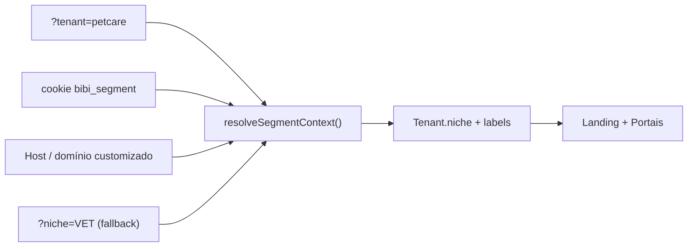
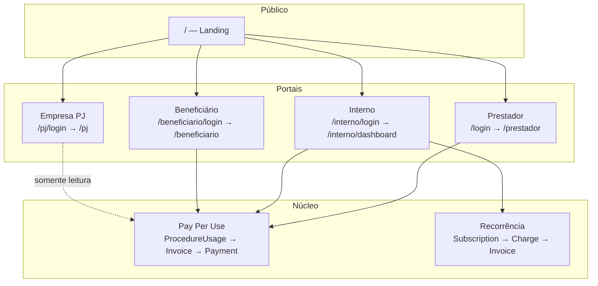
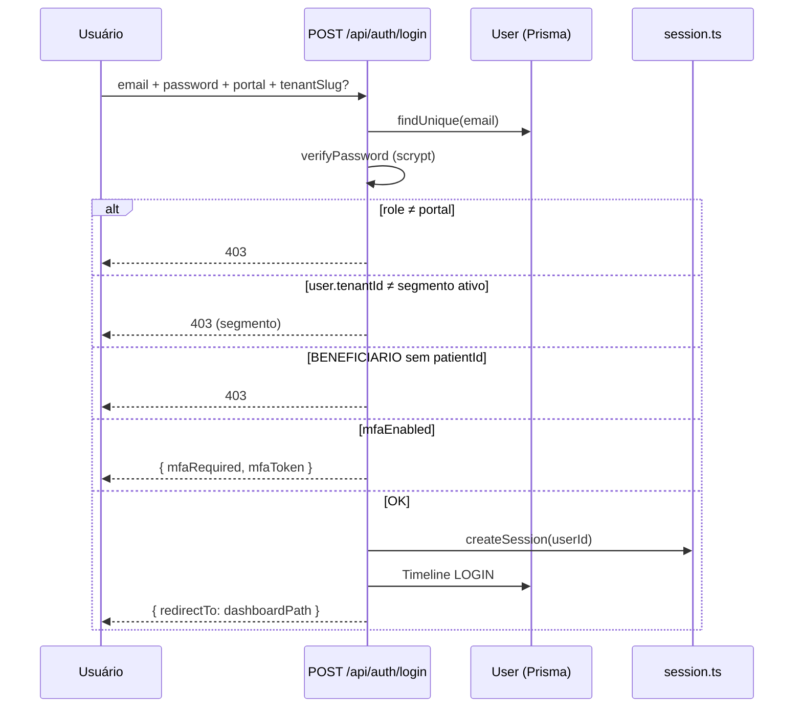
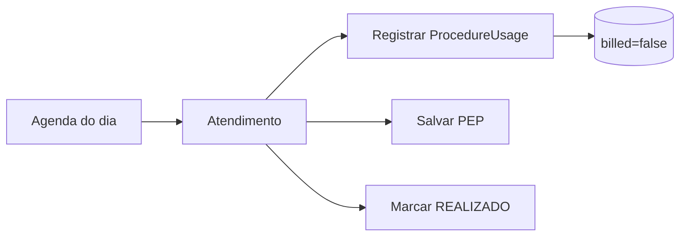
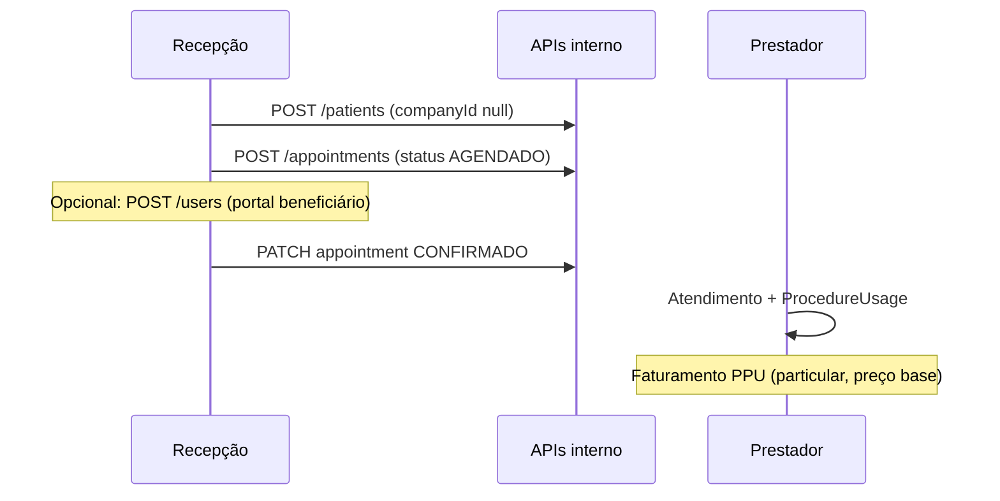
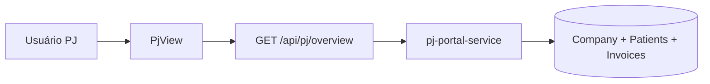
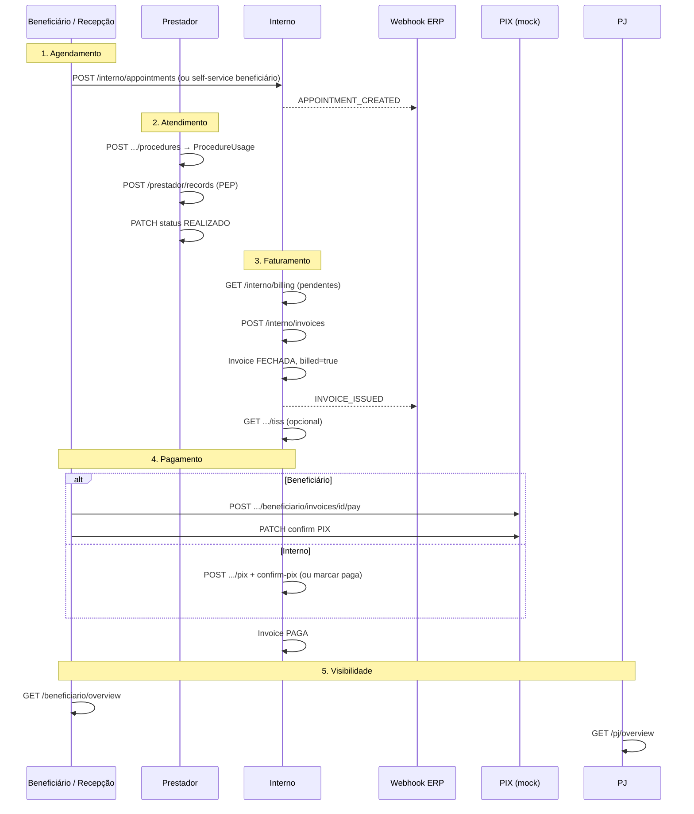
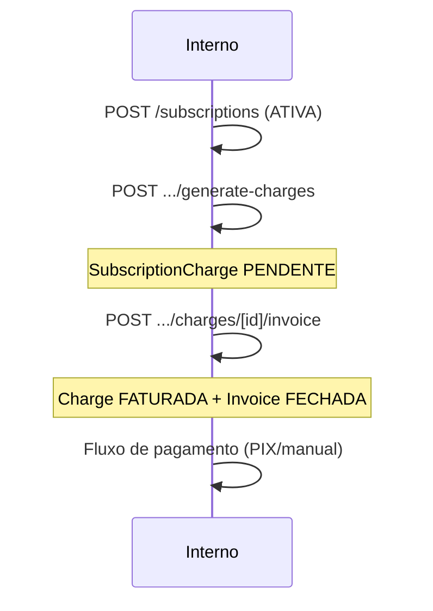
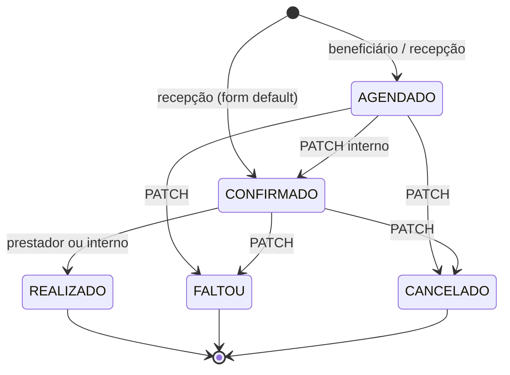
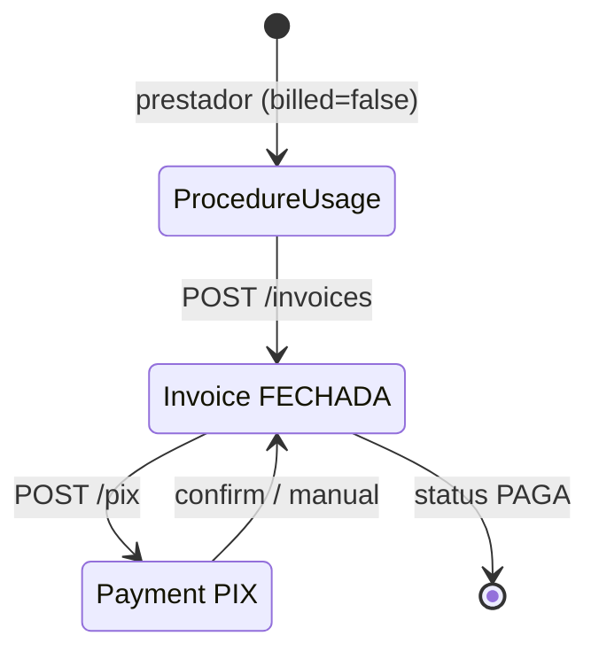

# Fluxos do Sistema Bibi - ServiceOS

Documentação de **todos os fluxos de usuário e de negócio**, derivada do código-fonte
(páginas App Router, componentes de view, Route Handlers e serviços em `src/lib/`).

> **ServiceOS v2.0:** vocabulário por nicho via `useLabels()` — ver [§0](#0-serviceos-v20--labels-e-landing). Escopo completo: [`V2_0.md`](V2_0.md).

Para setup e credenciais demo, ver [`README.md`](../README.md). Para arquitetura e ER,
ver [`ARQUITETURA.md`](ARQUITETURA.md). Para posicionamento vs mercado,
ver [`BENCHMARK.md`](BENCHMARK.md). Para jornada do usuário e backlog de melhorias UX,
ver [`JORNADA_CLIENTE.md`](JORNADA_CLIENTE.md). Para **falhas mapeadas nos quatro portais**,
ver [`AUDITORIA_FLUXOS.md`](AUDITORIA_FLUXOS.md). Para evidências visuais dos fluxos,
ver [`evidencias/README.md`](evidencias/README.md). Para operações (dev, release, deploy, IA),
ver [`OPERACOES.md`](OPERACOES.md). Para histórico de PRs/deploys do dia,
ver [`HISTORICO_2026-06-21.md`](HISTORICO_2026-06-21.md).

---

## Índice

0. [ServiceOS v2.0 — labels e landing](#0-serviceos-v20--labels-e-landing)
1. [Visão geral](#1-visão-geral)
2. [Autenticação e MFA](#2-autenticação-e-mfa)
3. [Portal Prestador](#3-portal-prestador)
4. [Portal Interno](#4-portal-interno)
5. [Portal PJ (Empresa)](#5-portal-pj-empresa)
6. [Portal Beneficiário](#6-portal-beneficiário)
7. [Fluxo master Pay Per Use (E2E)](#7-fluxo-master-pay-per-use-e2e)
8. [Fluxos auxiliares](#8-fluxos-auxiliares)
9. [RBAC — matriz perfil × módulo](#9-rbac--matriz-perfil--módulo)
10. [Máquinas de estado](#10-máquinas-de-estado)
11. [Mapa de APIs por portal](#11-mapa-de-apis-por-portal)
12. [Observações da POC](#12-observações-da-poc)

Jornada do cliente (UX, gaps e melhorias por portal): [`JORNADA_CLIENTE.md`](JORNADA_CLIENTE.md).  
Auditoria de falhas (segurança, RBAC API, bugs de fluxo): [`AUDITORIA_FLUXOS.md`](AUDITORIA_FLUXOS.md).

---

## 0. ServiceOS v2.0 — labels e landing

### 0.1 Resolução de segmento

**Prioridade** (`src/lib/segment/resolve.ts`): `?tenant=` → cookie assinado → domínio customizado → `?niche=` → default MEDICAL.

| Contexto | Como o segmento é definido | Arquivo |
|----------|----------------------------|---------|
| Landing pública | `?tenant=` (slug), cookie `bibi_segment`, domínio ou `?niche=` | `src/lib/segment/resolve.ts` |
| Persistência cookie | `POST /api/segment/persist` (client `SegmentCookiePersist`) | `src/lib/segment/cookie.ts` |
| Login | Body `tenantSlug` + `validateUserSegmentAccess()` — 403 se `user.tenantId ≠ segment` | `src/lib/segment/auth.ts` |
| Portais autenticados | `tenantId` da sessão → `resolveNicheFromTenantId()` | `src/lib/session.ts` |
| Defaults | `NICHE_MASTER_LABELS` | `src/constants/niches.ts` |

> `src/lib/niche/resolve.ts` é wrapper legado — delega para `segment/resolve`.

### 0.2 Fluxo de labels na UI

1. Servidor carrega `mergeNicheLabels(niche, tenant.labels)`.
2. `PortalShell` injeta `NicheProvider` com `niche` + `labels`.
3. Componentes client usam `useLabels()` → `labels.patient`, `t("appointment")`, etc.
4. Navegação dinâmica: `buildPrestadorNavTabs(labels)`, `buildCadastrosTabs(labels, niche)`.

**Regra:** não hardcodar "Paciente" / "Beneficiário" em novos componentes dos portais.

### 0.3 Tenants demo multi-nicho (seed)

| Nicho | Tenant | Slug | Login interno | Landing preview |
|-------|--------|------|---------------|-----------------|
| VET | PetCare | `petcare` | `operacao@petcare.demo` | `/?tenant=petcare` |
| DENTAL | Smile Odonto | `smile` | `operacao@smile.demo` | `/?tenant=smile` |
| LEGAL | Lex & Partners | `lex` | `operacao@lex.demo` | `/?tenant=lex` |
| SPA | Zen Studio | `zen` | `operacao@zen.demo` | `/?tenant=zen` |
| EDUCATION | EduPrime | `eduprime` | `operacao@eduprime.demo` | `/?tenant=eduprime` |

Senha: `bibi123`. Seed: `prisma/seed-data/niche-tenants.ts`.

### 0.4 Landing por nicho

Fluxo em `src/app/page.tsx`:

1. `resolveLandingNicheFromHeaders(nicheParam)` → nicho + labels.
2. `nicheLandingBranding()` aplica paleta do nicho.
3. `getNicheLandingContent(niche)` — features, FAQ, descrição dos portais com vocabulário correto.

O motor Pay Per Use (§7) **não muda** entre nichos — apenas rótulos e copy.

---

## 1. Visão geral

| Conceito | Onde no código |
|----------|----------------|
| Multi-tenant | `Tenant.tenantId` em todas as queries |
| Sessão | Cookie `bibi_session` — HMAC em `src/lib/session.ts` (8h) |
| Proteção otimista | `src/proxy.ts` — redireciona sem cookie |
| Validação real | `getSessionUser()` / `requireUser()` em páginas e APIs |
| Auditoria | `TimelineEvent` via `recordTimelineEvent()` |
| Integrações B2B | `webhook-service.ts` + cron retry |

### Credenciais demo (seed)

| Portal | Login | E-mail | Senha |
|--------|-------|--------|-------|
| Prestador | `/login` | `dra.helena@bibi.health` | `bibi123` |
| Interno (admin) | `/interno/login` | `faturamento@bibi.health` | `bibi123` |
| Interno (recepção) | `/interno/login` | `recepcao@bibi.health` | `bibi123` |
| Empresa PJ | `/pj/login` | `rh@techcorp.com` | `bibi123` |
| Beneficiário | `/beneficiario/login` | `joao.pereira@email.com` | `bibi123` |
| Beneficiário (particular) | `/beneficiario/login` | `pedro.almeida@email.com` | `bibi123` |

---

## 2. Autenticação e MFA

### 2.1 Login padrão

**UI:** `LoginForm` em cada portal → **API:** `POST /api/auth/login`

Body: `{ email, password, portal, tenantSlug? }` — `portal`: `prestador` | `interno` | `pj` | `beneficiario`

O campo opcional `tenantSlug` vem da landing (`?tenant=petcare`). Após validar credenciais, `validateUserSegmentAccess()` retorna **403** se o `user.tenantId` não pertence ao segmento ativo (impede login cross-tenant em demo multi-nicho).

**Redirecionamentos pós-login** (`src/lib/roles.ts`):

| Portal | Dashboard |
|--------|-----------|
| Prestador | `/prestador` |
| Interno | `/interno/dashboard` |
| PJ | `/pj` |
| Beneficiário | `/beneficiario` |

**Logout:** `POST /api/auth/logout` — remove cookie (botão Sair em `PortalShell`).

### 2.2 MFA TOTP (Tier 4)

Quando `User.mfaEnabled = true`:

1. Login retorna `{ mfaRequired: true, mfaToken }` (token assinado, 5 min).
2. UI solicita código de 6 dígitos.
3. `POST /api/auth/mfa/verify` com `{ mfaToken, code }` → cria sessão.

**Setup:** `/interno/seguranca` → `SecurityView` → `GET|POST /api/auth/mfa/setup`

| Ação | Body | Efeito |
|------|------|--------|
| Consultar | `GET` | `{ mfaEnabled }` |
| Iniciar | `{ action: "setup" }` | Retorna `secret` + `otpauthUrl` |
| Ativar | `{ action: "enable", secret, code }` | Grava secret, `mfaEnabled=true` |
| Desativar | `{ action: "disable", code }` | Limpa MFA |

---

## 3. Portal Prestador

**Role:** `PRESTADOR` · **Guard:** `getSessionUser()` + redirect `/login`

### Rotas e ações

| Rota | Componente | Ações do usuário |
|------|------------|------------------|
| `/prestador` | `AgendaView` | Ver agenda do dia; abrir atendimento |
| `/prestador/atendimento/[id]` | `AtendimentoView` | Registrar procedimentos, PEP, marcar REALIZADO |

### APIs disparadas

| Ação na UI | API | Serviço / efeito |
|------------|-----|------------------|
| Carregar agenda | `GET /api/prestador/agenda` | Appointments do provider (hoje) |
| Abrir atendimento | `GET /api/prestador/appointments/[id]` | Detalhe + usages + records |
| Catálogo | `GET /api/procedures` | Procedimentos do tenant |
| Registrar procedimento | `POST .../appointments/[id]/procedures` | `computePrice()` → `ProcedureUsage` (`billed=false`) |
| Salvar PEP | `POST /api/prestador/records` | `MedicalRecord` + timeline |
| Concluir atendimento | `PATCH .../appointments/[id]` `{ status: "REALIZADO" }` | Status + timeline |

**Precificação dinâmica:** `src/lib/pricing.ts` — `PricingRule.multiplier` por empresa
(ex.: TechCorp 0,85 → Consulta Clínica R$ 180 → **R$ 153** congelado em `priceCharged`).

---

## 4. Portal Interno

**Role:** `INTERNO` · **RBAC:** `internoProfile` · **Guard páginas:** `requireInternoPage(module)`

### Módulos e rotas

| Módulo | Rota | View | Função |
|--------|------|------|--------|
| `dashboard` | `/interno/dashboard` | `ExecutiveDashboardView` | KPIs executivos |
| `billing` | `/interno` | `BillingView` | Pay Per Use, faturas, PIX, TISS |
| `agenda` | `/interno/agenda` | `AppointmentsView` | CRUD agenda |
| `cadastros` | `/interno/cadastros` | `CadastrosView` | Pacientes, empresas, procedimentos, precificação, usuários |
| `crm` | `/interno/crm` | `CrmPipelineView` | Pipeline kanban |
| `subscriptions` | `/interno/assinaturas` | `SubscriptionsView` | Assinaturas e cobranças |
| `comunicacao` | `/interno/comunicacao` | `ComunicacaoView` | Fila de mensagens |
| `relatorios` | `/interno/relatorios` | `ReportsView` | CSV faturamento/CRM |
| `branding` | `/interno/branding` | `BrandingView` | White label |
| `integracoes` | `/interno/integracoes` | `IntegracoesView` | Webhooks B2B |
| `seguranca` | `/interno/seguranca` | `SecurityView` | MFA TOTP |
| *(sem módulo)* | `/interno/beneficiarios/[id]` | `PatientOverviewView` | Cliente 360° + export LGPD |

Nav filtrada em `InternoNav` por `internoPermissions`. Sem permissão → redirect `/interno/dashboard`.

### 4.1 Faturamento (`BillingView`)

**UI:** tabela de faturas emitidas com colunas Total, TISS (download XML) e **Ações**
(botões **PIX** e **Marcar paga** quando `status ≠ PAGA` e gateway configurado).

| Ação | API | Transição de estado |
|------|-----|---------------------|
| Listar | `GET /api/interno/billing` | — |
| Gerar fatura | `POST /api/interno/invoices` `{ patientId }` | Usages `billed=true`; Invoice `FECHADA`; webhook `INVOICE_ISSUED` |
| Marcar paga | `POST /api/interno/invoices/[id]/pay` | Invoice `PAGA`; Payment `CONFIRMED` |
| Gerar PIX | `POST /api/interno/invoices/[id]/pix` | Payment `PENDING` |
| Confirmar PIX | `POST /api/interno/invoices/[id]/confirm-pix` | Payment `CONFIRMED`; Invoice `PAGA` |
| Export TISS | `GET /api/interno/invoices/[id]/tiss` | XML via `tiss-service.ts` |

Serviço: `src/lib/invoice-service.ts`

### 4.2 Agenda (`AppointmentsView`)

| Ação | API | Efeito |
|------|-----|--------|
| Listar | `GET /api/interno/appointments?date=` | Por data |
| Criar | `POST /api/interno/appointments` | `createAppointment()`; TELE → `telemedicineUrl`; webhook `APPOINTMENT_CREATED` |
| Alterar | `PATCH /api/interno/appointments/[id]` | Status/modalidade |
| **Walk-in particular** | `POST /api/interno/patients` + `POST /api/interno/appointments` | Cadastro sem `companyId` + agendamento `AGENDADO` na mesma tela |
| **Check-in** | `PATCH .../appointments/[id]` `{ status: "CONFIRMADO" }` | Paciente chegou à clínica (AGENDADO → CONFIRMADO) |

**Fluxo walk-in (paciente não PJ):**

Serviço: `src/lib/appointment-service.ts` · Telemedicina: `src/lib/telemedicine.ts`

### 4.3 Cadastros (`CadastrosView`)

| Aba | Criar (POST) | Atualizar | Excluir | Observações |
|-----|--------------|-----------|---------|-------------|
| Beneficiários | `/api/interno/patients` | `PATCH .../patients/[id]` | — | Webhook `PATIENT_CREATED`; link Cliente 360° |
| Empresas | `/api/interno/companies` | `PATCH .../companies/[id]` | — | Status também via CRM |
| Procedimentos | `/api/interno/procedures` | `PUT .../procedures/[id]` | `DELETE` | Catálogo do tenant |
| **Precificação** | `/api/interno/pricing-rules` | `PUT .../pricing-rules/[id]` | `DELETE .../pricing-rules/[id]` | `PricingRule` por empresa+procedimento; escopo via `Procedure.tenantId` |
| Usuários | `/api/interno/users` | `PATCH .../users/[id]` | — | `role`, `internoProfile`, vínculos |
| **Mapa CRUD** | — | — | — | `CRUD_OPERATIONS_MAP` — 27 entidades, rotas API, filtro por portal (`?tab=operations`) |

Export LGPD: `GET /api/interno/patients/[id]/export` → `patient-export.ts`

**Precificação (`?tab=pricing`):** aba em `CadastrosView` → `CadastrosPricingTab`. Serviço: `src/lib/pricing-rule-service.ts` — lista/cria/atualiza/exclui regras filtrando por `procedure.tenantId`; valida que empresa e procedimento pertencem ao tenant da sessão. Motor de cálculo: `src/lib/pricing.ts` (`computePrice()`). Timeline: eventos `PricingRule` via `recordTimelineEvent()`.

### 4.4 CRM (`CrmPipelineView`)

| Ação | API | Efeito |
|------|-----|--------|
| Pipeline | `GET /api/interno/crm/pipeline` | Empresas por status |
| Mover | `PATCH /api/interno/companies/[id]/status` | Timeline `CONTRACT_CHANGED`; webhook `COMPANY_STATUS_CHANGED` |

Status: `LEAD → PROPOSTA → NEGOCIACAO → ATIVO → INADIMPLENTE → CANCELADO`

### 4.5 Recorrência (`SubscriptionsView`)

| Ação | API | Efeito |
|------|-----|--------|
| Criar | `POST /api/interno/subscriptions` | `Subscription` ATIVA |
| Status | `PATCH /api/interno/subscriptions/[id]` | ATIVA / SUSPENSA / CANCELADA |
| Gerar cobranças | `POST .../generate-charges` | `SubscriptionCharge` PENDENTE |
| Faturar cobrança | `POST .../charges/[chargeId]/invoice` | Charge FATURADA → Invoice FECHADA |

Serviço: `src/lib/subscription-service.ts` + bridge em `invoice-service.ts`

### 4.6 Comunicação (`ComunicacaoView`)

| Ação | API | Status Message |
|------|-----|----------------|
| Enfileirar | `POST /api/interno/messages` | PENDENTE |
| Despachar | `POST .../messages/[id]/dispatch` | ENVIADA ou FALHA |
| Cancelar | `PATCH .../messages/[id]` `{ action: "cancel" }` | CANCELADA |
| Lembretes | `POST /api/interno/reminders` | `reminder-service.ts` + auto-dispatch |

**Cron:** `POST /api/cron/reminders` (header `x-cron-secret`)

Templates: `APPOINTMENT_REMINDER`, `INVOICE_DUE`, `SUBSCRIPTION_DUE`, `GENERIC`

### 4.7 Integrações (`IntegracoesView`)

| Ação | API |
|------|-----|
| CRUD webhooks | `GET/POST /api/interno/webhooks`, `PATCH/DELETE .../[id]` |
| Log entregas | `GET /api/interno/webhooks/deliveries` |
| Retry manual | `POST .../deliveries/[id]/retry` |
| Cron retry | `POST /api/cron/webhooks` |

Eventos: `INVOICE_ISSUED`, `APPOINTMENT_CREATED`, `COMPANY_STATUS_CHANGED`, `PATIENT_CREATED`

Serviço: `src/lib/webhook-service.ts`

---

## 5. Portal PJ (Empresa)

**Role:** `PJ` · **Escopo:** `user.companyId` · **Somente leitura + export**

| Seção (`PjView`) | Dados |
|------------------|-------|
| Alertas | INADIMPLENTE, negociação, faturas abertas, cobranças vencidas |
| KPIs | Contrato, beneficiários, consumo PPU, MRR |
| Beneficiários | Consumo por colaborador |
| Assinaturas | Planos e cobranças pendentes |
| Faturas | Histórico corporativo |

| Ação | API | Serviço |
|------|-----|---------|
| Painel | `GET /api/pj/overview` | `pj-portal-service.ts` |
| CSV | `GET /api/pj/reports` | Export corporativo |

---

## 6. Portal Beneficiário

**Role:** `BENEFICIARIO` · **Escopo:** `user.patientId` (anti-IDOR)

| Seção (`BeneficiarioView`) | Ações |
|----------------------------|-------|
| Agendar consulta | Prestador + data + slot + modalidade |
| Resumo | Próximo atendimento, pendente PPU, assinatura |
| Agenda | Lista + link telemedicina |
| Consumo Pay Per Use | Procedimentos billed/não billed |
| Faturas | Pagar com PIX (status FECHADA) |
| Assinatura / PEP / Timeline | Somente leitura |

| Ação | API | Serviço |
|------|-----|---------|
| Overview | `GET /api/beneficiario/overview` | `beneficiary-overview.ts` |
| Prestadores | `GET /api/beneficiario/providers` | Users PRESTADOR |
| Slots | `GET /api/beneficiario/slots?providerId&date` | `scheduling-service.ts` (8h–18h, 30 min) |
| Agendar | `POST /api/beneficiario/appointments` | `bookBeneficiaryAppointment()` |
| PIX | `POST /api/beneficiario/invoices/[id]/pay` | `createInvoicePixCharge()` |
| Confirmar PIX | `PATCH .../pay` `{ paymentId }` | `confirmInvoicePixPayment()` |

---

## 7. Fluxo master Pay Per Use (E2E)

Fluxo completo cross-portal — núcleo do produto.

**Passos resumidos:**

1. **Agendar** — recepção (`/interno/agenda`) ou beneficiário (`/beneficiario`).
2. **Atender** — prestador registra procedimentos (preço congelado) e PEP.
3. **Faturar** — interno agrupa usages não faturados → `Invoice` FECHADA.
4. **Cobrar** — PIX mock ou marcação manual → `Invoice` PAGA.
5. **Acompanhar** — beneficiário (self-service) e PJ (corporativo).

---

## 8. Fluxos auxiliares

### 8.1 Recorrência → Fatura

### 8.2 Lembretes automáticos

`reminder-service.ts` enfileira mensagens quando:

| Gatilho | Template | Antecedência |
|---------|----------|--------------|
| Consulta agendada | `APPOINTMENT_REMINDER` | 24 h |
| Cobrança assinatura | `SUBSCRIPTION_DUE` | 3 dias |
| Pay Per Use não faturado | `INVOICE_DUE` | conforme regra |

Disparo: `POST /api/interno/reminders` ou cron `POST /api/cron/reminders`.

### 8.3 Webhooks B2B

- Payload JSON + header `X-Bibi-Signature` (HMAC-SHA256 se `secret` configurado).
- Retry exponencial (até 5 tentativas); cron `POST /api/cron/webhooks`.

### 8.4 CRM → alertas PJ

Empresa `INADIMPLENTE`, faturas `FECHADA` em aberto ou cobranças vencidas →
alertas em `getPjPortalOverview()`.

### 8.5 Walk-in particular (recepção)

Paciente **sem empresa PJ** (`Patient.companyId = null`). UI em `AppointmentsView`:

| Passo | Ação na UI | API |
|-------|------------|-----|
| 1 | Preencher walk-in (nome, CPF, nascimento, prestador) | `POST /api/interno/patients` |
| 2 | **Cadastrar e agendar agora** | `POST /api/interno/appointments` (`AGENDADO`) |
| 3 | Opcional: criar portal beneficiário | `POST /api/interno/users` |
| 4 | **Confirmar chegada** na lista do dia | `PATCH …/appointments/[id]` → `CONFIRMADO` |
| 5 | Prestador atende → PPU preço base | fluxo §7 |

Credencial demo: `pedro.almeida@email.com` (particular, histórico de fatura PAGA no seed).

### 8.6 Mapa de operações CRUD

Fonte canônica: `src/lib/crud-operations-map.ts` · UI: `/interno/cadastros?tab=operations`.

Cobre **27 entidades** nos portais Interno, Prestador, Beneficiário, PJ, Auth e Sistema —
cada operação com tela, rota API e tipo de exposição (UI, Download, API-only, Cron).

### 8.7 Melhorias de fluxo (jornada clínica)

Fonte canônica: `src/lib/flow-improvements-map.ts` · UI: `/interno/cadastros?tab=operations` (aba Mapa CRUD).

| Melhoria | Portal | UI | API |
|----------|--------|-----|-----|
| Cancelar consulta | Beneficiário | `/beneficiario` → Minha agenda | `PATCH /api/beneficiario/appointments/[id]` `{ action: "cancel" }` |
| Confirmar presença | Prestador | `/prestador/atendimento/[id]` | `PATCH …/prestador/appointments/[id]` `{ status: "CONFIRMADO" }` |
| Stepper PPU | Beneficiário / Prestador | FlowStepper no resumo e atendimento | `care-journey.ts` |
| QR PIX mock | Beneficiário | `/beneficiario` → Faturas | `POST …/invoices/[id]/pay` |
| Walk-in + check-in | Interno | `/interno/agenda` | §8.5 |

Regras de cancelamento beneficiário: somente `AGENDADO`, consulta futura; libera slot (`scheduling-service.ts`).

---

## 9. RBAC — matriz perfil × módulo

Definido em `src/lib/interno-permissions.ts`. Perfil `null` = **ADMIN** (seed faturamento).

| Módulo | ADMIN | FATURAMENTO | RECEPCAO | READONLY |
|--------|:-----:|:-----------:|:--------:|:--------:|
| dashboard | ✓ | ✓ | ✓ | ✓ |
| billing | ✓ | ✓ | ✗ | ✗ |
| agenda | ✓ | ✗ | ✓ | ✗ |
| cadastros | ✓ | ✗ | ✓ | ✗ |
| crm | ✓ | ✗ | ✗ | ✗ |
| subscriptions | ✓ | ✓ | ✗ | ✗ |
| comunicacao | ✓ | ✗ | ✓ | ✗ |
| relatorios | ✓ | ✓ | ✗ | ✓ |
| branding | ✓ | ✗ | ✗ | ✗ |
| integracoes | ✓ | ✗ | ✗ | ✗ |
| seguranca | ✓ | ✗ | ✗ | ✗ |

### Onde é aplicado

| Camada | Comportamento |
|--------|---------------|
| **Páginas** | `requireInternoPage(module)` — sem permissão → `/interno/dashboard` |
| **Nav** | `InternoNav` filtra tabs |
| **APIs (parcial)** | `requireInternoModule()` em: billing (invoices, TISS), CRM status, branding, integracoes, users (POST), export LGPD |

> **Gap conhecido:** várias APIs internas usam apenas `requireUser(["INTERNO"])`.
> RECEPCAO poderia chamar URLs diretamente — hardening futuro: alinhar todas as mutações.
> Evidências e tabela de endpoints: [`AUDITORIA_FLUXOS.md`](AUDITORIA_FLUXOS.md) §4.

---

## 10. Máquinas de estado

### 10.1 Appointment

Valores: `AGENDADO | CONFIRMADO | REALIZADO | FALTOU | CANCELADO`

`CANCELADO` / `FALTOU` liberam slot (`scheduling-service.ts`).

Modality: `PRESENCIAL | TELE` — TELE gera `telemedicineUrl`.

### 10.2 Invoice e Payment

**Invoice:** `ABERTA | FECHADA | PAGA` — faturas nascem **`FECHADA`** (PPU e recorrência).

**Payment:** `PENDING | CONFIRMED | FAILED | CANCELLED`

Só `FECHADA` aceita pagamento. `PAGA` é terminal.

### 10.3 Message

`PENDENTE → ENVIADA | FALHA | CANCELADA`

### 10.4 WebhookDelivery

`PENDING → SUCCESS | FAILED` — backoff `min(60s × 2^(attempt-1), 15min)`, max 5 tentativas.

### 10.5 Subscription / SubscriptionCharge

**Subscription:** `ATIVA | SUSPENSA | CANCELADA`

**SubscriptionCharge:** `PENDENTE → FATURADA | CANCELADA`

---

## 11. Mapa de APIs por portal

### Auth (todos)
`POST /api/auth/login` · `POST /api/auth/logout` · `GET /api/auth/me` ·
`GET|POST /api/auth/mfa/setup` · `POST /api/auth/mfa/verify`

### Segmento (público)
`POST /api/segment/persist` — persiste cookie `bibi_segment` (HMAC, 7 dias)

### Prestador
`GET /api/prestador/agenda` · `GET|PATCH /api/prestador/appointments/[id]` ·
`POST .../procedures` · `POST /api/prestador/records` · `GET /api/procedures`

### Beneficiário
`GET /api/beneficiario/overview|providers|slots` ·
`POST /api/beneficiario/appointments` ·
`PATCH /api/beneficiario/appointments/[id]` ·
`POST|PATCH /api/beneficiario/invoices/[id]/pay`

### PJ
`GET /api/pj/overview` · `GET /api/pj/reports`

### Interno (principais grupos)
`dashboard` · `billing` · `invoices/*` · `appointments/*` · `patients/*` ·
`companies/*` · `procedures/*` · `pricing-rules/*` · `users/*` · `subscriptions/*` · `messages/*` ·
`reminders` · `crm/pipeline` · `reports` · `branding/*` · `webhooks/*`

### Cron (sistema)
`POST /api/cron/reminders` · `POST /api/cron/webhooks` — header `x-cron-secret`

Especificação completa: [`public/openapi.yaml`](../public/openapi.yaml)

---

## 12. Observações da POC

1. **Proxy ≠ RBAC** — `src/proxy.ts` só verifica cookie; role e perfil validados no servidor.
2. **SQLite + Prisma 6** — status são `String`, não enums Prisma.
3. **Adapters mock** — `PAYMENT_GATEWAY=mock`, `COMMUNICATION_PROVIDER=console`.
4. **TISS** — XML simplificado; validação XSD pendente (Tier 5).
5. **Domínio custom** — verificação manual; sem challenge DNS automático.
6. **Cliente 360°** — acessível a qualquer INTERNO autenticado (sem módulo RBAC na página).
7. **Auditoria de fluxos** — mapa completo de falhas por portal em [`AUDITORIA_FLUXOS.md`](AUDITORIA_FLUXOS.md) (2026-06-22).

---

*Documento gerado a partir do código em `src/app/`, `src/components/` e `src/lib/`.*
