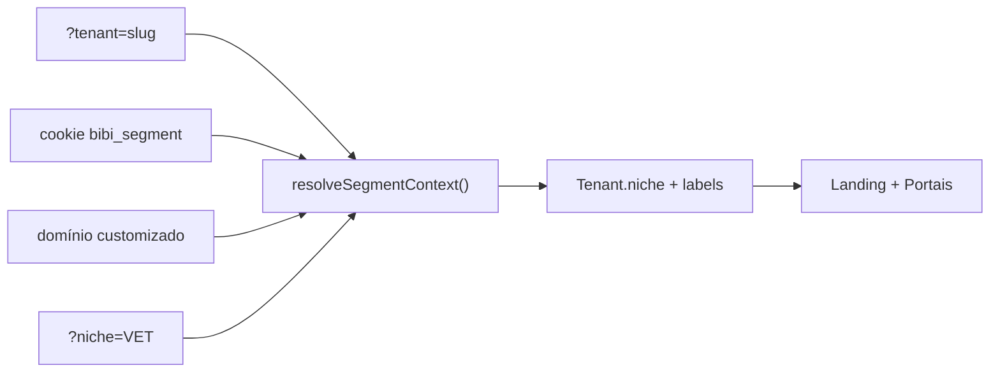
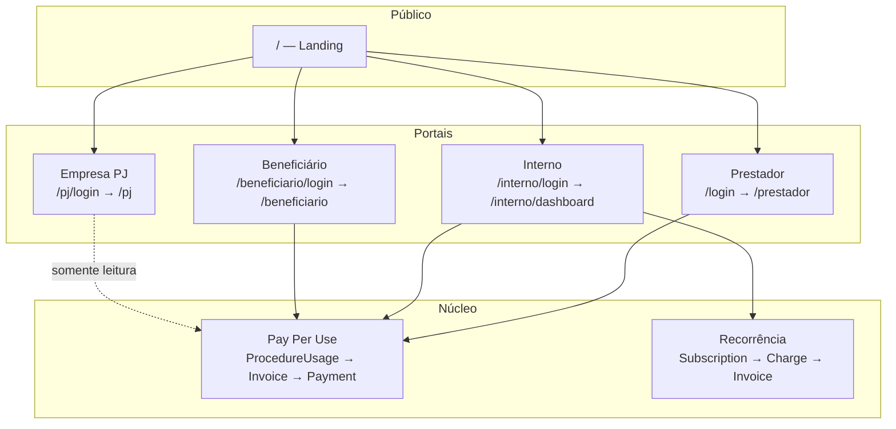
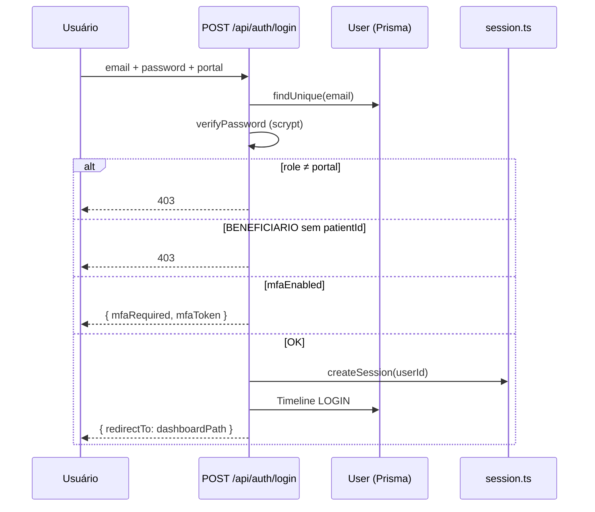
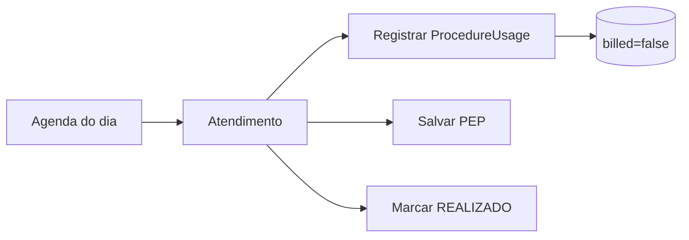
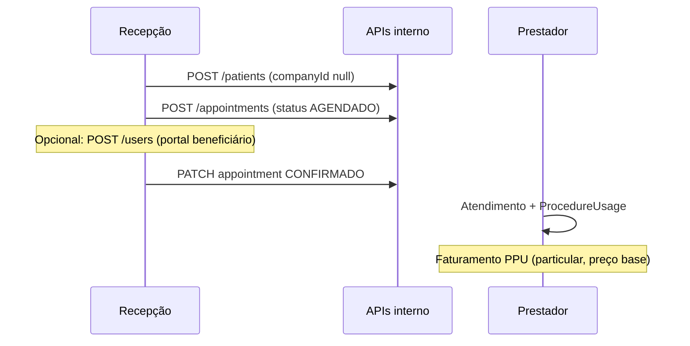
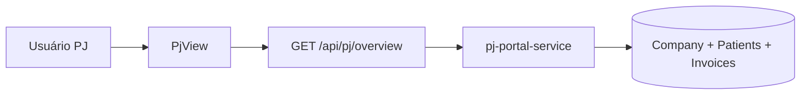
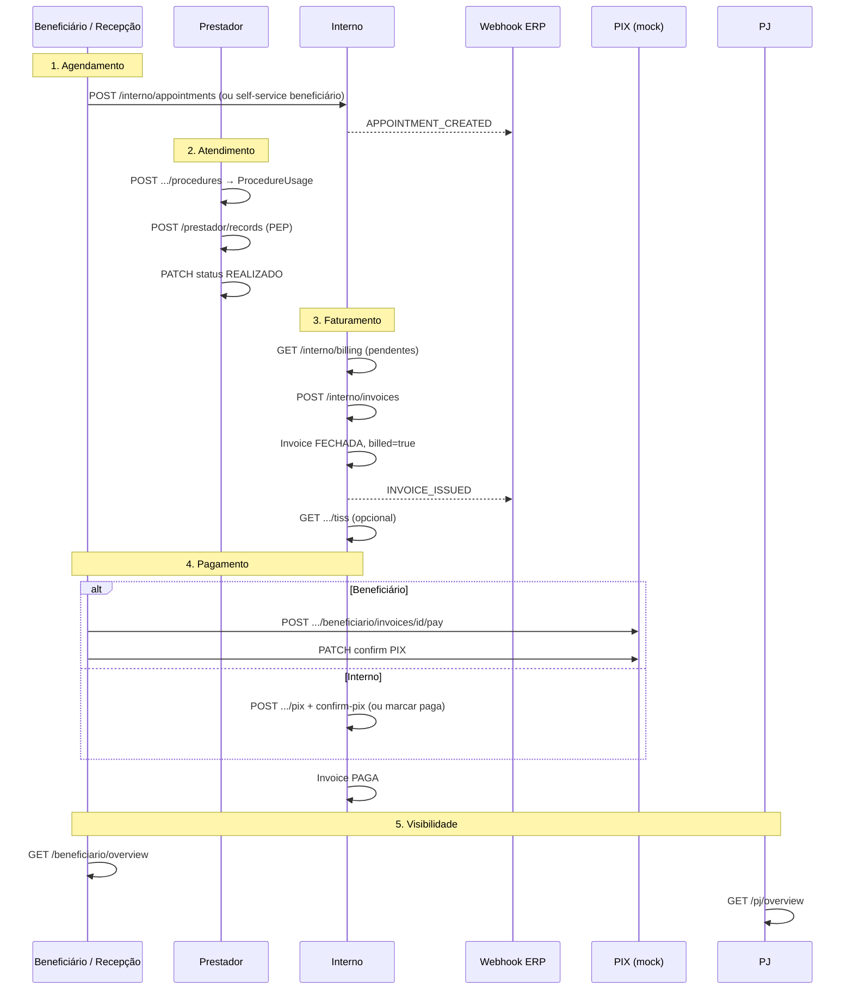
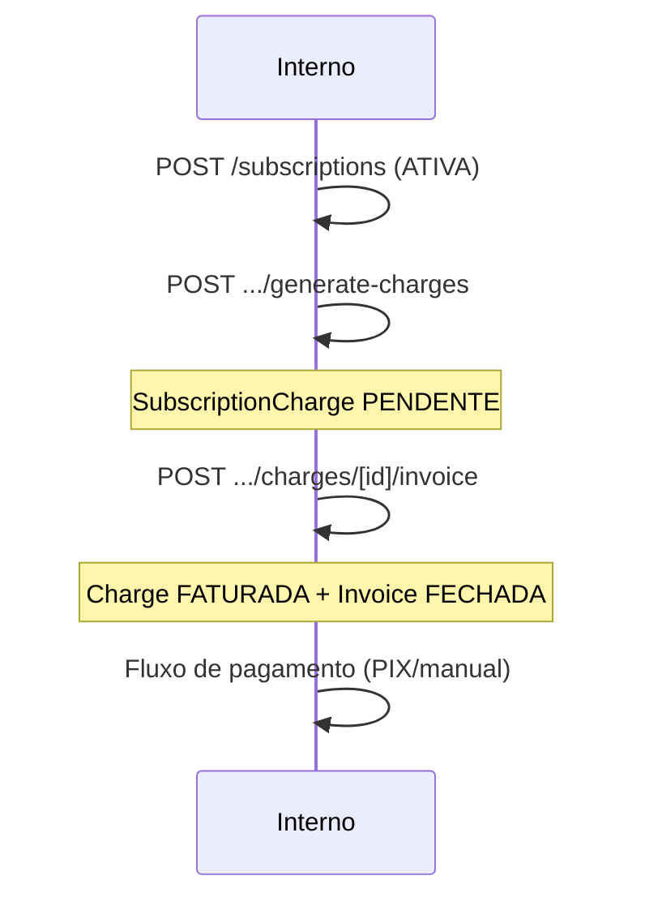
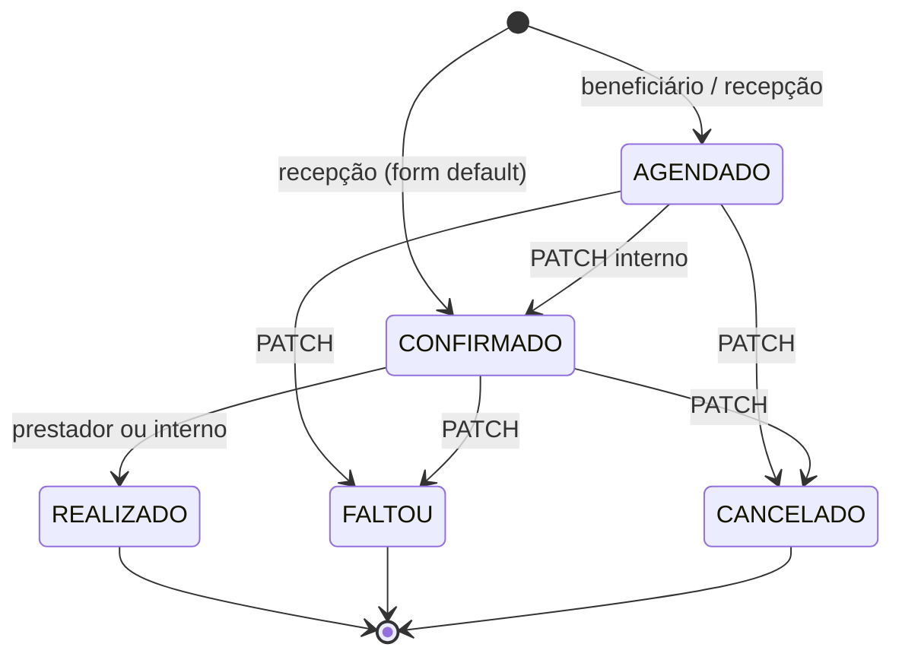
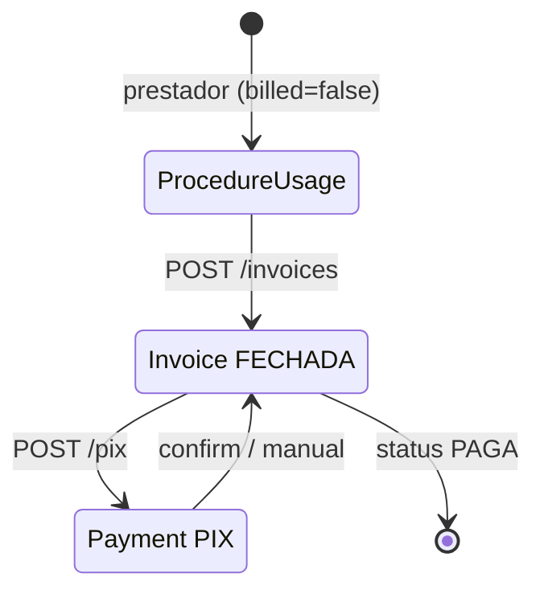

# Fluxos do Sistema Bibi - ServiceOS

Documentação de **todos os fluxos de usuário e de negócio**, derivada do código-fonte
(páginas App Router, componentes de view, Route Handlers e serviços em `src/lib/`).

> **ServiceOS v3.0.8** em produção (jul/2026): narrativa operacional do consultório ([`JORNADA_CONSULTORIO.md`](JORNADA_CONSULTORIO.md)), reset transacional CEDIG — ver [`../versoes/RELEASES.md`](../versoes/RELEASES.md). Pacote anterior (v3.0.7): drawer mobile pela direita, dashboard executivo com hierarquia de KPIs, exports canônicos CSV/JSON/TXT/PDF — ver [§4.0.1](#401-dashboard-executivo-v307), [§4.11](#411-exportações-tabulares-v307) e [§8.9](#89-melhorias-de-fluxo-jornada-clínica). CEDIG: [`../clientes/cedig/STATUS.md`](../clientes/cedig/STATUS.md) · documentos clínicos: [`DOCUMENTOS_CLINICOS.md`](DOCUMENTOS_CLINICOS.md).

Para setup e credenciais demo, ver [`README.md`](../../README.md). Para arquitetura e ER,
ver [`ARQUITETURA.md`](../plataforma/ARQUITETURA.md). Para posicionamento vs mercado (POC × referências),
ver [`BENCHMARK.md`](../plataforma/BENCHMARK.md). Para jornada do usuário e backlog de melhorias UX,
ver [`JORNADA_CLIENTE.md`](JORNADA_CLIENTE.md). Para **falhas mapeadas nos quatro portais**,
ver [`AUDITORIA_FLUXOS.md`](AUDITORIA_FLUXOS.md). Para evidências visuais dos fluxos,
ver [`../evidencias/README.md`](../evidencias/README.md). Para operações (dev, release, deploy),
ver [`OPERACOES.md`](../plataforma/OPERACOES.md). Para histórico de PRs/deploys,
ver [`../plataforma/HISTORICO_2026-06-21.md`](../plataforma/HISTORICO_2026-06-21.md).

**Última revisão factual:** julho/2026 — alinhado a `src/lib/navigation/routes.ts`, seed e testes Vitest.

---

## Índice

0. [ServiceOS v2.0 — labels e landing](#0-serviceos-v20--labels-e-landing)
1. [Visão geral](#1-visão-geral)
2. [Autenticação e MFA](#2-autenticação-e-mfa)
3. [Portal Prestador](#3-portal-prestador)
4. [Portal Interno](#4-portal-interno)
5. [Portal PJ (Empresa)](#5-portal-pj-empresa)
6. [Portal Beneficiário](#6-portal-beneficiário)
7. [Fluxo master Pay Per Use (E2E)](#7-fluxo-master-pay-per-use-e2e)
8. [Fluxos auxiliares](#8-fluxos-auxiliares)
9. [RBAC — matriz perfil × módulo](#9-rbac--matriz-perfil--módulo)
10. [Máquinas de estado](#10-máquinas-de-estado)
11. [Mapa de APIs por portal](#11-mapa-de-apis-por-portal)
12. [Observações da POC](#12-observações-da-poc)

Jornada do cliente (UX, gaps e melhorias por portal): [`JORNADA_CLIENTE.md`](JORNADA_CLIENTE.md).  
Narrativa operacional no consultório (todas as ramificações): [`JORNADA_CONSULTORIO.md`](JORNADA_CONSULTORIO.md).  
Auditoria de falhas (segurança, RBAC API, bugs de fluxo): [`AUDITORIA_FLUXOS.md`](AUDITORIA_FLUXOS.md).

---

## 0. ServiceOS v2.0 — labels e landing

### 0.1 Resolução de segmento (tenant + nicho)

```mermaid
flowchart LR
  TenantQ["?tenant=slug"] --> Resolve["resolveSegmentContext()"]
  Cookie["cookie bibi_segment"] --> Resolve
  Host["domínio customizado"] --> Resolve
  NicheQ["?niche=VET"] --> Resolve
  Resolve --> Tenant["Tenant.niche + labels"]
  Tenant --> UI["Landing + Portais"]
```

**Prioridade (FATO — código):** `?tenant=` → cookie `bibi_segment` → domínio customizado → `?niche=` → default `MEDICAL`.

| Contexto | Como o segmento é definido | Arquivo |
|----------|----------------------------|---------|
| Landing / visitante | `resolveSegmentContext()` — ver prioridade acima | `src/lib/segment/resolve.ts` |
| Persistência mobile | `POST /api/segment/persist` grava cookie após `?tenant=` | `SegmentCookiePersist.tsx` |
| Portais autenticados | `tenantId` da sessão → labels do tenant | `src/lib/session.ts` |
| Defaults por nicho | `NICHE_MASTER_LABELS` | `src/constants/niches.ts` |

### 0.2 Fluxo de labels na UI

1. Servidor carrega `mergeNicheLabels(niche, tenant.labels)`.
2. `PortalShell` injeta `NicheProvider` com `niche` + `labels`.
3. Componentes client usam `useLabels()` → `labels.patient`, `t("appointment")`, etc.
4. Navegação dinâmica: `buildPrestadorNavTabs(labels)`, `buildCadastrosTabs(labels, niche)`.

**Regra:** não hardcodar "Paciente" / "Beneficiário" em novos componentes dos portais.

### 0.3 Tenants demo multi-nicho (seed)

| Nicho | Tenant (slug) | Login interno | Preview landing |
|-------|---------------|---------------|-----------------|
| VET | PetCare (`petcare`) | `operacao@petcare.demo` | `/?tenant=petcare` ou `/?niche=VET` |
| DENTAL | Smile Odonto (`smile`) | `operacao@smile.demo` | `/?tenant=smile` ou `/?niche=DENTAL` |
| LEGAL | Lex & Partners (`lex`) | `operacao@lex.demo` | `/?tenant=lex` ou `/?niche=LEGAL` |
| SPA | Zen Studio (`zen`) | `operacao@zen.demo` | `/?tenant=zen` ou `/?niche=SPA` |
| EDUCATION | EduPrime (`eduprime`) | `operacao@eduprime.demo` | `/?tenant=eduprime` ou `/?niche=EDUCATION` |

Senha: `bibi123`. Seed: `prisma/seed-data/niche-tenants.ts`. **FATO:** tenants de nicho têm apenas interno + prestador no seed (sem PJ/beneficiário dedicados).

### 0.4 Landing por nicho

Fluxo em `src/app/page.tsx`:

1. `resolveLandingNicheFromHeaders(nicheParam)` → nicho + labels.
2. `nicheLandingBranding()` aplica paleta do nicho.
3. `getNicheLandingContent(niche)` — features, FAQ, descrição dos portais com vocabulário correto.

**Nav da home (v3.0.6):** 7 âncoras em `src/lib/landing/navigation.ts` (`HOME_NAV_ANCHORS`) — Solução, Como funciona, Segmentos, Demo, Portais, Contato, FAQ. Renderizado em `LandingHeader`, `LandingMobileMenu` e `LandingFooter`. Seções ROI, comparativo e para-quem permanecem na página (scroll), fora do menu — ver [`comercial/PLANO_HOMEPAGE.md`](../comercial/PLANO_HOMEPAGE.md).

**Marca no header:** `PLATFORM.brandName` (**Sistema Bibi**) via `getPlatformBranding()` em `src/lib/platform.ts` — sem sufixo ServiceOS no título visível.

O motor Pay Per Use (§7) **não muda** entre nichos — apenas rótulos e copy.

---

## 1. Visão geral

```mermaid
flowchart TB
  subgraph Público
    L["/ — Landing"]
  end
  subgraph Portais
    PR["Prestador<br/>/login → /prestador"]
    IN["Interno<br/>/interno/login → /interno/dashboard"]
    PJ["Empresa PJ<br/>/pj/login → /pj"]
    BE["Beneficiário<br/>/beneficiario/login → /beneficiario"]
  end
  subgraph Núcleo
    PPU["Pay Per Use<br/>ProcedureUsage → Invoice → Payment"]
    SUB["Recorrência<br/>Subscription → Charge → Invoice"]
  end
  L --> PR & IN & PJ & BE
  PR --> PPU
  IN --> PPU & SUB
  BE --> PPU
  PJ -.->|somente leitura| PPU
```

| Conceito | Onde no código |
|----------|----------------|
| Multi-tenant | `Tenant.tenantId` em todas as queries |
| Sessão | Cookie `bibi_session` — HMAC em `src/lib/session.ts` (8h) |
| Proteção otimista | `src/proxy.ts` — redireciona sem cookie |
| Validação real | `getSessionUser()` / `requireUser()` em páginas e APIs |
| Auditoria | `TimelineEvent` via `recordTimelineEvent()` |
| Integrações B2B | `webhook-service.ts` + cron retry |

### Credenciais demo (seed)

| Portal | Login | E-mail | Senha |
|--------|-------|--------|-------|
| Prestador | `/login` | `dra.helena@bibi.health` | `bibi123` |
| Interno (admin) | `/interno/login` | `faturamento@bibi.health` | `bibi123` |
| Interno (recepção) | `/interno/login` | `recepcao@bibi.health` | `bibi123` |
| Empresa PJ | `/pj/login` | `rh@techcorp.com` | `bibi123` |
| Beneficiário | `/beneficiario/login` | `joao.pereira@email.com` | `bibi123` |
| Beneficiário (particular) | `/beneficiario/login` | `pedro.almeida@email.com` | `bibi123` |

---

## 2. Autenticação e MFA

### 2.1 Login padrão

**UI:** `LoginForm` em cada portal → **API:** `POST /api/auth/login`

Body: `{ email, password, portal, tenantSlug? }` — `portal`: `prestador` | `interno` | `pj` | `beneficiario`

`tenantSlug` (opcional): slug digitado no campo **Clínica / tenant** do `LoginForm`. Quando informado, a API valida se o usuário pertence ao tenant ativo (`validateUserSegmentAccess` em `src/lib/segment/auth.ts`). Mismatch → **403** com mensagem amigável (`buildSegmentMismatchMessage`).

```mermaid
sequenceDiagram
  participant U as Usuário
  participant API as POST /api/auth/login
  participant DB as User (Prisma)
  participant S as session.ts

  U->>API: email + password + portal
  API->>DB: findUnique(email)
  API->>API: verifyPassword (scrypt)
  alt role ≠ portal
    API-->>U: 403
  else BENEFICIARIO sem patientId
    API-->>U: 403
  else mfaEnabled
    API-->>U: { mfaRequired, mfaToken }
  else OK
    API->>S: createSession(userId)
    API->>DB: Timeline LOGIN
    API-->>U: { redirectTo: dashboardPath }
  end
```

**Redirecionamentos pós-login** (`src/lib/roles.ts`):

| Portal | Dashboard |
|--------|-----------|
| Prestador | `/prestador` |
| Interno | `/interno/dashboard` |
| PJ | `/pj` |
| Beneficiário | `/beneficiario` |

**Logout:** `POST /api/auth/logout` — remove cookie (botão Sair em `PortalShell`).

### 2.2 Login unificado (v2.5)

**UI:** `LoginForm` em todos os portais · **Helpers:** `src/lib/auth/login-access.ts`

| Recurso | Comportamento |
|---------|---------------|
| Campo tenant | Slug digitável (`cedig`, `petcare`…) — normalizado por `normalizeTenantSlug` |
| Aplicar clínica | Atualiza `?tenant=` na URL e branding via cookie `bibi_segment` |
| Seletor de portal | `LOGIN_PORTAL_OPTIONS` — navega para `/login`, `/interno/login`, `/pj/login` ou `/beneficiario/login` |
| Dual-store | `ensureDataStoreForSegmentAccess` — garante banco demo/operação antes do login |
| Erro de segmento | 403 se credencial válida mas tenant errado (ex.: login CEDIG com usuário Horizonte) |

Doc detalhada: [`../versoes/V2_5.md`](../versoes/V2_5.md).

### 2.3 MFA TOTP (Tier 4)

Quando `User.mfaEnabled = true`:

1. Login retorna `{ mfaRequired: true, mfaToken }` (token assinado, 5 min).
2. UI solicita código de 6 dígitos.
3. `POST /api/auth/mfa/verify` com `{ mfaToken, code }` → cria sessão.

**Setup:** `/interno/seguranca` → `SecurityView` → `GET|POST /api/auth/mfa/setup`

| Ação | Body | Efeito |
|------|------|--------|
| Consultar | `GET` | `{ mfaEnabled }` |
| Iniciar | `{ action: "setup" }` | Retorna `secret` + `otpauthUrl` |
| Ativar | `{ action: "enable", secret, code }` | Grava secret, `mfaEnabled=true` |
| Desativar | `{ action: "disable", code }` | Limpa MFA |

---

## 3. Portal Prestador

**Role:** `PRESTADOR` · **Guard:** `getSessionUser()` + redirect `/login`

### Rotas e ações

| Rota | Componente | Ações do usuário |
|------|------------|------------------|
| `/prestador` | `AgendaView` | Ver agenda do dia; abrir atendimento |
| `/prestador/atendimento/[id]` | `AtendimentoView` | Registrar procedimentos, PEP, marcar REALIZADO |

### APIs disparadas

| Ação na UI | API | Serviço / efeito |
|------------|-----|------------------|
| Carregar agenda | `GET /api/prestador/agenda` | Appointments do provider (hoje) |
| Calendário externo | OAuth Google/Microsoft + feed ICS + `.../appointments/[id]/calendar` | Push automático + fallback ICS — [`CALENDAR_INTEGRATION.md`](../plataforma/CALENDAR_INTEGRATION.md) |
| Abrir atendimento | `GET /api/prestador/appointments/[id]` | Detalhe + usages + records |
| Catálogo | `GET /api/procedures` | Procedimentos do tenant |
| Registrar procedimento | `POST .../appointments/[id]/procedures` | `computePrice()` → `ProcedureUsage` (`billed=false`) |
| Salvar PEP | `POST /api/prestador/records` | `MedicalRecord` + timeline (receita/atestado estruturados — ver [`DOCUMENTOS_CLINICOS.md`](DOCUMENTOS_CLINICOS.md)) |
| Aplicar protocolo de exames | `POST .../patients/[id]/exam-protocols` | N× `ExamOrder` a partir do template |
| Prescrever (comum / controle especial) | `POST .../medications` | `MedicationPrescription.prescriptionKind` + status ATIVA/SUSPENSA/ENCERRADA |
| Reativar / suspender prescrição | `PATCH /api/prestador/medications/[id]` `{ status }` | Transições ATIVA ↔ SUSPENSA ↔ ENCERRADA |
| Concluir atendimento | `PATCH .../appointments/[id]` `{ status: "REALIZADO" }` | Status + timeline |

```mermaid
flowchart LR
  A[Agenda do dia] --> B[Atendimento]
  B --> C[Registrar ProcedureUsage]
  B --> D[Salvar PEP]
  B --> E[Marcar REALIZADO]
  C --> F[(billed=false)]
```

**Precificação dinâmica:** `src/lib/pricing.ts` — `PricingRule.multiplier` por empresa
(ex.: TechCorp 0,85 → Consulta Clínica R$ 320 → **R$ 272** congelado em `priceCharged`).

---

## 4. Portal Interno

**Role:** `INTERNO` · **RBAC:** `internoProfile` · **Guard páginas:** `requireInternoPage(module)`

### Módulos e rotas

| Módulo | Rota | View | Função |
|--------|------|------|--------|
| `dashboard` | `/interno/dashboard` | `ExecutiveDashboardView` | KPIs executivos |
| `billing` | `/interno` | `BillingView` | Pay Per Use, faturas, PIX, TISS |
| `agenda` | `/interno/agenda` | `AppointmentsView` | CRUD agenda |
| `gestao` | `/interno/gestao` | `ClinicFinanceView` | Gestão clínica CEDIG — lançamentos, despesas, KPIs, export |
| `cadastros` | `/interno/cadastros` | `CadastrosView` | Pacientes, empresas, procedimentos, usuários |
| `estoque` | `/interno/estoque` | `StockView` | Produtos, lotes, movimentações, kits por procedimento, alertas |
| `crm` | `/interno/crm` | `CrmPipelineView` | Pipeline kanban |
| `subscriptions` | `/interno/assinaturas` | `SubscriptionsView` | Assinaturas e cobranças |
| `comunicacao` | `/interno/comunicacao` | `ComunicacaoView` | Fila de mensagens |
| `relatorios` | `/interno/relatorios` | `ReportsView` | CSV faturamento/CRM |
| `auditoria` | `/interno/auditoria` | `AuditoriaView` | Timeline universal, export CSV/PDF |
| `branding` | `/interno/branding` | `BrandingView` | White label |
| `integracoes` | `/interno/integracoes` | `IntegracoesView` | Webhooks B2B |
| `seguranca` | `/interno/seguranca` | `SecurityView` | MFA TOTP, dual-store demo/operação, reset demo |
| *(sem módulo)* | `/interno/beneficiarios/[id]` | `PatientOverviewView` | Cliente 360° + export LGPD |

Nav: **14 abas** em `INTERNO_NAV_TABS` (`routes.ts`) + **Obras** (`projetos`) condicional por nicho (`niche-nav.ts`), filtrada em `InternoNav` por `internoPermissions`. A aba **Gestão clínica** aparece somente para nichos `MEDICAL` e `DENTAL`. Sem permissão → redirect `/interno/dashboard`.

### 4.0.1 Dashboard executivo (v3.0.7)

**Rota:** `/interno/dashboard` · **View:** `ExecutiveDashboardView` · **API:** `GET /api/interno/dashboard`

Hierarquia visual revisada em v3.0.7:

1. **Alerta de fonte** — explica que lançamentos/despesas operacionais ficam em Gestão clínica (evita dupla contagem com PPU).
2. **Indicadores principais** — grid `StatCard` com PPU pendente, total faturado, MRR e atendimentos do dia.
3. **Métricas secundárias** — faixa compacta com totais de beneficiários, empresas, mensagens pendentes.
4. **Receita / CRM / atividade** — cards em colunas com links rápidos para módulos.

Serviço: `src/lib/executive-dashboard.ts` (`getExecutiveDashboard()`). KPIs de gestão clínica (`clinicFinance`) aparecem quando o tenant tem dados no mês corrente.

### 4.1 Faturamento (`BillingView`)

**UI:** tabela de faturas emitidas com colunas Total, TISS (download XML) e **Ações**
(botões **PIX** e **Marcar paga** quando `status ≠ PAGA` e gateway configurado).

| Ação | API | Transição de estado |
|------|-----|---------------------|
| Listar | `GET /api/interno/billing` | — |
| Gerar fatura | `POST /api/interno/invoices` `{ patientId }` | Usages `billed=true`; Invoice `FECHADA`; webhook `INVOICE_ISSUED` |
| Marcar paga | `POST /api/interno/invoices/[id]/pay` | Invoice `PAGA`; Payment `CONFIRMED` |
| Gerar PIX | `POST /api/interno/invoices/[id]/pix` | Payment `PENDING` |
| Confirmar PIX | `POST /api/interno/invoices/[id]/confirm-pix` | Payment `CONFIRMED`; Invoice `PAGA` |
| Export TISS | `GET /api/interno/invoices/[id]/tiss` | XML via `tiss-service.ts` · RBAC `billing` |

Serviço: `src/lib/invoice-service.ts` · guia TISS: `src/lib/tiss-service.ts`

**Validação TISS (v3.0.4):** a rota retorna **422** com `code` quando a fatura existe mas
não gera guia válida — evita XML semanticamente inválido para a operadora.

| HTTP | `code` | Causa |
|------|--------|-------|
| 200 | — | XML `application/xml` (download `tiss-guia-{id}.xml`) |
| 404 | — | Fatura inexistente ou de outro tenant |
| 422 | `NO_ITEMS` | Fatura sem procedimentos (`invoice.items.length === 0`) |
| 422 | `NO_PATIENT_DOCUMENT` | Beneficiário sem CPF/documento (carteira ficaria vazia) |
| 403 | — | Perfil sem módulo `billing` (ex.: RECEPCAO) |

Corpo de erro 422: `{ "error": "<mensagem>", "code": "NO_ITEMS" | "NO_PATIENT_DOCUMENT" }`.
`escapeXml` cobre os 5 caracteres reservados XML. Validação XSD oficial ANS permanece fora do POC (Tier 5).
Testes: `tests/api/tiss-guide.test.ts`.

### 4.2 Agenda (`AppointmentsView`)

| Ação | API | Efeito |
|------|-----|--------|
| Listar | `GET /api/interno/appointments?date=` | Por data |
| Criar | `POST /api/interno/appointments` | `createAppointment()`; TELE → `telemedicineUrl`; webhook `APPOINTMENT_CREATED` |
| Calendário externo | Painel ICS + `GET .../appointments/[id]/calendar` | Feed assinável (Google/Outlook/Apple) e links one-shot — ver [`../plataforma/CALENDAR_INTEGRATION.md`](../plataforma/CALENDAR_INTEGRATION.md) |
| Alterar | `PATCH /api/interno/appointments/[id]` | Status/modalidade |
| **Walk-in particular** | `POST /api/interno/patients` + `POST /api/interno/appointments` | Cadastro sem `companyId` + agendamento `AGENDADO` na mesma tela |
| **Check-in** | `PATCH .../appointments/[id]` `{ status: "CONFIRMADO" }` | Paciente chegou à clínica (AGENDADO → CONFIRMADO) |
| **Lançar na gestão** | Navega para `/interno/gestao` com prefill | Disponível em nichos MEDICAL/DENTAL — dados do agendamento pré-preenchidos |

**Fluxo walk-in (paciente não PJ):**

```mermaid
sequenceDiagram
  participant R as Recepção
  participant API as APIs interno
  participant P as Prestador

  R->>API: POST /patients (companyId null)
  R->>API: POST /appointments (status AGENDADO)
  Note over R: Opcional: POST /users (portal beneficiário)
  R->>API: PATCH appointment CONFIRMADO
  P->>P: Atendimento + ProcedureUsage
  Note over P: Faturamento PPU (particular, preço base)
```

Serviço: `src/lib/appointment-service.ts` · Telemedicina: `src/lib/telemedicine.ts`

### 4.2.1 Gestão clínica CEDIG (`ClinicFinanceView`) — v2.4 / v2.6

**Rota:** `/interno/gestao` · **RBAC:** módulo `gestao` (ADMIN/FATURAMENTO/RECEPCAO write; READONLY somente leitura)  
**Visível em:** nichos `MEDICAL` e `DENTAL` apenas.

| Ação | API | Efeito |
|------|-----|--------|
| Listar lançamentos | `GET /api/interno/clinic-finance/launches` | Exames com status de ponte |
| Criar lançamento | `POST /api/interno/clinic-finance/launches` | Dispara `bridgeExamLaunchToOperations` |
| Despesas | `GET/POST /api/interno/clinic-finance/expenses` | Despesas operacionais |
| KPIs | `GET /api/interno/clinic-finance/kpis` | Dashboard da gestão |
| Export mensal | `GET /api/interno/clinic-finance/export?format=` | CSV/JSON/TXT/PDF/XLSX via `serveTabularExport` |

**Mobile (v3.0.7):** abaixo de `md` (`< 768px`), a lista de lançamentos usa **cards** (`md:hidden`) em vez da tabela (`hidden md:block`); formulários e filtros empilham em coluna (`flex-col`). Em desktop, tabela completa com scroll horizontal (`ds-scroll-x`). Ver `ClinicFinanceView.tsx`.

**Ponte automática (v2.6):** ao registrar lançamento, `src/lib/clinic-finance/bridge.ts` cria ou vincula `Patient`, `Appointment`, `ProcedureUsage` e `Invoice`. Estados: `bridgeStatus` = `SYNCED` | `PARTIAL` | `FAILED` | `SKIPPED`.

Doc completa: [`../clientes/cedig/STATUS.md`](../clientes/cedig/STATUS.md) · [`../versoes/V2_6.md`](../versoes/V2_6.md) · contrato HTTP: [`../plataforma/API_DOCS.md`](../plataforma/API_DOCS.md) §8.

### 4.3 Cadastros (`CadastrosView`)

| Aba | Criar (POST) | Atualizar | Excluir | Observações |
|-----|--------------|-----------|---------|-------------|
| Beneficiários | `/api/interno/patients` | `PATCH .../patients/[id]` | — | Webhook `PATIENT_CREATED`; link Cliente 360° |
| Empresas | `/api/interno/companies` | `PATCH .../companies/[id]` | — | Status também via CRM |
| Procedimentos | `/api/interno/procedures` | `PUT .../procedures/[id]` | `DELETE` | Catálogo do tenant |
| Usuários | `/api/interno/users` | `PATCH .../users/[id]` | — | `role`, `internoProfile`, vínculos |
| **Protocolos** (`?tab=protocols`) | `/api/interno/exam-protocol-templates` | `PATCH .../exam-protocol-templates/[id]` | — | `ProtocolTemplatesPanel` (cuidados) + `ExamProtocolTemplatesPanel` (exames); aplicar em lote no prestador via `POST .../patients/[id]/exam-protocols` |
| **Mapa CRUD** | — | — | — | `CRUD_OPERATIONS_MAP` — 27 entidades, rotas API, filtro por portal (`?tab=operations`) |

Export LGPD: `GET /api/interno/patients/[id]/export` → `patient-export.ts`

### 4.4 CRM (`CrmPipelineView`)

| Ação | API | Efeito |
|------|-----|--------|
| Pipeline | `GET /api/interno/crm/pipeline` | Empresas por status |
| Mover | `PATCH /api/interno/companies/[id]/status` | Timeline `CONTRACT_CHANGED`; webhook `COMPANY_STATUS_CHANGED` |

Status: `LEAD → PROPOSTA → NEGOCIACAO → ATIVO → INADIMPLENTE → CANCELADO`

### 4.5 Recorrência (`SubscriptionsView`)

| Ação | API | Efeito |
|------|-----|--------|
| Criar | `POST /api/interno/subscriptions` | `Subscription` ATIVA |
| Status | `PATCH /api/interno/subscriptions/[id]` | ATIVA / SUSPENSA / CANCELADA |
| Gerar cobranças | `POST .../generate-charges` | `SubscriptionCharge` PENDENTE |
| Faturar cobrança | `POST .../charges/[chargeId]/invoice` | Charge FATURADA → Invoice FECHADA |

Serviço: `src/lib/subscription-service.ts` + bridge em `invoice-service.ts`

### 4.6 Comunicação (`ComunicacaoView`)

| Ação | API | Status Message |
|------|-----|----------------|
| Enfileirar | `POST /api/interno/messages` | PENDENTE |
| Despachar | `POST .../messages/[id]/dispatch` | ENVIADA ou FALHA |
| Cancelar | `PATCH .../messages/[id]` `{ action: "cancel" }` | CANCELADA |
| Lembretes | `POST /api/interno/reminders` | `reminder-service.ts` + auto-dispatch |

**Cron:** `POST /api/cron/reminders` (header `x-cron-secret`)

Templates: `APPOINTMENT_REMINDER`, `INVOICE_DUE`, `SUBSCRIPTION_DUE`, `GENERIC`

### 4.7 Integrações (`IntegracoesView`)

| Ação | API |
|------|-----|
| CRUD webhooks | `GET/POST /api/interno/webhooks`, `PATCH/DELETE .../[id]` |
| Log entregas | `GET /api/interno/webhooks/deliveries` |
| Retry manual | `POST .../deliveries/[id]/retry` |
| Cron retry | `POST /api/cron/webhooks` |

Eventos: `INVOICE_ISSUED`, `APPOINTMENT_CREATED`, `APPOINTMENT_UPDATED`, `APPOINTMENT_CANCELLED`, `COMPANY_STATUS_CHANGED`, `PATIENT_CREATED`, `ENTITY_REVERTED`

Calendários externos (ICS / Google / Outlook): [`../plataforma/CALENDAR_INTEGRATION.md`](../plataforma/CALENDAR_INTEGRATION.md) · APIs `GET/POST/DELETE /api/{prestador,interno}/calendar` e feed público `GET /api/calendar/feed/{token}`.

Serviço: `src/lib/webhook-service.ts`

### 4.8 Estoque médico (`StockView`) — v1.3

| Ação | API | Efeito |
|------|-----|--------|
| Produtos | `GET/POST /api/interno/stock/products`, `PATCH/DELETE .../[id]` | CRUD catálogo |
| Lotes | `GET/POST /api/interno/stock/lots`, `PATCH .../lots/[id]` | Validade e saldo |
| Movimentações | `POST /api/interno/stock/movements` | Entrada/saída/ajuste |
| Kits por procedimento | `GET/PUT /api/interno/stock/procedure-kits/[procedureId]` | Vínculo insumo ↔ procedimento |
| Alertas | `GET /api/interno/stock/alerts` | Estoque baixo / vencimento |

Serviço: `src/lib/stock-service.ts` · RBAC: perfil **RECEPCAO** tem acesso (`interno-permissions.ts`).

### 4.9 Auditoria (`AuditoriaView`)

| Ação | API | Efeito |
|------|-----|--------|
| Timeline | `GET /api/interno/audit` | Eventos `TimelineEvent` filtráveis |
| Export | `GET /api/interno/audit/export?format=` | CSV/JSON/TXT/PDF/XLSX via `serveTabularExport` |

Perfis **FATURAMENTO** e **READONLY** têm acesso somente leitura.

### 4.10 Segurança e dual-store (`SecurityView`)

| Ação | API / UI | Efeito |
|------|----------|--------|
| MFA TOTP | `POST /api/auth/mfa/setup`, `verify` | Segundo fator para interno |
| Alternar demo/operação | `GET/PATCH /api/interno/data-store` | Quando `DUAL_DATA_STORE=true` |
| Restaurar seed demo | `POST /api/interno/demo/reset` | Somente ADMIN + modo demo + `ALLOW_DEMO_RESET` |

Detalhes: [`../plataforma/OPERACAO_DADOS.md`](../plataforma/OPERACAO_DADOS.md).

### 4.11 Exportações tabulares (v3.0.7)

Motor unificado para relatórios e listagens nos portais.

| Camada | Arquivo | Papel |
|--------|---------|-------|
| UI | `ExportButtons.tsx` | Botões por formato; query `?format=` no `baseUrl` |
| Tipos | `src/lib/exports/tabular-types.ts` | `TabularExport` / `TabularColumn` — contrato entre builders e servidor |
| Formatos | `src/lib/exports/format.ts` | `EXPORT_FORMATS`, `LIST_EXPORT_FORMATS`, `REPORT_EXPORT_FORMATS` |
| Builders | `src/lib/exports/builders.ts` | Monta `TabularExport` por domínio (PJ, auditoria, faturamento, …) |
| Servidor | `src/lib/exports/serve.ts` | `serveTabularExport()` — CSV com BOM UTF-8, JSON, TXT, PDF tabular, XLSX |
| TXT | `src/lib/exports/text.ts` | `buildTxtFromTabular` — colunas separadas por ` \| ` |
| Intercâmbio | `src/lib/imports/interchange.ts` | Dataset canônico compartilhado com import CSV/JSON |

**Query comum:** `?format=pdf|csv|json|txt|xlsx` (fallback por rota em `parseExportFormat`).

| Portal / tela | Endpoint | Formatos UI |
|---------------|----------|-------------|
| Interno — relatórios | `GET /api/interno/reports?type=billing\|crm` | PDF, CSV, JSON, TXT |
| Interno — faturamento | `GET /api/interno/billing/export` | PDF, Excel, CSV, JSON |
| Interno — auditoria | `GET /api/interno/audit/export` | idem `LIST_EXPORT_FORMATS` |
| Interno — gestão | `GET /api/interno/clinic-finance/export` | idem |
| PJ | `GET /api/pj/reports` | PDF, CSV, JSON, TXT |
| Prestador — extrato | `GET /api/prestador/extrato/export` | PDF, Excel, CSV, JSON |
| Beneficiário | `GET /api/beneficiario/export?section=` | por seção |

Testes: `tests/unit/export-formats.test.ts` · `tests/api/exports.test.ts` · `tests/api/portal-flows.test.ts` (CSV PJ canônico).

---

## 5. Portal PJ (Empresa)

**Role:** `PJ` · **Escopo:** `user.companyId` · **Somente leitura + export**

| Seção (`PjView`) | Dados |
|------------------|-------|
| Alertas | INADIMPLENTE, negociação, faturas abertas, cobranças vencidas |
| KPIs | Contrato, beneficiários, consumo PPU, MRR |
| Beneficiários | Consumo por colaborador |
| Assinaturas | Planos e cobranças pendentes |
| Faturas | Histórico corporativo |

| Ação | API | Serviço |
|------|-----|---------|
| Painel | `GET /api/pj/overview` | `pj-portal-service.ts` |
| Export | `GET /api/pj/reports?format=` | `buildPjTabularExport` + `serveTabularExport` (PDF/CSV/JSON/TXT) |

```mermaid
flowchart LR
  RH[Usuário PJ] --> V[PjView]
  V --> O[GET /api/pj/overview]
  O --> S[pj-portal-service]
  S --> DB[(Company + Patients + Invoices)]
```

---

## 6. Portal Beneficiário

**Role:** `BENEFICIARIO` · **Escopo:** `user.patientId` (anti-IDOR)

**Nav:** 11 abas em `BENEFICIARIO_NAV_TABS` (`routes.ts`) + **Obras** (`/beneficiario/obras`) condicional para nicho `CONSTRUCTION` (não listada nas tabs estáticas).

| Aba | Rota | Função |
|-----|------|--------|
| Agendar | `/beneficiario/agendar` | Novo agendamento (prestador + slot) |
| Resumo | `/beneficiario/resumo` | KPIs, próximo atendimento, pendências PPU |
| Agenda | `/beneficiario/agenda` | Lista + link telemedicina |
| Consumo | `/beneficiario/consumo` | Procedimentos billed/não billed |
| Faturas | `/beneficiario/faturas` | PIX mock para faturas FECHADA |
| Medicações | `/beneficiario/medicacoes` | Care Chart — prescrições ativas |
| Exames | `/beneficiario/exames` | Pedidos de exame |
| Plano | `/beneficiario/plano` | Benefícios corporativos |
| Assinatura | `/beneficiario/assinatura` | Planos recorrentes |
| Prontuário | `/beneficiario/prontuario` | PEP somente leitura |
| Histórico | `/beneficiario/historico` | Timeline clínica |

| Ação | API | Serviço |
|------|-----|---------|
| Overview | `GET /api/beneficiario/overview` | `beneficiary-overview.ts` |
| Prestadores | `GET /api/beneficiario/providers` | Users PRESTADOR |
| Slots | `GET /api/beneficiario/slots?providerId&date` | `scheduling-service.ts` (8h–18h, 30 min) |
| Agendar | `POST /api/beneficiario/appointments` | `bookBeneficiaryAppointment()` |
| PIX | `POST /api/beneficiario/invoices/[id]/pay` | `createInvoicePixCharge()` |
| Confirmar PIX | `PATCH .../pay` `{ paymentId }` | `confirmInvoicePixPayment()` |

---

## 7. Fluxo master Pay Per Use (E2E)

Fluxo completo cross-portal — núcleo do produto.

```mermaid
sequenceDiagram
  participant B as Beneficiário / Recepção
  participant P as Prestador
  participant I as Interno
  participant WH as Webhook ERP
  participant Pay as PIX (mock)

  Note over B: 1. Agendamento
  B->>I: POST /interno/appointments (ou self-service beneficiário)
  I-->>WH: APPOINTMENT_CREATED

  Note over P: 2. Atendimento
  P->>P: POST .../procedures → ProcedureUsage
  P->>P: POST /prestador/records (PEP)
  P->>P: PATCH status REALIZADO

  Note over I: 3. Faturamento
  I->>I: GET /interno/billing (pendentes)
  I->>I: POST /interno/invoices
  I->>I: Invoice FECHADA, billed=true
  I-->>WH: INVOICE_ISSUED
  I->>I: GET .../tiss (opcional)

  Note over B,I: 4. Pagamento
  alt Beneficiário
    B->>Pay: POST .../beneficiario/invoices/id/pay
    B->>Pay: PATCH confirm PIX
  else Interno
    I->>I: POST .../pix + confirm-pix (ou marcar paga)
  end
  I->>I: Invoice PAGA

  Note over B,PJ: 5. Visibilidade
  B->>B: GET /beneficiario/overview
  PJ->>PJ: GET /pj/overview
```

**Passos resumidos:**

1. **Agendar** — recepção (`/interno/agenda`) ou beneficiário (`/beneficiario`).
2. **Atender** — prestador registra procedimentos (preço congelado) e PEP.
3. **Faturar** — interno agrupa usages não faturados → `Invoice` FECHADA.
4. **Cobrar** — PIX mock ou marcação manual → `Invoice` PAGA.
5. **Acompanhar** — beneficiário (self-service) e PJ (corporativo).

**Narrativa operacional (todas as ramificações):** [`JORNADA_CONSULTORIO.md`](JORNADA_CONSULTORIO.md) — chegada → agenda → atendimento → fechamento com pagamento e anexos.

---

## 8. Fluxos auxiliares

### 8.1 Recorrência → Fatura

```mermaid
sequenceDiagram
  participant I as Interno
  I->>I: POST /subscriptions (ATIVA)
  I->>I: POST .../generate-charges
  Note over I: SubscriptionCharge PENDENTE
  I->>I: POST .../charges/[id]/invoice
  Note over I: Charge FATURADA + Invoice FECHADA
  I->>I: Fluxo de pagamento (PIX/manual)
```

### 8.2 Lembretes automáticos

`reminder-service.ts` enfileira mensagens quando:

| Gatilho | Template | Antecedência |
|---------|----------|--------------|
| Consulta agendada | `APPOINTMENT_REMINDER` | 24 h |
| Cobrança assinatura | `SUBSCRIPTION_DUE` | 3 dias |
| Pay Per Use não faturado | `INVOICE_DUE` | conforme regra |

Disparo: `POST /api/interno/reminders` ou cron `POST /api/cron/reminders`.

### 8.3 Webhooks B2B

- Payload JSON + header `X-Bibi-Signature` (HMAC-SHA256 se `secret` configurado).
- Retry exponencial (até 5 tentativas); cron `POST /api/cron/webhooks`.

### 8.4 CRM → alertas PJ

Empresa `INADIMPLENTE`, faturas `FECHADA` em aberto ou cobranças vencidas →
alertas em `getPjPortalOverview()`.

### 8.5 Walk-in particular (recepção)

Paciente **sem empresa PJ** (`Patient.companyId = null`). UI em `AppointmentsView`:

| Passo | Ação na UI | API |
|-------|------------|-----|
| 1 | Preencher walk-in (nome, CPF, nascimento, prestador) | `POST /api/interno/patients` |
| 2 | **Cadastrar e agendar agora** | `POST /api/interno/appointments` (`AGENDADO`) |
| 3 | Opcional: criar portal beneficiário | `POST /api/interno/users` |
| 4 | **Confirmar chegada** na lista do dia | `PATCH …/appointments/[id]` → `CONFIRMADO` |
| 5 | Prestador atende → PPU preço base | fluxo §7 |

Credencial demo: `pedro.almeida@email.com` (particular, histórico de fatura PAGA no seed).

### 8.6 Mapa de operações CRUD

Fonte canônica: `src/lib/crud-operations-map.ts` · UI: `/interno/cadastros?tab=operations`.

Cobre **27 entidades** nos portais Interno, Prestador, Beneficiário, PJ, Auth e Sistema —
cada operação com tela, rota API e tipo de exposição (UI, Download, API-only, Cron).

### 8.7 Dual-store demo / operação

Quando `DUAL_DATA_STORE=true` (dev e Netlify):

1. Build gera `demo.db` + `operation.db` (`scripts/netlify-build.mjs`).
2. Modo ativo persiste em Blobs (`data-store-mode`) ou arquivo local.
3. ADMIN alterna em `/interno/seguranca` via `DataStoreCard`.
4. APIs usam `getPrisma()` → banco conforme modo ativo.

### 8.8 Persistência de segmento (landing)

1. Visitante abre `/?tenant=petcare` (ou outro slug).
2. Cliente chama `POST /api/segment/persist` → cookie `bibi_segment`.
3. Navegação subsequente mantém tenant sem repetir query string.

### 8.9 Melhorias de fluxo (jornada clínica)

Fonte canônica: `src/lib/flow-improvements-map.ts` · UI: `/interno/cadastros?tab=operations` — seção **Mapa de melhorias de fluxo** (abaixo do Mapa de operações CRUD na mesma aba) · E2E: `e2e/flow-improvements.spec.ts`.

| Melhoria | Portal | UI | API |
|----------|--------|-----|-----|
| Nav portais v3.0.7 | Cross-portal | Drawer direita + categorias com separador | — |
| Nav portais v3.0.6 | Cross-portal | NavTabs + menu Mais + drawer nos 4 portais | — |
| Cancelar consulta | Beneficiário | `/beneficiario` → Minha agenda | `PATCH /api/beneficiario/appointments/[id]` `{ action: "cancel" }` |
| Confirmar presença | Prestador | `/prestador/atendimento/[id]` | `PATCH …/prestador/appointments/[id]` `{ status: "CONFIRMADO" }` |
| Stepper PPU | Beneficiário / Prestador | FlowStepper no resumo e atendimento | `care-journey.ts` |
| Stepper faturado/pago (v3.0.5) | Prestador | `/prestador/atendimento/[id]` — passos **Faturado** e **Pago** | `deriveCareJourneyBilling()` + `invoiceStatus` nos usages |
| Abas sem corte (v3.0.5) | Prestador | `TabBar` com `shortLabel` + `ScrollableNavRail` | `AtendimentoView.tsx` |
| QR PIX mock | Beneficiário | `/beneficiario` → Faturas | `POST …/invoices/[id]/pay` |
| Walk-in + check-in | Interno | `/interno/agenda` | §8.5 |

#### Stepper PPU — faturamento (v3.0.5)

Módulo: `src/lib/care-journey.ts` · testes: `tests/lib/care-journey.test.ts`.

1. `GET /api/prestador/appointments/[id]` inclui `usages[].invoiceStatus` (join `invoiceItem → invoice`).
2. `deriveCareJourneyBilling({ usages })` deriva:
   - `hasUnbilledUsages` — algum `ProcedureUsage` com `billed: false`;
   - `hasOpenInvoice` — fatura vinculada com status ≠ `PAGA`, ou todos os usages `billed` sem link de fatura ainda;
   - `hasPaidInvoice` — algum usage com `invoiceStatus === "PAGA"`.
3. `resolveCareJourneyStep()` prioriza `pago` → `faturado` → `realizado` → `confirmado` → `agendado` (pagamento vence `REALIZADO` no prestador).
4. `AtendimentoView` e `BeneficiarioView` passam as flags ao `FlowStepper`.

Documentos clínicos no atendimento (atestado, receita, protocolos): [`DOCUMENTOS_CLINICOS.md`](DOCUMENTOS_CLINICOS.md).

Regras de cancelamento beneficiário: somente `AGENDADO`, consulta futura; libera slot (`scheduling-service.ts`).

---

## 9. RBAC — matriz perfil × módulo

Definido em `src/lib/interno-permissions.ts`. Perfil `null` = **ADMIN** (seed faturamento).

| Módulo | ADMIN | FATURAMENTO | RECEPCAO | READONLY |
|--------|:-----:|:-----------:|:--------:|:--------:|
| dashboard | ✓ | ✓ | ✓ | ✓ |
| billing | ✓ | ✓ | ✗ | ✗ |
| agenda | ✓ | ✗ | ✓ | ✗ |
| cadastros | ✓ | ✗ | ✓ | ✗ |
| estoque | ✓ | ✗ | ✓ | ✗ |
| crm | ✓ | ✗ | ✗ | ✗ |
| projetos | ✓ | ✓ | ✓ | ✗ |
| gestao | ✓ | ✓ | ✓ | ✓ (somente leitura) |
| subscriptions | ✓ | ✓ | ✗ | ✗ |
| comunicacao | ✓ | ✗ | ✓ | ✗ |
| relatorios | ✓ | ✓ | ✗ | ✓ |
| auditoria | ✓ | ✓ | ✗ | ✓ |
| branding | ✓ | ✗ | ✗ | ✗ |
| integracoes | ✓ | ✗ | ✗ | ✗ |
| seguranca | ✓ | ✗ | ✗ | ✗ |

### Onde é aplicado

| Camada | Comportamento |
|--------|---------------|
| **Páginas** | `requireInternoPage(module)` — sem permissão → `/interno/dashboard` |
| **Nav** | `InternoNav` filtra tabs |
| **APIs** | **96/96** rotas internas usam `requireInternoModule` / `requireInternoAdmin` — matriz UI = matriz API. Teste: `tests/security/rbac-gaps.test.ts` |

> **Gap remanescente (baixa prioridade):** apenas **7** rotas usam `requireInternoModuleWrite` (gestão clínica + ações destrutivas). Demais mutações confiam na matriz de módulos. Evidências: [`AUDITORIA_FLUXOS.md`](AUDITORIA_FLUXOS.md) §5.

---

## 10. Máquinas de estado

### 10.1 Appointment

Valores: `AGENDADO | CONFIRMADO | REALIZADO | FALTOU | CANCELADO`

```mermaid
stateDiagram-v2
  [*] --> AGENDADO: beneficiário / recepção
  [*] --> CONFIRMADO: recepção (form default)
  AGENDADO --> CONFIRMADO: PATCH interno
  AGENDADO --> CANCELADO: PATCH
  AGENDADO --> FALTOU: PATCH
  CONFIRMADO --> REALIZADO: prestador ou interno
  CONFIRMADO --> FALTOU: PATCH
  CONFIRMADO --> CANCELADO: PATCH
  REALIZADO --> [*]
  FALTOU --> [*]
  CANCELADO --> [*]
```

`CANCELADO` / `FALTOU` liberam slot (`scheduling-service.ts`).

Modality: `PRESENCIAL | TELE` — TELE gera `telemedicineUrl`.

### 10.2 Invoice e Payment

**Invoice:** `ABERTA | FECHADA | PAGA` — faturas nascem **`FECHADA`** (PPU e recorrência).

**Payment:** `PENDING | CONFIRMED | FAILED | CANCELLED`

```mermaid
stateDiagram-v2
  state "ProcedureUsage" as PU
  state "Invoice FECHADA" as INV
  state "Payment PIX" as PAY

  [*] --> PU: prestador (billed=false)
  PU --> INV: POST /invoices
  INV --> PAY: POST /pix
  PAY --> INV: confirm / manual
  INV --> [*]: status PAGA
```

Só `FECHADA` aceita pagamento. `PAGA` é terminal.

### 10.3 Message

`PENDENTE → ENVIADA | FALHA | CANCELADA`

### 10.4 WebhookDelivery

`PENDING → SUCCESS | FAILED` — backoff `min(60s × 2^(attempt-1), 15min)`, max 5 tentativas.

### 10.5 Subscription / SubscriptionCharge

**Subscription:** `ATIVA | SUSPENSA | CANCELADA`

**SubscriptionCharge:** `PENDENTE → FATURADA | CANCELADA`

---

## 11. Mapa de APIs por portal

**Inventário (jul/2026):** **163** Route Handlers · **123** paths OpenAPI · **40** handlers sem YAML — ver [`API_DOCS.md`](../plataforma/API_DOCS.md) e `npm run openapi:verify`.

**Páginas App Router (jul/2026):** contagem de `page.tsx` por portal — distinto de abas na nav:

| Portal | Páginas | Nav (abas) | Revalidar |
|--------|--------:|-----------|-----------|
| Prestador | 8 | 6 + login | `find src/app/prestador -name page.tsx \| wc -l` |
| Interno | 21 | 14–15 + login + detalhes | `find src/app/interno -name page.tsx \| wc -l` |
| PJ | 4 | 2 + login | `find src/app/pj -name page.tsx \| wc -l` |
| Beneficiário | 15 | 11–12 + login | `find src/app/beneficiario -name page.tsx \| wc -l` |

Detalhe por portal: [`TESTES.md`](../plataforma/TESTES.md) §Mapa de rotas.

### Auth (todos)
`POST /api/auth/login` · `POST /api/auth/logout` · `GET /api/auth/me` ·
`GET|POST /api/auth/mfa/setup` · `POST /api/auth/mfa/verify`

### Prestador
`GET /api/prestador/agenda` · `GET|POST|DELETE /api/prestador/calendar` ·
`GET .../appointments/[id]/calendar` · `GET|PATCH /api/prestador/appointments/[id]` ·
`POST .../procedures` · `POST /api/prestador/records` · `GET /api/procedures` ·
`POST .../patients/[id]/exam-protocols` · `POST .../patients/[id]/medications` ·
`PATCH /api/prestador/medications/[id]` · feed público `GET /api/calendar/feed/{token}`

### Beneficiário
`GET /api/beneficiario/overview|providers|slots` ·
`POST /api/beneficiario/appointments` ·
`PATCH /api/beneficiario/appointments/[id]` ·
`POST|PATCH /api/beneficiario/invoices/[id]/pay`

### PJ
`GET /api/pj/overview` · `GET /api/pj/reports`

### Interno (principais grupos)
`dashboard` · `billing` · `invoices/*` · `appointments/*` · `patients/*` ·
`companies/*` · `procedures/*` · `users/*` · `exam-protocol-templates/*` ·
`subscriptions/*` · `messages/*` · `reminders` · `crm/pipeline` · `reports` ·
`branding/*` · `webhooks/*`

### Cron (sistema)
`POST /api/cron/reminders` · `POST /api/cron/webhooks` — header `x-cron-secret`

Especificação completa: [`public/openapi.yaml`](../../public/openapi.yaml)

---

## 12. Observações da POC

1. **Proxy ≠ RBAC** — `src/proxy.ts` valida presença e assinatura HMAC do cookie; role e perfil validados no servidor.
2. **SQLite + Prisma 6** — status são `String`, não enums Prisma.
3. **Adapters mock** — `PAYMENT_GATEWAY=mock`, `COMMUNICATION_PROVIDER=console`.
4. **TISS** — XML simplificado com validação estrutural (422 `NO_ITEMS` / `NO_PATIENT_DOCUMENT`); XSD oficial ANS pendente (Tier 5).
5. **Domínio custom** — verificação manual; sem challenge DNS automático.
6. **Cliente 360°** — acessível a qualquer INTERNO autenticado (sem módulo RBAC na página).
7. **Auditoria de fluxos** — mapa completo de falhas por portal em [`AUDITORIA_FLUXOS.md`](AUDITORIA_FLUXOS.md) (2026-06-22).

---

*Documento gerado a partir do código em `src/app/`, `src/components/` e `src/lib/`.*
