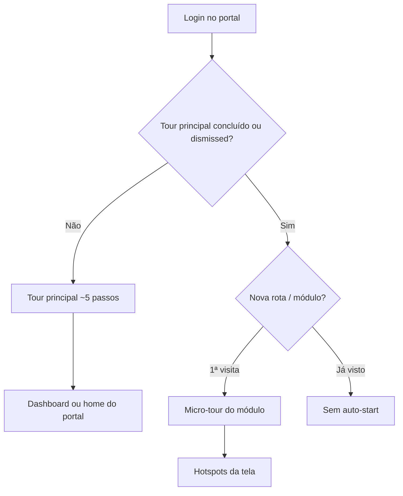

# Tour guiado (onboarding) — Sistema Bibi - ServiceOS

Product tour nos quatro portais autenticados. Versão atual: **v3** (`ONBOARDING_VERSION = 3`).

**Código:** `src/lib/onboarding/` · **UI:** `src/components/onboarding/`

---

## Arquitetura em duas fases



| Fase | Gatilho | Passos típicos |
|------|---------|----------------|
| **Principal** | 1º login; `!completed && !dismissed` | welcome, nav-overview, nav-modules, page-dashboard, assistant |
| **Micro** | 1ª visita ao módulo; tour principal já feito ou pulado | page-* com hotspots (order ≥ 100) |
| **PJ (full)** | Página única `/pj` | Todos os passos de uma vez |

---

## Mapa por portal

### Interno

| Escopo (`route-scope`) | Micro-tour destaca |
|------------------------|-------------------|
| `dashboard` | Painel executivo |
| `billing` | Cliente 360°, pendências PPU, faturas |
| `agenda` | Walk-in, agenda do dia |
| `cadastros` | Central + mapa CRUD |
| `seguranca` | MFA, dual-store, restaurar demo |
| `projetos` | ERP obras (CONSTRUCTION) |
| `cliente-360` | Visão `/interno/beneficiarios/[id]` |

Nav condensado lista todos os módulos via `buildInternoNavTabs()` — labels por nicho.

### Prestador

| Escopo | Micro-tour |
|--------|------------|
| `dashboard` | Próximo atendimento, fila |
| `atendimento` | PEP (`atendimento-pep`) |
| `campo` | Diário de obra (CONSTRUCTION) |

### Beneficiário

| Escopo | Micro-tour |
|--------|------------|
| `agendar` | Formulário `schedule-form` |
| `resumo` | Jornada de cuidado |
| `faturas` | Botão PIX `beneficiario-pix-pay` |

### PJ

Tour **full** na `/pj`: resumo, beneficiários, assinaturas, faturas (+ projetos se CONSTRUCTION).

---

## Persistência (`localStorage`)

Chave: `bibi_onboarding`

```json
{
  "interno": { "completed": true, "version": 3, "dismissed": false },
  "routes": {
    "interno:billing": { "completed": true, "version": 3 },
    "interno:agenda": { "dismissed": true, "version": 3 }
  }
}
```

| Ação | Efeito |
|------|--------|
| Concluir tour | `completed: true` — não auto-inicia de novo |
| Pular / fechar (×) | `dismissed: true` no tour principal; micro-tour grava em `routes` |
| Botão **Tour** no header | `resetTour(portal)` + reinicia tour principal |
| `ONBOARDING_VERSION` bump | Usuários com versão antiga veem tour atualizado |

---

## Mobile

- Nav desktop (`lg+`): abas com `data-tour-nav`
- Mobile: `MobileNavDrawer` com `data-tour-nav` nos links + `data-tour-id="mobile-nav-trigger"` no botão Módulos
- Botão **? Tour** visível em todas as larguras

---

## E2E / CI

Auto-start desligado em testes: `NEXT_PUBLIC_DISABLE_ONBOARDING_AUTO=true` em `playwright.config.ts`.

Helper `skipOnboardingTours()` em `e2e/helpers/auth.ts` marca portais e rotas como concluídos.

---

## Reiniciar para demo/apresentação

```javascript
localStorage.removeItem('bibi_onboarding');
location.reload();
```

Ou: botão **Tour** no header (reinicia só o portal atual).

---

## Referências

- Mapa de features: `src/lib/onboarding/feature-map.ts`
- Escopo de rota: `src/lib/onboarding/route-scope.ts`
- Testes: `tests/unit/onboarding.test.ts`
- Release: [`versoes/V2_3.md`](../versoes/V2_3.md)
