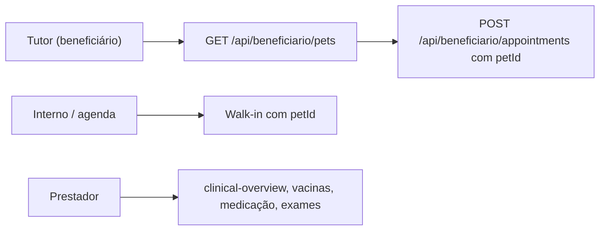

# Segmento: Veterinária (`VET`)

Clínicas veterinárias, pet shops e auxílio pet corporativo.

## Glossário UI

| Chave | Termo |
|-------|-------|
| Paciente | Pet |
| Prestador | Veterinário |
| Procedimento | Serviço |
| Consulta | Atendimento |
| Beneficiário | Tutor |
| Prontuário | Ficha clínica |

## Demo

| Papel | E-mail | Tenant |
|-------|--------|--------|
| Interno | `operacao@petcare.demo` | PetCare |
| Prestador | `dr.rafael@petcare.demo` | PetCare |
| Tutor (beneficiário) | `tutor@petcare.demo` | PetCare |
| Empresa PJ | `rh@techpet.demo` | PetCare |

Senha: **`bibi123`**

Catálogo demo: consulta, vacinação, exames, cirurgia, internação e estética (banho/tosa). Massa operacional com histórico e agendamentos futuros.

**Modelo Pet:** tutores em `Patient`; animais em `Pet` (espécie, raça, porte) vinculados ao tutor. Agendamentos VET exigem `petId`.

## Fluxos (v2.1)

| Portal | UI | APIs principais |
|--------|-----|-----------------|
| Interno | `CadastrosPetsTab`, walk-in em `/interno/agenda` | `GET/POST /api/interno/pets`, `PATCH .../pets/[id]` |
| Beneficiário | Seletor de pet ao agendar; plano de cuidado | `GET /api/beneficiario/pets`, `GET .../pets/[id]/vaccines` |
| Prestador | Ficha clínica no atendimento VET | `GET /api/prestador/pets`, `.../clinical-overview`, `.../vaccines`, `.../medications`, `.../exam-orders`, `.../clinical-profile` |

Fluxo completo: [`../../produto/FLUXOS.md`](../../produto/FLUXOS.md) §8.13.

## Pesquisa

- [Pesquisa de mercado VET](./pesquisa.md)

## Código

- Seed: `prisma/seed-data/niche-catalogs.ts` · `prisma/seed-data/niche-operational.ts`
- Landing: `/?tenant=petcare`
