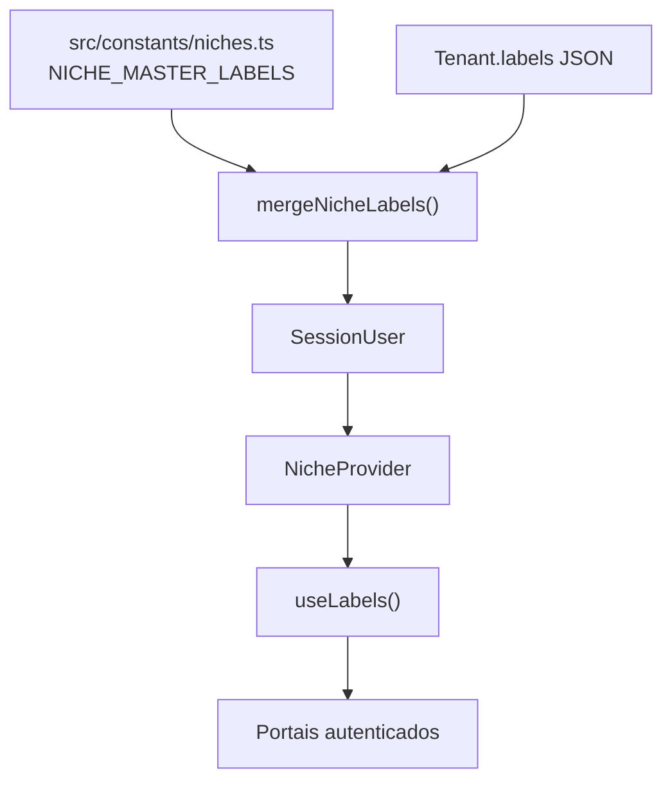

# Sistema Bibi - ServiceOS v2.0 — Escopo e changelog

Documento canônico do **pacote v2.0**: o que mudou em relação à v1.x (HealthTech POC),
o que está implementado, o que permanece roadmap e onde encontrar cada detalhe.

| Meta | Valor |
|------|-------|
| **Codinome** | ServiceOS |
| **Branch de integração** | `dev` |
| **Produção atual** | **v2.0.0** — **Sistema Bibi - ServiceOS** — deploy `6a3abdc1` @ `b661b39` |
| **Data desta revisão** | Junho/2026 |

---

## 1. Visão em uma frase

O Bibi deixa de ser apenas uma POC HealthTech e passa a ser uma **infraestrutura horizontal Pay Per Use multi-nicho** — o mesmo motor de agenda, faturamento e portais serve saúde, veterinária, odontologia, jurídico, bem-estar e educação, alterando **labels**, **branding** e **landing** por tenant.

**ROI de referência (500 colaboradores):** ~R$ 175k/mês (tradicional) → ~R$ 23,4k/mês (Pay Per Use) = **~87% economia**. Ver [`plataforma/ROI_REFERENCIA.md`](../plataforma/ROI_REFERENCIA.md).

---

## 2. O que mudou (resumo executivo)

| Área | Antes (v1.x) | Depois (v2.0) |
|------|--------------|---------------|
| Posicionamento | HealthTech / clínica | **ServiceOS** — qualquer prestador de serviço |
| Tenant | Nome + multi-tenancy | + `niche` + `labels` (JSON) |
| UI dos portais | Strings fixas ("Paciente") | `useLabels()` — vocabulário por nicho |
| Landing `/` | Genérica saúde | Conteúdo por nicho + `?niche=VET` |
| Procedure | Só saúde | `serviceType` + categorias `SERVICO`, `SESSAO` |
| Seed | Clínica Horizonte + VitaCare | + 5 tenants demo (VET, DENTAL, LEGAL, SPA, EDUCATION) |
| Documentação | HealthOS / Bibi POC | README, BENCHMARK, pesquisa, ARQUITETURA alinhados |

**O que NÃO mudou:** motores de `ProcedureUsage`, `PricingRule`, `Invoice`, PIX mock, webhooks, RBAC, MFA, dual-store demo/operação.

---

## 3. Nichos suportados

| `niche` | Setor | Tenant demo (seed) | Login interno |
|---------|-------|-------------------|---------------|
| `MEDICAL` | Saúde | Clínica Horizonte | `faturamento@bibi.health` |
| `VET` | Veterinária | PetCare | `operacao@petcare.demo` |
| `DENTAL` | Odontologia | Smile Odonto | `operacao@smile.demo` |
| `LEGAL` | Jurídico | Lex & Partners | `operacao@lex.demo` |
| `SPA` | Bem-estar | Zen Studio | `operacao@zen.demo` |
| `EDUCATION` | Educação | EduPrime | `operacao@eduprime.demo` |

Senha demo: **`bibi123`**.

Preview local da landing: `/?niche=VET`, `/?niche=LEGAL`, etc.

---

## 4. Camada de labels (eternização dos dicionários)

| Artefato | Caminho | Função |
|----------|---------|--------|
| Dicionário mestre | `src/constants/niches.ts` | Defaults tipados; TypeScript falha se faltar chave |
| Merge | `src/lib/niche/labels.ts` | Tenant overrides + defaults |
| Resolução server | `src/lib/niche/resolve.ts` | Host, tenantId, `?niche=` |
| Hook client | `src/hooks/useLabels.tsx` | `{ labels, t, niche }` |
| Nav dinâmica | `src/lib/navigation/niche-nav.ts` | Tabs Prestador, Beneficiário, Cadastros |
| Landing copy | `src/lib/niche/landing-content.ts` | Features, FAQ, portais por nicho |
| Regra IA | `AGENTS.md` + `docs/prompts/SERVICEOS_V2_IMPLEMENTATION.md` | Nunca hardcodar "Paciente" |

**Chaves obrigatórias (`NicheLabelKey`):** `patient`, `patients`, `provider`, `providers`, `procedure`, `procedures`, `appointment`, `appointments`, `medicalRecord`, `beneficiary`, `beneficiaries`, `company`, `portalBeneficiary`, `portalProvider`, `service`.

---

## 5. Procedimentos demo multi-nicho

| Procedimento | Nicho | Preço demo |
|--------------|-------|------------|
| Consulta Clínica Médica | MEDICAL | R$ 320 |
| Banho e Tosa | VET | R$ 150 |
| Consulta Odontológica | DENTAL | R$ 350 |
| Hora Técnica Jurídica | LEGAL | R$ 500 |
| Aula de Yoga | SPA | R$ 120 |
| Aula Particular | EDUCATION | R$ 150 |

Faixa de referência comercial: **R$ 300–R$ 500** para consultas e serviços profissionais.

**Price Snapshot:** `ProcedureUsage.priceCharged` congela o valor no ato do registro — válido em todos os nichos.

---

## 6. White label e personalização

| Camada | Implementado | Roadmap |
|--------|:------------:|---------|
| Logo + cores por tenant | ✅ `TenantBranding` + Blobs | — |
| Tema escuro por tenant | ✅ `colorScheme` | — |
| Paleta automática por nicho | ✅ `applyNicheBrandingDefaults()` | — |
| Landing por nicho | ✅ `getNicheLandingContent()` | — |
| Domínio customizado → tenant | ✅ `resolveTenantIdFromHost()` | Verificação DNS manual |
| Copy 100% custom por clínica | 🟡 tagline + displayName | `landingHeadline` no branding |
| Homepage exclusiva por prestador | ❌ | Wizard onboarding |

**Diferencial comercial:** "Sua marca, seu sistema" — o cliente sente propriedade sem fork de código.

---

## 7. UI migrada para `useLabels()` (parcial)

| Componente / área | Status |
|-------------------|--------|
| `PrestadorNav`, `BeneficiarioNav` | ✅ tabs dinâmicas |
| `CadastrosView`, `InternoCadastrosHeader` | ✅ abas dinâmicas |
| `ExecutiveDashboardView` | ✅ labels em KPIs |
| `PortalShell` + `NicheProvider` | ✅ |
| Landing pública | ✅ por nicho |
| `routes.ts`, breadcrumbs, PJ portal | 🟡 strings fixas |
| Mensagens de API server-side | 🟡 genéricas |
| PEP templates | 🟡 vocabulário médico |

---

## 8. Testes

| Arquivo | Cobertura |
|---------|-----------|
| `tests/unit/niche.test.ts` | 16 testes — master labels, merge, landing, seed prices |
| `tests/integration/pricing-db.test.ts` | `computePrice` + isolamento por `tenantId` |
| `tests/api/audit-pricing.test.ts` | CRUD pricing rules + timeline |

Validação de pacote: `npm run pre-release` (lint → `docs:verify` → `db:verify` → test → `netlify:build`).

Comando focado: `npm run test -- tests/unit/niche.test.ts`

---

## 9. Documentação atualizada (v2.0)

| Documento | Conteúdo v2.0 |
|-----------|---------------|
| [`V2_0.md`](V2_0.md) | **Escopo canônico** — changelog e matriz do pacote |
| [`README.md`](../../README.md) | Título ServiceOS, ROI ~87%, tenants demo |
| [`V2_0_ARCHITECTURE.md`](V2_0_ARCHITECTURE.md) | Arquitetura técnica multi-nicho |
| [`../plataforma/ARQUITETURA.md`](../plataforma/ARQUITETURA.md) | §0 ServiceOS, §0.1 Abstração de Linguagem |
| [`../plataforma/BENCHMARK.md`](../plataforma/BENCHMARK.md) | § ServiceOS vs mercado |
| [`../produto/FLUXOS.md`](../produto/FLUXOS.md) | §0 labels e landing |
| [`../produto/JORNADA_CLIENTE.md`](../produto/JORNADA_CLIENTE.md) | Personalização por nicho |
| [`../plataforma/DESIGN_SYSTEM.md`](../plataforma/DESIGN_SYSTEM.md) | Labels + paletas por nicho |
| [`../plataforma/NOTEBOOKLM.md`](../plataforma/NOTEBOOKLM.md) | RAG ServiceOS |
| [`../plataforma/TESTES.md`](../plataforma/TESTES.md) | `niche.test.ts` + suite Vitest |
| [`../plataforma/OPERACOES.md`](../plataforma/OPERACOES.md) | URLs demo multi-nicho, regra `useLabels()` |
| [`RELEASES.md`](RELEASES.md) | **v2.0.0 em produção** |
| [`../pesquisa/README.md`](../pesquisa/README.md) | Matriz, ROI, síntese consultor |
| [`../segmentos/README.md`](../segmentos/README.md) | Deep Research por vertical |
| [`../prompts/SERVICEOS_V2_IMPLEMENTATION.md`](../prompts/SERVICEOS_V2_IMPLEMENTATION.md) | Prompt mestre para IAs |
| [`AGENTS.md`](../../AGENTS.md) | Glossário + regras obrigatórias |

---

## 10. Roadmap pós-v2.0 (não neste pacote)

1. Migrar strings fixas restantes para `useLabels()`.
2. Campo `landingHeadline` em `TenantBranding` (homepage por cliente).
3. ESLint rule ou codemod anti-"Paciente" hardcoded.
4. Admin UI para editar `Tenant.labels` sem seed.

---

## 11. Referências cruzadas

- Arquitetura detalhada: [`V2_0_ARCHITECTURE.md`](V2_0_ARCHITECTURE.md)
- Benchmark técnico: [`../plataforma/BENCHMARK.md`](../plataforma/BENCHMARK.md)
- Pesquisa estratégica: [`../pesquisa/09-sintese-consultor-senior.md`](../pesquisa/09-sintese-consultor-senior.md)
- Operações e IA: [`../plataforma/OPERACOES.md`](../plataforma/OPERACOES.md) §7
- Pacotes: [`RELEASES.md`](RELEASES.md)
