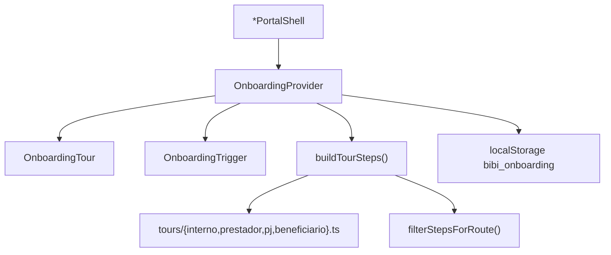

# Sistema Bibi - ServiceOS v2.2 — Escopo e changelog

Pacote **v2.2.0** adiciona **onboarding guiado** (product tour) nos quatro portais autenticados, sobre a base **v2.1.0**.

| Meta | Valor |
|------|-------|
| **Versão** | `2.2.0` |
| **Tag git** | `v2.2.0` |
| **PR** | [#142](https://github.com/Piulres/sistema-bibi/pull/142) |
| **Produção** | deploy `6a3ea6c5` @ `2c38248` (25/06/2026) |
| **Pacote anterior** | **v2.1.0** — [`V2_1.md`](V2_1.md) |

---

## 1. Resumo executivo

A v2.2 melhora a **primeira experiência** em cada portal com um tour automático: spotlight no elemento alvo, hotspot pulsante, tooltip posicionado e textos adaptados ao nicho via `useLabels()`. O usuário pode reiniciar o guia pelo botão **Tour** no header a qualquer momento.

**Não confundir** com o roadmap “wizard de onboarding” (escolha de nicho na contratação) — isso permanece em [`JORNADA_CLIENTE.md`](../produto/JORNADA_CLIENTE.md) §0.

---

## 2. Arquitetura do tour



| Camada | Arquivo | Papel |
|--------|---------|-------|
| Provider | `src/components/onboarding/OnboardingProvider.tsx` | Estado do tour, auto-start, navegação entre passos |
| Overlay | `src/components/onboarding/OnboardingTour.tsx` | Spotlight, hotspot, tooltip, teclado (Esc, setas) |
| Trigger | `src/components/onboarding/OnboardingTrigger.tsx` | Botão **Tour** no `PortalHeader` |
| Definição | `src/lib/onboarding/tours/*.ts` | Passos por portal com `labels` do tenant |
| Roteamento | `src/lib/onboarding/match-route.ts` | Filtra passos por `pathname` (exato ou prefixo `*`) |
| Persistência | `src/lib/onboarding/storage.ts` | `bibi_onboarding` — progresso **por portal** |
| Tipos | `src/lib/onboarding/types.ts` | `ONBOARDING_VERSION`, `OnboardingStep`, etc. |

### Integração nos portais

Cada `*PortalShell` envolve o conteúdo autenticado com `OnboardingProvider` + `OnboardingTour`:

- `src/components/layout/InternoPortalShell.tsx`
- `src/components/layout/PrestadorPortalShell.tsx`
- `src/components/layout/PjPortalShell.tsx`
- `src/components/layout/BeneficiarioPortalShell.tsx`

**Âncoras DOM** (`data-tour-id`): `portal-header`, `portal-nav`, `portal-content`, `portal-assistant`, `onboarding-trigger`. Novos passos devem apontar para seletores existentes ou adicionar âncoras estáveis.

### Comportamento (ground truth)

| Regra | Implementação |
|-------|---------------|
| Auto-start | Primeira visita ao portal → tour após **800 ms** se `!isTourCompleted(portal)` |
| Conclusão | Último passo ou botão **Concluir** → `markTourCompleted(portal)` |
| Pular / fechar | **Pular**, **×** ou **Esc** → `endTour(false)` — **não** marca como concluído |
| Reinício manual | Botão **Tour** → `resetTour(portal)` + `startTour()` |
| Passos por rota | Passo com `route` só aparece na rota correspondente; passo genérico cede lugar ao específico no mesmo `target` |
| Versão do tour | `ONBOARDING_VERSION = 1` — incrementar força novo tour para todos os usuários |
| Labels | Textos usam `labels.patient`, `labels.appointment`, etc. do tenant ativo |

### Passos por portal (resumo)

| Portal | Passos base | Passos contextuais por rota |
|--------|-------------|----------------------------|
| **Interno** | welcome, nav, content, assistant | dashboard, billing (`/interno`), agenda (`/interno/agenda*`), cadastros (`/interno/cadastros*`) |
| **Prestador** | welcome, nav, content, assistant | dashboard, agenda (`/prestador`) |
| **PJ** | welcome, nav, content, assistant | resumo, beneficiários (`/pj` — seções com `data-tour-id`) |
| **Beneficiário** | welcome, nav, content, assistant | agendar (`/beneficiario/agendar*`), resumo (`/beneficiario/resumo`) |

---

## 3. Desenvolvedor — adicionar passo ao tour

1. Garantir âncora `data-tour-id="…"` no componente alvo (ou seletor CSS estável).
2. Editar o builder em `src/lib/onboarding/tours/<portal>.ts`:

```ts
{
  id: "meu-passo",
  target: '[data-tour-id="minha-secao"]',
  title: `Título com ${labels.patient}`,
  content: "Descrição do passo.",
  placement: "bottom", // top | left | right | auto
  route: "/interno/minha-rota*", // opcional — prefixo com *
}
```

3. Cobrir em `tests/unit/onboarding.test.ts` (filtro de rota e labels).
4. Se mudar estrutura global, incrementar `ONBOARDING_VERSION` em `types.ts`.

---

## 4. Testes (ground truth v2.2)

| Camada | Quantidade |
|--------|------------|
| Vitest | **403** casos |
| Playwright E2E | **128** (10 specs × chromium + mobile-chrome) |
| Onboarding unit | `tests/unit/onboarding.test.ts` — match-route, builders, storage parse |

Comandos: `npm run lint` · `npm run test` · `CI=true npm run test:e2e` · `npm run pre-release`

---

## 5. Documentação relacionada

| Doc | Conteúdo |
|-----|----------|
| [`RELEASES.md`](RELEASES.md) | Pacotes fechados e deploy |
| [`V2_1.md`](V2_1.md) | Base v2.1 (assistente, VET, change-mgmt…) |
| [`../produto/JORNADA_CLIENTE.md`](../produto/JORNADA_CLIENTE.md) | UX do tour na jornada do usuário |
| [`../produto/FLUXOS.md`](../produto/FLUXOS.md) | §8.10 — fluxo técnico do tour |
| [`../plataforma/TESTES.md`](../plataforma/TESTES.md) | Mapa de testes |
| [`../plataforma/LANDING_CHANGELOG.md`](../plataforma/LANDING_CHANGELOG.md) | Changelog `#novidades` na home |

---

## 6. O que permanece roadmap

- Wizard de contratação (escolher nicho / configurar tenant) — distinto do product tour
- Tour condicionado a perfil RBAC interno (hoje todos os passos visíveis; `permissions` já está no contexto)
- Tour na landing pública (hoje só portais autenticados)
- i18n além dos labels por nicho
