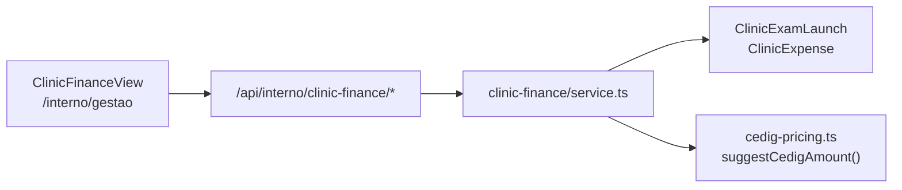

# ServiceOS v2.4 — CEDIG gestão clínica

Linha **v2.4.x** — piloto operacional CEDIG Cruzeiro (endoscopia / colonoscopia).

| Campo | Valor |
|-------|-------|
| **Versão** | `2.4.0` |
| **Tag git** | `v2.4.0` |
| **Foco** | Gestão clínica (lançamentos + despesas + KPIs) + tenant CEDIG |
| **Cliente** | [`docs/clientes/cedig/`](../clientes/cedig/) |
| **Produção** | ver [`RELEASES.md`](RELEASES.md) |

---

## Escopo

- Módulo `/interno/gestao` (RBAC `gestao`)
- Modelos `ClinicExamLaunch` · `ClinicExpense`
- Tabelas de preço Particular / CentralMed / Bem Saúde / Dr Saúde
- Seed `/?tenant=cedig` — equipe, catálogo, 4 portais, histórico demo
- Correções pós-homologação: labels Exame, pacientes do prestador, tours, dedupe médicos

## Fora de escopo (fase 2)

- Export Excel mensal
- Lançamento → fatura PPU / estoque kits
- E2E Playwright dedicado CEDIG

---

## Arquitetura (gestão clínica)

Módulo **separado do Pay Per Use** — registra receita operacional diária (planilha da secretária), não gera `Invoice` nem `ProcedureUsage`.

| Camada | Arquivo |
|--------|---------|
| Página | `src/app/interno/gestao/page.tsx` |
| UI | `src/components/ClinicFinanceView.tsx` |
| Serviço | `src/lib/clinic-finance/service.ts` |
| Preços CEDIG | `src/lib/clinic-finance/cedig-pricing.ts` |
| Constantes UI | `src/lib/clinic-finance/constants.ts` |
| Schema | `prisma/schema.prisma` — `ClinicExamLaunch`, `ClinicExpense` |

**Visibilidade na nav:** aba **Gestão clínica** só em nichos `MEDICAL` e `DENTAL` (`buildInternoNavTabs` em `niche-nav.ts`). Outros nichos não exibem a rota.

---

## RBAC

Módulo `gestao` em `interno-permissions.ts`:

| Perfil | Acesso |
|--------|--------|
| ADMIN | ✓ |
| FATURAMENTO | ✓ |
| RECEPCAO | ✓ |
| READONLY | ✓ (somente leitura na UI) |

Guard de página: `requireInternoPage("gestao")`. APIs: `requireInternoModule("gestao")` em todos os Route Handlers `clinic-finance/*`.

---

## APIs (`/api/interno/clinic-finance`)

| Método | Rota | Função |
|--------|------|--------|
| `GET` | `/meta` | Médicos, exames, pacientes, formas de pagamento, categorias de despesa, tabelas de preço |
| `GET` | `/launches?year=&month=` | Lançamentos do mês |
| `POST` | `/launches` | Cria `ClinicExamLaunch` (1 linha por paciente) |
| `GET` | `/expenses?year=&month=` | Despesas do mês |
| `POST` | `/expenses` | Cria `ClinicExpense` |
| `GET` | `/kpis?year=&month=` | KPIs agregados (receita, lucro, ticket, produção por médico) |

Query `year` / `month` opcionais — default = mês calendário atual (`parseMonth` em `service.ts`).

**Gap OpenAPI (jul/2026):** estas 4 rotas ainda não constam em `public/openapi.yaml`. Rodar `npm run openapi:sync` ao enriquecer o contrato.

Fluxo detalhado: [`produto/FLUXOS.md`](../produto/FLUXOS.md) §4.11.

---

## Modelos de dados

### `ClinicExamLaunch`

Uma linha por atendimento/exame no mês — espelha a planilha da secretária.

| Campo | Descrição |
|-------|-----------|
| `patientName` | Nome (texto livre; vincula `patientId` se nome coincide com cadastro) |
| `providerId` | Médico (`User` role `PRESTADOR`) |
| `procedureId` | Tipo de exame (`Procedure` do tenant) |
| `priceTable` | `PARTICULAR` · `CENTRALMED` · `BEM_SAUDE` · `DR_SAUDE` |
| `paymentMethod` | `DINHEIRO` · `PIX` · `CARTAO` · `CONVENIO` · `TRANSFERENCIA` · `OUTRO` |
| `amountReceived` | Valor recebido (secretária pode ajustar após sugestão) |
| `biopsies` · `polypectomies` · `mucosectomies` · `clips` | Contadores terapêuticos |
| `polypectomyTier` | Faixa de polipectomia quando aplicável |
| `performedAt` | Data do exame (default: agora) |

### `ClinicExpense`

Despesa operacional (opex) — **não** movimentação de estoque.

Categorias: `LABORATORIO` · `ANESTESISTA` · `PESSOAL` · `INSUMOS` · `MEDICAMENTOS` · `TAXA_CARTAO` · `OUTRAS`.

### KPIs (`getClinicFinanceKpis`)

Calculados no servidor a partir dos lançamentos e despesas do mês:

- Receita total · despesas · lucro operacional
- Contagem de exames · frascos para laboratório (soma de `biopsies`)
- Ticket médio · lucro por exame
- Exames por tipo · produção por médico · despesas por categoria

---

## Motor de preços (CEDIG)

`suggestCedigAmount()` em `cedig-pricing.ts` combina:

- Preço base do exame na tabela escolhida
- Biópsias (R$ 150/frasco)
- Polipectomias por faixa de tamanho
- Mucosectomias e clips conforme tabelas institucionais

Tabelas e valores demo: [`clientes/cedig/README.md`](../clientes/cedig/README.md). Seed: `prisma/seed-data/cedig-catalog.ts`.

---

## Demo e homologação

| Contexto | Como acessar |
|----------|--------------|
| Tenant CEDIG | `/?tenant=cedig` → login interno `alana@cedig.demo` / `bibi123` |
| Gestão clínica | `/interno/gestao` após login |
| Modo operação | `/interno/seguranca` → `OPERAR` ([`OPERACAO_DADOS.md`](../plataforma/OPERACAO_DADOS.md)) |
| Roteiro browser | [`clientes/cedig/ROTEIRO_HOMOLOGACAO.md`](../clientes/cedig/ROTEIRO_HOMOLOGACAO.md) |
| Histórico validação | [`clientes/cedig/HISTORICO_VALIDACAO.md`](../clientes/cedig/HISTORICO_VALIDACAO.md) |

---

## Referências cruzadas

- Fluxos técnicos: [`produto/FLUXOS.md`](../produto/FLUXOS.md) §4.11 · §9 (RBAC)
- Jornada UX secretária: [`produto/JORNADA_CLIENTE.md`](../produto/JORNADA_CLIENTE.md) §5
- Segmento saúde: [`segmentos/medical/README.md`](../segmentos/medical/README.md)
- Massa de testes CEDIG: [`plataforma/MASSA_TESTES.md`](../plataforma/MASSA_TESTES.md)
