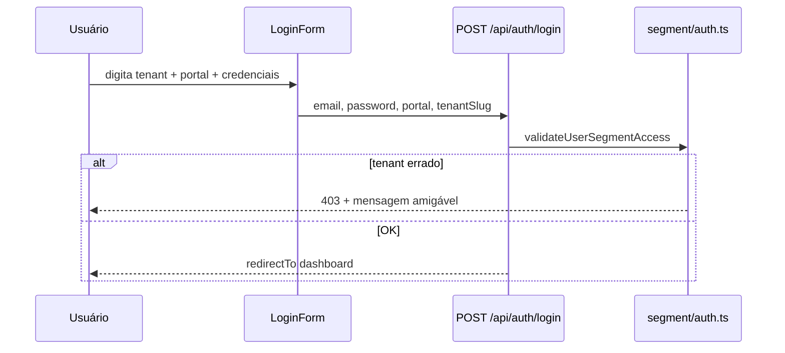

# ServiceOS v2.5 — Login com tenant e portal

Linha **v2.5.x** — acesso unificado nas telas de login dos quatro portais.

| Campo | Valor |
|-------|-------|
| **Versão** | `2.5.0` |
| **Tag git** | `v2.5.0` (empilhado em v2.6.0) |
| **Foco** | Campo de clínica/tenant + seletor de portal no login |
| **Produção** | ver [`RELEASES.md`](RELEASES.md) |

---

## Escopo

- Campo **Clínica / tenant** no `LoginForm` (slug digitável, ex.: `cedig`)
- Botão **Aplicar clínica** — atualiza `?tenant=` e branding
- Select **Portal** — Interno · Prestador · PJ · Beneficiário (navega para o login correto)
- Helpers: `src/lib/auth/login-access.ts` (`normalizeTenantSlug`, `buildLoginAccessHref`)
- Body do login: `{ email, password, portal, tenantSlug? }` — ver [`FLUXOS.md`](../produto/FLUXOS.md) §2
- Validação de segmento: `validateUserSegmentAccess()` em `src/lib/segment/auth.ts` — 403 se `user.tenantId` ≠ tenant ativo
- Dual-store: `ensureDataStoreForSegmentAccess()` seleciona demo/operação antes do login
- Mantém atalhos de segmento demo e fluxo MFA

### Fluxo resumido

## Fora de escopo

- Autocomplete de tenants a partir do banco
- Domínio customizado por clínica (já coberto por host/cookie quando configurado)
